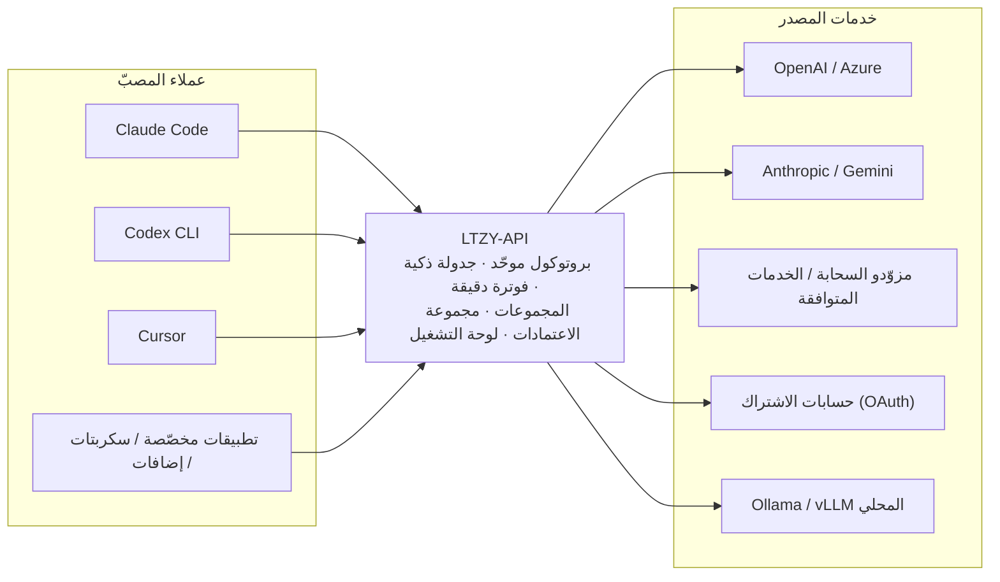
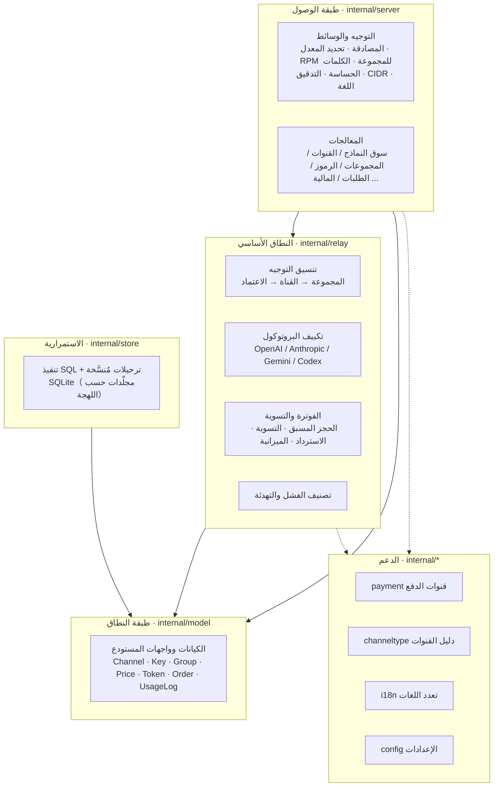
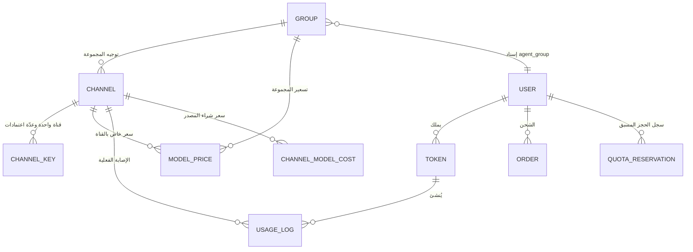
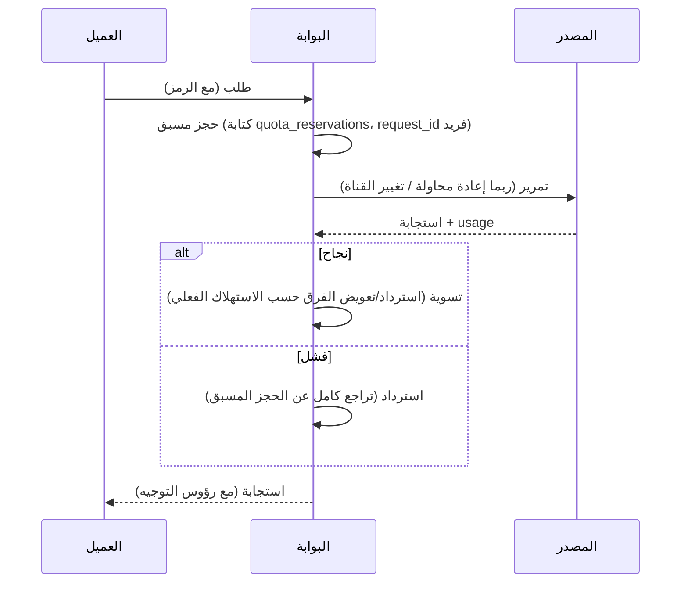

<div align="center" dir="rtl">


# LTZY-API

**اجمع كل مزوّدي الذكاء الاصطناعي (AI) لديك في مدخل واحد.**

بوابة LLM API ذاتية الاستضافة · نظام إدارة استهلاك الذكاء الاصطناعي

Self-hosted LLM Gateway · OpenAI-compatible API


[简体中文](README.md) · [English](README.en.md) · [Français](README.fr.md) · [Русский](README.ru.md) · [Español](README.es.md) · [العربية](README.ar.md)

> كان يُعرف سابقًا باسم **AQUA-API** — أُعيدت تسميته إلى **LTZY-API** في أكتوبر 2026. الروابط القديمة تُعيد التوجيه تلقائيًا.

</div>

---

## العنوان الرسمي

| القناة | العنوان |
| --- | --- |
| الموقع الرسمي (عرض حيّ) | https://ltzy.top |
| مستودع الكود | https://github.com/LTZY-ACU/LTZY-API |
| الإبلاغ عن مشكلة (Issues) | https://github.com/LTZY-ACU/LTZY-API/issues |

> **هذا المستودع هو المصدر الموثوق الوحيد للعنوان الرسمي.** إذا تغيّر النطاق، فسيُحدَّث هنا أولًا ثم يُنقل إلى أي مكان آخر.
> لذلك، حفظ هذا المستودع أكثر موثوقية من حفظ نطاق.

### تنبيه ضد التقليد

- هذا المشروع **لا يوفّر ولا يصرّح** بأي خدمات «شحن بالوكالة» أو «تشغيل بالوكالة» أو «مشاركة رسمية». كود الخادم مفتوح بالكامل
  ([رخصة MIT](LICENSE))، ويمكن لأي شخص استضافته ذاتيًا —— **القدرة على تشغيله ≠ كونه رسميًا**.
- لا تعتمد إلا على العناوين الواردة في الجدول أعلاه. أي نطاق آخر، حتى لو بدت واجهته متطابقة، لا علاقة له بهذا المشروع.
- لن تطلب الجهة الرسمية أبدًا عبر الرسائل الخاصة كلمة المرور أو رمز الدفع أو رمز التحقق.
- استخدام هذا المشروع يعني قبول [«إرشادات المستخدم وإخلاء المسؤولية»](DISCLAIMER.md)؛ وحدود العلامة التجارية موضّحة في [«بيان العلامة التجارية»](TRADEMARK.md).
- قبل المشاركة في التطوير، اقرأ [«دليل المساهمة»](CONTRIBUTING.md) (نموذج Fork + PR، وفرع `main` محميّ).

### هل لا تفتح الروابط؟

هذا النوع من المواقع كثيرًا ما يُحجب خطأً من برامج التواصل الاجتماعي (QQ/WeChat وغيرها). عند حدوث ذلك:

1. جرّب متصفحًا آخر، أو غيّر الشبكة (بيانات الجوال ↔ النطاق المنزلي) ثم أعد المحاولة؛
2. **شارِك عنوان هذا المستودع بدلًا من النطاق المجرّد** —— احتمال الحجب الخاطئ لروابط منصّات استضافة الكود أقل بكثير،
   ويمكن للطرف الآخر التأكد من العنوان الرسمي الأحدث من داخل المستودع؛
3. إذا تأكدت أنه حجب خاطئ، فتقدّم بطلب اعتراض وفق ما تنص عليه المنصّة.

> عند مواجهة أي مشكلة، مرحبًا بك في مجموعة التواصل: **مجموعة QQ رقم 1103667832** (مدخل «انضم إلى المحادثة» أعلى يمين الصفحة الرئيسية للموقع).

---

## جدول المحتويات

- [العنوان الرسمي](#العنوانالرسمي)
- [إخلاء المسؤولية](#إخلاءالمسؤولية)
- [ما هذا المشروع](#ماهذاالمشروع)
- [لماذا تختاره](#لماذاتختاره)
- [نظرة عامة على الميزات](#نظرةعامةعلىالميزات)
- [الميزات الأساسية](#الميزاتالأساسية)
- [بنية النظام](#بنيةالنظام)
- [نموذج البيانات الأساسي](#نموذجالبياناتالأساسي)
- [دورة حياة الطلب الكاملة](#دورةحياةالطلبالكاملة)
- [البروتوكولات والمصادر المدعومة](#البروتوكولاتوالمصادرالمدعومة)
- [قائمة الواجهات](#قائمةالواجهات)
- [الأذونات والأدوار](#الأذوناتوالأدوار)
- [تفاصيل الفوترة والمحاسبة](#تفاصيلالفوترةوالمحاسبة)
- [المكدس التقني](#المكدسالتقني)
- [البدء السريع](#البدءالسريع)
- [الإعدادات](#الإعدادات)
- [أمثلة الربط](#أمثلةالربط)
- [دليل التشغيل](#دليلالتشغيل)
- [تعدد اللغات](#تعدداللغات)
- [الأمان](#الأمان)
- [النشر والسعة](#النشروالسعة)
- [الأسئلة الشائعة](#الأسئلةالشائعة)
- [المعجم](#المعجم)
- [خارطة الطريق](#خارطةالطريق)
- [التطوير](#التطوير)
- [المساهمة](#المساهمة)
- [الترخيص](#الترخيص)

---

## إخلاء المسؤولية

**قبل استخدام هذا المشروع، يُرجى قراءة [«إرشادات المستخدم وإخلاء المسؤولية»](DISCLAIMER.md) أولًا.**
هذا المشروع مخصّص للاستخدام القانوني في البحث التقني والإدارة الداخلية فقط؛ وعلى المستخدم الالتزام بالقوانين واللوائح
في منطقته وبشروط الخدمات المصدرية المتصلة. ولا يتحمّل المؤلف أي مسؤولية عن أي خسارة ناتجة عن استخدام هذا المشروع.

وحدود العلامة التجارية موضّحة في [«بيان العلامة التجارية»](TRADEMARK.md).

---

## ما هذا المشروع

LTZY-API هو **بوابة LLM API ذاتية الاستضافة**، وهو في الوقت نفسه **نظام لإدارة استهلاك الذكاء الاصطناعي**.

عادةً ما تكون مصادرك مزيجًا من عناصر غير متوافقة: مفاتيح OpenAI الرسمية، وAzure، وClaude، وGemini، ومزوّدو السحابة المتنوّعون،
والخدمات المتوافقة مع OpenAI، والحسابات المشترك بها (Claude / Codex / Gemini)، وكذلك Ollama / vLLM المُشغّلة محليًا.
أما الطرف المستهلك لديك فهو تطبيقات متنوّعة: Claude Code، وCodex CLI، وCursor، وتطبيقات مخصّصة، وسكربتات، وإضافات.

يقف LTZY-API في الوسط، منظّمًا هذه الفوضى في **مدخل واحد، وبروتوكول واحد، ودفتر حساب واضح**.



المشكلات الجوهرية التي يحلّها ثلاث كلمات: **التوحيد** (البروتوكول والمدخل)، و**الموثوقية** (تجنّب الأعطال تلقائيًا)، و**قابلية المحاسبة** (كل قرش له مستند).

---

## لماذا تختاره

البوابات المماثلة كثيرة، والناقص هو تلك التي **يمكن ائتمانها على الحسابات**. وكل بند أدناه تصميم وُلد بعد تجاوز عقبات حقيقية.

| المحور | الممارسة الشائعة | LTZY-API |
| --- | --- | --- |
| مفاتيح المصدر | تُخزَّن نصًا صريحًا ويمكن رؤيتها من اللوحة | تشفير AES-256-GCM قبل التخزين، والمفتاح الرئيسي يُحقن من متغيّر البيئة فقط؛ وحتى لو اختُرق الخادم لا يمكن تصدير النص الصريح |
| المفتاح الرئيسي للتشفير | يُكتب معًا في ملف الإعدادات | يُتجاهل الحقل المطابق في ملف الإعدادات تمامًا، ولا يُقبل إلا عبر متغيّر البيئة، فلا يتسرّب مع المستودع |
| عطل المصدر | تعطيل دائم عند الفشل المتكرر، فيتقلّص الرصيد المتاح باستمرار | تصنيف الفشل + تهدئة نصف مفتوحة: تحديد المعدل مجرّد تجنّب مؤقّت ويعود تلقائيًا؛ ولا يُزال الاعتماد إلا عند إعلان المصدر صراحةً إبطاله |
| استراتيجية إعادة المحاولة | إعادة المحاولة دائمًا، أو عدمها دائمًا | توزيع حسب نوع الفشل: 429 تهدئة وتغيير المفتاح، 5xx تغيير القناة، 401/403 تهدئة طويلة، مراجعة المحتوى تغيير النموذج، 200 الفارغ تخفيض، مع احترام `Retry-After` |
| تحديد المعدل والتزامن | عتبة واحدة شاملة، فيتقيّد الجميع | حساب مستقل لكل اعتماد (الوزن / الأولوية / الحد في الدقيقة / الطلبات الجارية)؛ ويمكن للمجموعة تعيين حزمة طلبات لكل دقيقة |
| الرصيد | استعلام قبل الطلب وبعده، ما يؤدي إلى تجاوز في التزامن | حجز مسبق → تسوية → استرداد؛ والرصيد المتاح = الرصيد − المستخدَم − الجاري، فلا يمكن تجاوزه حتى مع التزامن |
| الميزانية الدورية | رصيد إجمالي فقط، ولا يُعرف التجاوز إلا بعده | ميزانية بنافذة متدحرجة على مستوى الرمز (يومي / أسبوعي / شهري)، مع فصل تلقائي عند تجاوز النافذة |
| فوترة التدفق | قراءة أول بايتات من الاستجابة فقط، فتُحسب الإجابات الطويلة بصفر | تحليل SSE تدريجيًا، ويُلتقط `usage` حتى إن ظهر في الإطار الأخير من التدفق |
| البروتوكول | دعم التوافق مع OpenAI فقط | البروتوكولات الثلاثة كاملة في المصبّ: OpenAI / Anthropic / Gemini، واختيار مُكيّف المصدر حسب نوع القناة |
| تمييز الجمهور | المفتاح هو الصلاحية، فلا تمييز بين المجاني والمدفوع | المجموعة تحدّد القنوات المتاحة والسعر، ويمكن للرمز اختيار مجموعة: نفس المصدر، لكن كل جمهور يُحاسَب على حدة |
| تسليم الوكلاء | الاعتماد على التذكّر اليدوي للخصومات، فتتضارب الحسابات | مجموعة الوكلاء: يعرض السوق «السعر الأصلي مشطوبًا + السعر بعد الخصم» حسب هوية الوكيل، والخصم هو مضاعف المجموعة، وسعر السوق مطابق للخصم الفعلي |
| مرونة التسعير | سعر واحد لكل نموذج، لا يقبل التغيير | السعر قابل للتهيئة على ثلاثة أبعاد «النموذج × المجموعة × القناة»؛ وكل سجل يحفظ لقطة نسخة التسعير، فتبقى الفواتير القديمة قابلة لإعادة الحساب بعد تغيير السعر |
| إظهار التكلفة | الإيرادات فقط، دون معرفة الربح | تقرير مطابقة التكلفة الحقيقية: تجميع الإيراد والتكلفة والهامش حسب المجموعة / القناة / النموذج، مع إمكانية حساب سعر الشراء بالكمية وبالمرة |
| التشغيل والصيانة | مراقبة القنوات يدويًا | لوحة صحّة القنوات + تعطيل تلقائي حسب معدّل النجاح؛ ولوحة الإدارة تدعم تقييد الوصول بقائمة CIDR المسموحة |
| الامتثال | بيان إخلاء مسؤولية واحد يكفي | نظام تنبيهات امتثال شامل: قسم بيان الاتفاقية + شعارات النماذج + نافذة تأكيد الزيارة الأولى + تنبيه في صفحة الشحن |
| النشر | يتطلب تثبيت قاعدة بيانات وRedis وبيئة ترجمة | ملف تنفيذي واحد + SQLite، والواجهة مضمّنة، بدون CGO، ولا حاجة إلى gcc |

---

## نظرة عامة على الميزات

جدول واحد يعرض حدود القدرات كاملة (والتفاصيل في الأقسام التالية).

| الوحدة | القدرة |
| --- | --- |
| ربط البروتوكولات | التوافق مع OpenAI · Anthropic · Gemini · Codex / Responses، ويمكن تشغيل أنواع الوصول الأربعة معًا |
| تكييف المصدر | التوافق مع OpenAI · Azure OpenAI · Anthropic · Gemini · Codex · حسابات الاشتراك؛ والدليل يسجّل 79 نوع قناة، منها 37 منفّذة |
| توجيه القنوات | توجيه المجموعات · تفريع النموذج على مستوى القناة · المجموعات والتفريع على مستوى الاعتماد · قواعد الوقت · تخطّي قاطع الدائرة على مستوى القناة |
| جدولة الاعتمادات | تسلسلي / دوري / عشوائي مرجّح / الأطول دون استخدام / الأقل جاريًا؛ الوزن · الأولوية · الحد في الدقيقة · الطلبات الجارية · نهاية التهدئة |
| معالجة الأعطال | إعادة محاولة حسب تصنيف الفشل · تهدئة على مستوى القناة×النموذج · تراجع أُسّي · احترام `Retry-After` · لزوجة الجلسة · استعادة نصف مفتوحة |
| الفوترة | بالكمية (ثلاثة أسعار: الإدخال / الإخراج / التخزين المؤقت) · بالمرة · المطابقة العامة · سعر خاص بالقناة · مضاعف المجموعة · لقطة نسخة التسعير |
| الرصيد والتحكّم | ثلاث مراحل: حجز مسبق / تسوية / استرداد · رصيد على مستويَي الرمز والمستخدم · ميزانية دورية للرمز (يومي / أسبوعي / شهري) · سجل طلبات خالٍ من التكرار |
| المجموعات والوكلاء | كيان المجموعة · مضاعف الفوترة · عتبة الفتح · RPM للمجموعة · التوزيع عبر اللوحة فقط · فئة تسليم الوكلاء وسعر السوق بعد الخصم |
| الدفع والمحاسبة | يدوي / YiPay（易支付） / Stripe / Alipay الرسمي / WeChat Pay الرسمي · رموز الاسترداد · إدخال طلبات خالٍ من التكرار · تسجيل الدفعات المتأخرة |
| نظام المستخدمين | التسجيل · تسجيل الدخول برمز البريد وإعادة تعيين كلمة المرور · كوكي الجلسة · رصيد تجريبي محدود · مكافأة الإحالة · الحضور اليومي |
| لوحة التشغيل | سوق النماذج · القنوات ومجموعة المفاتيح · المجموعات · الأسعار · الرموز · المستخدمون · الطلبات · رموز الاسترداد · سجل الاستدعاءات · التدقيق |
| قدرات إضافية | المهام غير المتزامنة · بناء المدوّنة اللغوية · البريد الجماعي · إعلانات الموقع · الكلمات الحساسة · تعيين النماذج · الحسابات المشتركة عبر OAuth |
| المراقبة | لوحة صحّة القنوات · تنبيه معدّل إعادة المحاولة · تقرير مطابقة التكلفة · رؤوس استجابة التوجيه · نظرة عامة على الصيانة والنسخ الاحتياطي |
| الأمان | تخزين المفاتيح مشفّرة · إخفاء البيانات في السجلات · قائمة CIDR · تدقيق استرجاع النص الصريح · الحماية من تجاوز الصلاحيات |
| تعدد اللغات | 6 لغات في الخادم والواجهة · ويوفّر هذا المستند نسخًا بلغات الأمم المتحدة الرسمية الستّ |
| النشر | ملف تنفيذي واحد · Docker · systemd · واجهة مضمّنة · SQLite بلا صيانة |

---

## الميزات الأساسية

### البوابة والتمرير

- **ثلاثة بروتوكولات في المصبّ**: التوافق مع OpenAI (`/v1/chat/completions`، `/v1/models`، `/v1/embeddings`)،
  وAnthropic (`/v1/messages`)، وGemini (`/v1beta`) —— ويمكن لكل بروتوكول استقبال أن يتولّى العميل المقابل مباشرة
- **مُكيّفات المصدر**: التوافق مع OpenAI، وAzure OpenAI (اسم النشر + api-version)، وAnthropic، وGemini،
  وCodex / Responses، ومختلف حسابات الاشتراك
- **تمثيل وسيط موحّد**: كل شيء يتقارب داخليًا إلى بروتوكول OpenAI (N×1)، فإضافة مصدر تتطلب كتابة «الدخول» فقط، وإضافة مصبّ تتطلب كتابة «الخروج» فقط
- **تحويل ثنائي الاتجاه للتدفق**: أحداث SSE من Anthropic / Gemini ↔ `chat.completion.chunk` من OpenAI، بما في ذلك استدعاء الأدوات
- **مهلة مصدر 300 ثانية**: الإجابات الطويلة للنماذج الكبيرة لا تُقطع
- **تمرير الأخطاء كما هي**: تُعاد أخطاء المصدر الحقيقية (بما فيها `detail` بصيغة RFC7807 و`error.message` من OpenAI) مباشرةً، دون إخفاء
- **رؤوس استجابة التوجيه القابلة للمراقبة**: `X-Routed-Via` (القناة التي أُصيبت فعليًا)، و`X-Fallback-Attempts` (عدد محاولات التخفيض)،
  و`X-Upstream` (اسم نموذج المصدر الفعلي)، فلا حاجة إلى التقاط الحزم لتشخيص المشكلات

### مجموعة الاعتمادات والجدولة الذكية

- **خمس استراتيجيات**: تسلسلي / دوري / عشوائي مرجّح / الأطول دون استخدام / الأقل جاريًا (الافتراضية)، قابلة للتبديل على مستوى القناة
- **معطيات على مستوى الاعتماد**: الوزن، والأولوية، والحد في الدقيقة، والطلبات الجارية، ونهاية التهدئة، قابلة للتعديل مفتاحًا مفتاحًا من اللوحة
- **إعادة المحاولة مدفوعة بتصنيف الفشل**:
  - `429`: تغيير المفتاح وإدخال ذلك المفتاح في تهدئة قصيرة (تراجع أُسّي)، مع احترام `Retry-After` من المصدر
  - `5xx` / المهلة: إعادة المحاولة بتغيير القناة
  - `401 / 403 / 402`: تهدئة طويلة (دون إزالة متسرّعة، لتجنّب قتل مفتاح سليم بسبب تحكّم لحظي)
  - اعتراض مراجعة المحتوى: تغيير النموذج
  - `200` بمحتوى فارغ: يُعدّ فشلًا ويُخفَّض
- **تهدئة على مستوى القناة × النموذج**: الفشل يهدّئ «هذه القناة × هذا النموذج» فقط، دون المساس ببقية نماذج القناة نفسها
- **لزوجة الجلسة**: تُثبَّت الجلسة نفسها (`X-Session-Id`) على الاعتماد نفسه لرفع معدّل إصابة ذاكرة المصدر المؤقتة، مع تخفيض تلقائي عند فقدان الهدف
- **قاطع الدائرة على مستوى القناة**: عند نفاد رصيد / حصة كل اعتمادات قناة ما، يتخطّاها التوجيه بنشاط ويسجّل ذلك، بدلًا من اختيارها ثم الفشل
- **أساليب إدخال متعدّدة**: فردي / لصق دفعي / دمج في واحد

### الفوترة والمحاسبة

- **المعادلة**: «الرصيد = (رموز الإدخال × سعر الإدخال + رموز الإخراج × سعر الإخراج) / 1,000,000»، مع دعم التسعير بالمرة أيضًا
- **قواعد السعر**: المطابقة باسم النموذج أو بنمط عام، ويمكن ربطها بمجموعة، أو تهيئة سعر خاص لقناة معيّنة
- **فصل سعر التخزين المؤقت**: رموز إصابة الذاكرة المؤقتة لدى المصدر تُحتسب بسعر مستقل (وعند عدم تهيئته يُرجَع إلى سعر الإدخال)
- **أمان الرصيد**: ثلاث مراحل: حجز مسبق + تسوية + استرداد، مع سجل خالٍ من التكرار يضمن «الإدخال مرة واحدة على الأكثر»
- **لقطة نسخة التسعير**: كل سجل استدعاء يحفظ نسخة قاعدة التسعير وقتها، فتبقى الفواتير القديمة قابلة لإعادة الحساب بالسعر القديم بعد تغيير الأسعار
- **الميزانية الدورية**: يمكن تعيين «حد أقصى للإنفاق في كل دورة N رصيدًا» على الرمز، مع إعادة ضبط كسولة عند انتهاء النافذة دون الاعتماد على مهام مجدولة
- **قنوات الدفع**: تأكيد يدوي / YiPay（易支付） / Stripe / Alipay الرسمي (RSA2) / WeChat Pay الرسمي (APIv3 + التحقق من توقيع شهادة المنصّة + AES-GCM)
- **محاسبة الطلبات**: التحقق من توقيع الردّ، والإدخال الخالي من التكرار، وتسجيل الدفعات المتأخرة، والإدخال والإغلاق اليدويان
- **رموز الاسترداد**: توليد دفعي؛ والاسترداد المتزامن عملية ذرّية في معاملة واحدة، فحتى 10 عمليات متزامنة على الرمز نفسه لا تنجح إلا مرة واحدة

### المجموعات والتسعير ونظام الوكلاء

- **المجموعة كيان من الدرجة الأولى**: الاسم المعروض، ومضاعف الفوترة، وعتبة الفتح، والحد الأقصى للطلبات في الدقيقة
- **مجموعات تُوزَّع عبر اللوحة فقط**: أسعار الجملة / فئات الوكلاء غير مرئية تمامًا للمستخدم العادي، ولا يُسنِدها إلا المدير
- **فئة تسليم الوكلاء**: المستخدم المُسنَد إلى مجموعة وكلاء يرى في سوق النماذج نماذج فئته هو وأسعارها،
  معروضة بعرض «السعر الأصلي مشطوبًا + السعر بعد الخصم بالبرتقالي»
- **سعر السوق = الخصم الفعلي**: سعر سوق الوكيل والفوترة يأتيان من مجموعة قواعد الأسعار نفسها
- **إحصاء مراجع المجموعة**: يُخبرك بعدد القنوات وقواعد الأسعار المتأثّرة قبل حذف المجموعة
- **حساب التسعير العام**: `GET /api/models/quote` (بدون تسجيل دخول)، أدخل عدد الرموز فيُعاد تقدير التكلفة

### التشغيل ولوحة الإدارة

- **سوق النماذج**: ترشيح متعدّد الأوجه مع ربط عدّادات الأوجه + بحث + فرز + عرض بالبطاقات والقوائم +
  نافذة تفاصيل (جدول الأسعار، وقت النفاذ، أمر cURL جاهز للتشغيل، حاسبة التكلفة)
- **إدارة القنوات**: إضافة وتعديل وحذف، وفحص الاتصال، ودُرج مجموعة المفاتيح، وجلب قائمة نماذج المصدر بنقرة، وحساب سعر الشراء من المصدر (بالكمية / بالمرة)
- **لوحة صحّة القنوات**: معدّل النجاح، وعدد المفاتيح في التهدئة، والرصيد المتبقّي في شاشة واحدة؛ مع دعم التعطيل التلقائي حسب معدّل النجاح
- **تقرير المطابقة المالية**: تجميع الإيراد والتكلفة والهامش ونسبة الهامش حسب المجموعة / القناة / النموذج
- **تنبيه معدّل إعادة المحاولة**: إحصاء `r = عدد استدعاءات المصدر / عدد الطلبات المفوتَرة` حسب مجموعة الخصم، وتنبيه عند تجاوز خط التعادل
- **الرموز**: الرصيد / الانتهاء / قائمة النماذج المسموحة / المجموعة المنتمي إليها / الميزانية الدورية / استرجاع النص الصريح الخاضع للتدقيق
- **نظام المستخدمين**: التسجيل، وتسجيل الدخول برمز البريد وإعادة تعيين كلمة المرور، ومنح الرصيد التجريبي المحدود واسترجاعه عند الانتهاء
- **الدعوة والحضور**: رمز الدعوة، وسجل مكافآت التسجيل والشحن، والحضور اليومي
- **إعلانات الموقع / تدقيق العمليات / الكلمات الحساسة / SMTP / المهام غير المتزامنة / البريد الجماعي / بناء المدوّنة اللغوية**
- **بقية اللوحة**: بيانات النماذج وتعيينها، وحسابات الاشتراك عبر OAuth، ونظرة عامة على الصيانة والنسخ الاحتياطي لقاعدة البيانات

### الواجهة والسمات

- **ثلاث سمات**: فاتحة / داكنة / زرقاء داكنة، قابلة للتبديل في أي وقت مع حفظ التفضيل محليًا
- **واجهة بستّ لغات**: الصينية المبسّطة، وEnglish، وFrançais، وРусский، وEspañol، والعربية (مع تخطيط RTL)
- **الجوّال**: شريط تنقّل سفلي، وتحويل الجداول تلقائيًا إلى بطاقات، ومراعاة المنطقة الآمنة، وانبثاق النوافذ من الأسفل

---

## بنية النظام

تصميم طبقّي باعتماد أحادي الاتجاه، ويُمنع الاعتماد الدائري بين حزم `internal/`.



| الطبقة | المجلّد | المسؤولية | ما لا تفعله |
| --- | --- | --- | --- |
| طبقة الوصول | `internal/server` | التوجيه، والوسائط، والتحقق من الطلبات، وتحويل DTO | لا تكتب SQL مباشرةً، ولا تنفّذ منطق التمرير |
| النطاق الأساسي | `internal/relay` | التوجيه، وتحويل البروتوكول، والتمرير، والفوترة والتسوية، ومعالجة الفشل | لا تدرك تفاصيل HTTP، وتعتمد على واجهات `model` فقط |
| طبقة النطاق | `internal/model` | الكيانات، والقواعد، وتعريفات واجهات المستودع | لا تكتب SQL، ولا تدرك HTTP |
| الاستمرارية | `internal/store` | تنفيذ المستودع، وتشغيل الترحيلات، والاستعلامات المُجمَّعة | لا تحمل قواعد العمل |
| الدعم | `payment` / `channeltype` / `i18n` / `config` | تكييف الدفع، ودليل القنوات، والنصوص، والإعدادات | لا تعتمد عكسيًا على الطبقات الأعلى |

> إضافة مصدر: سجّل النوع في `internal/channeltype/catalog.go`؛ وإن اختلف البروتوكول فأضف مُكيّفًا في `internal/relay/`.
> إضافة جدول بيانات: أنشئ نصًّا ترقيميًا متزايدًا جديدًا في `internal/store/migrations/sqlite/` (إضافة فقط دون تعديل)،
> ثم زامن كيان `model` وقائمة أعمدة `store`.

---

## نموذج البيانات الأساسي



| الكيان | الحقول الرئيسية | الوصف |
| --- | --- | --- |
| `model_groups` | `ratio` المضاعف · `rpm_limit` الحد في الدقيقة · `unlock_min_recharge_cents` العتبة · `admin_only` التوزيع عبر اللوحة فقط | حامل الجمهور وفئة الوكيل؛ والمضاعف هو الخصم |
| `channels` | `group_names` المجموعات المخدومة · `models` النماذج المدعومة · `key_strategy` استراتيجية الجدولة · استراتيجيات إعادة المحاولة والتهدئة | «هل يمكن المرور عبر هذا المصدر» |
| `channel_keys` | المفتاح المشفّر · تفريع `group_names` / `models` · `weight` / `priority` / `rpm_limit` / `in_flight` · `cooldown_until` · نافذة رصيد الاشتراك | «أي مفتاح يُستخدم عند المرور عبر هذا المصدر» |
| `model_prices` | `model` · `group_name` · `channel_id` (0 = بدون تحديد قناة) · سعر الإدخال / التخزين المؤقت / الإخراج / بالمرة · طريقة الفوترة | أولوية أخذ السعر: سعر خاص بالقناة → السعر الافتراضي للمجموعة |
| `tokens` | `remain_quota` / `unlimited_quota` · `group_name` · `budget_quota` / `budget_period` / `budget_window_*` | اعتماد المصبّ + الميزانية الدورية |
| `quota_reservations` | فهرس فريد لـ`request_id` · آلة حالة `status` · `reserved` / `settled` | بوابة خالية من التكرار تضمن الإدخال مرة واحدة على الأكثر |
| `usage_logs` | القناة الفعلية / نموذج المصدر · تفاصيل الرموز · `quota` · لقطة التسعير `price_version` | أساس المطابقة وإعادة الحساب |
| `channel_model_costs` | قواعد سعر الشراء بالكمية / بالمرة | مدخل مطابقة التكلفة |
| `payment_orders` | `trade_no` · المبلغ · آلة الحالة | طلبات الشحن |
| `users` | الرصيد · `agent_group` مجموعة الوكيل · الدور | الحساب وانتماء الوكيل |

---

## دورة حياة الطلب الكاملة

المسار الذي يسلكه استدعاء `/v1/chat/completions` داخل البوابة، لتسهيل تشخيص المشكلات والتطوير الثانوي.

```mermaid
flowchart TD
    S["طلب العميل"] --> P1["① المصادقة وتحديد المعدل"]
    P1 --> P1a["TokenAuth: التحقق من الرمز (مفعّل / منتهٍ / قائمة النماذج المسموحة / المجموعة المنتمي إليها)"]
    P1a --> P1b["الحجز المسبق للرصيد (الخطوة الأولى: حجز → تسوية → استرداد)"]
    P1b --> P1c["بوابة RPM للمجموعة (تمرير بتكلفة صفرية عند rpm_limit = 0)"]
    P1c --> P1d["التصفية المسبقة للكلمات الحساسة"]

    P1d --> P2["② التوجيه"]
    P2 --> P2a["تصفية القنوات المتاحة حسب المجموعة (حالة التمكين / دعم النموذج / قواعد الوقت)"]
    P2a --> P2b["فحص قاطع الدائرة على مستوى القناة: هل نفد رصيد كل الاعتمادات → تخطٍّ"]
    P2b --> P2c["اختيار الاعتماد داخل القناة: تهدئة الفشل + تهدئة القناة×النموذج + لزوجة الجلسة + خمس استراتيجيات"]

    P2c --> P3["③ التمرير والتكييف"]
    P3 --> P3a["بروتوكول الوصول → تمثيل OpenAI الداخلي → مُكيّف المصدر"]
    P3a --> P3b["تحويل ثنائي الاتجاه للتدفق (على مستوى إطار SSE)"]
    P3b --> P3c["معالجة تصنيف الفشل: 429 تغيير المفتاح / 5xx تغيير القناة / المراجعة تغيير النموذج / 200 الفارغ تخفيض"]

    P3c --> P4["④ الكتابة والمسك"]
    P4 --> P4a["حقن رؤوس استجابة المراقبة (X-Routed-Via / X-Fallback-Attempts / X-Upstream)"]
    P4a --> P4b["تسوية الرصيد: استرداد/تعويض الفرق عند النجاح، واسترداد كامل عند الفشل"]
    P4b --> P4c["كتابة سجل الاستدعاء (القناة الفعلية / نموذج المصدر / لقطة نسخة التسعير)"]
    P4c --> P4d["تحديث الحالة التشغيلية للاعتماد (آخر استخدام / التهدئة / عدّاد الفشل / الرصيد)"]
```



---

## البروتوكولات والمصادر المدعومة

**المصبّ (كيف تتصل التطبيقات بالموقع)**: التوافق مع OpenAI · Anthropic · Gemini

**المصدر (كيف يتصل الموقع بالجهات الأخرى)**: الدليل يسجّل **79** نوع قناة، منظّمة في 8 فئات رئيسية:

| الفئة الرئيسية | الوصف |
| --- | --- |
| نماذج اللغة الكبيرة النصية | OpenAI / Azure / Anthropic / Gemini / DeepSeek / Kimi / 智谱 / 通义 / 硅基流动 / OpenRouter / Groq / Together / Mistral / xAI / Ollama / vLLM وغيرها |
| الخدمات المجمّعة | مختلف وسائط التجميع |
| حسابات الاشتراك | حسابات اشتراك Claude / Codex / Gemini وغيرها (تحديث OAuth) |
| الاستضافة الذاتية | النشر المحلي والخاص |
| الصور | مصادر توليد الصور |
| الفيديو | مصادر توليد الفيديو |
| الصوت | مصادر الصوت |
| التضمين | مصادر التضمين (Embedding) |

> **توضيح صادق**: من بين الأنواع الـ79، **أُكمل 37 نوعًا بمُكيّف بروتوكول وتنفيذ مصادقة** (`Available: true`) وقابلة للاختيار مباشرة؛
> أما بقية الأنواع فتُوسَم في اللوحة بـ«سيُدعم قريبًا» ويُمنع اختيارها، فلا تكتشف عدم إمكانية الاستدعاء بعد إتمام نصف الإعداد.
> ويُثبّت `internal/channeltype/catalog_test.go` قائمة البروتوكولات والمصادقات المنفّذة، لمنع الوسم الخاطئ.

---

## قائمة الواجهات

### واجهات البوابة (بروتوكولات المصبّ)

| الطريقة | المسار | الوصف |
| --- | --- | --- |
| POST | `/v1/chat/completions` | محادثة متوافقة مع OpenAI (تدعم التدفق) |
| POST | `/v1/embeddings` | التمثيل المتجهي (embeddings) |
| GET | `/v1/models` | قائمة النماذج المتاحة |
| POST | `/v1/messages` | بروتوكول Anthropic (اتصال Claude Code مباشرة) |
| POST | `/v1/responses` | بروتوكول OpenAI Responses / Codex |
| POST | `/v1beta/models/*action` | بروتوكول Gemini |
| POST | `/v1/tasks` | إرسال مهمة توليد غير متزامنة |
| GET | `/v1/tasks` · `/v1/tasks/:ref` | قائمة المهام وتفاصيلها |

### الواجهات العامة (بدون تسجيل دخول)

| الطريقة | المسار | الوصف |
| --- | --- | --- |
| GET | `/healthz` | فحص الصحّة (يتضمّن قاعدة البيانات ونسخة الترحيل) |
| GET | `/api/status` | معلومات الموقع (تشمل نسبة صرف الرصيد ومعلومات الامتثال) |
| GET | `/api/models` | سوق النماذج (مع عرض الوكيل) |
| GET | `/api/models/quote` | الحساب العام للتسعير |
| GET | `/api/announcements` | إعلانات الموقع |
| GET | `/api/payment/public` | معطيات الدفع العامة |
| POST/GET | `/api/payments/:method/notify` | رد الاتصال بالدفع (التحقق من التوقيع حسب القناة) |
| GET | `/sitemap.xml` · `/robots.txt` | SEO |

### واجهات الحساب

| الطريقة | المسار | الوصف |
| --- | --- | --- |
| POST | `/api/auth/register` | التسجيل |
| POST | `/api/auth/login` · `/api/auth/admin-login` | تسجيل الدخول بكلمة المرور / تسجيل دخول لوحة الإدارة |
| POST | `/api/auth/email-code` · `/api/auth/email-login` | رمز البريد وتسجيل الدخول بالرمز |
| POST | `/api/auth/password-reset` | إعادة تعيين كلمة المرور |
| GET | `/api/install/status` · POST `/api/install` | معالج التثبيت |
| GET | `/api/auth/me` · POST `/api/auth/logout` | الهوية الحالية / تسجيل الخروج |

### بوابة المستخدم `/api/user`

إدارة الرموز (إنشاء/حذف/تعديل/استعلام) واسترجاع النص الصريح (`/tokens`، `/tokens/:id/key`)، والمجموعات الاختيارية (`/groups`)، والاستهلاك والسجلات
(`/usage`، `/logs`)، والمهام (`/tasks`)، والطلبات (`/orders`، `/orders/:tradeNo`)، والاسترداد (`/redeem`)،
والدعوة والمكافآت (`/referral`، `/referral/rewards`)، والحضور (`/checkin`)، والنظرة المالية (`/finance`)،
والرصيد التجريبي (`/trial`).

### لوحة الإدارة `/api/admin`

| المجموعة | نقاط النهاية النموذجية |
| --- | --- |
| نظرة عامة | `/dashboard` · `/maintenance/overview` · `/maintenance/backup` |
| القنوات | `/channels` إضافة/حذف/تعديل/استعلام · `/channels/:id/test` فحص الحيوية · `/channels/:id/keys` مجموعة المفاتيح · `/channels/:id/costs` سعر الشراء · `/channels/:id/mappings` تعيين النماذج · `/fetch-models` جلب النماذج · `/channel-types` |
| المجموعات والتسعير | `/groups` إضافة/حذف/تعديل/استعلام · `/prices` إضافة/حذف/تعديل/استعلام · `/prices/quote` الحساب |
| الرموز والمستخدمون | `/tokens` إضافة/حذف/تعديل/استعلام والنص الصريح · `/users` إضافة/حذف/تعديل/استعلام |
| المحتوى والتشغيل | `/announcements` · `/broadcasts` البريد الجماعي · `/sensitive-words` · `/corpus/*` المدوّنة اللغوية · `/trial-grants` |
| المالية | `/orders` · `mark-paid` / `close` · `/redeem-codes` · `/finance/reconciliation` مطابقة التكلفة |
| النظام | `/settings` · `/smtp` واختبار الإرسال · `/oauth-providers` · `/audit-logs` · `/logs` · `/tasks` |

> المرجع الكامل لأكثر من 140 نقطة نهاية هو `internal/server/router.go`؛ ونقاط نهاية الإدارة محميّة افتراضيًا بمصادقة الجلسة،
> ويمكن إضافة قائمة CIDR المسموحة فوقها.

---

## الأذونات والأدوار

| الدور | تحديد الهوية | النطاق المرئي | القدرات النموذجية |
| --- | --- | --- | --- |
| زائر | غير مسجّل | سوق النماذج (الأسعار العامة)، والحساب العام، والإعلانات | معرفة الأسعار، وحساب التكلفة |
| مستخدم عادي | كوكي الجلسة | رموزه / استهلاكه / طلباته / دعواته / حضوره | إنشاء رمز، وشحن، وعرض الفواتير |
| مستخدم وكيل | مُسنَد إلى `agent_group` | يعرض السوق **فئته هو** مع النماذج والسعر بعد الخصم | الاستدعاء بخصم التسليم، والمحاسبة حسب الخصم |
| مدير | دور مدير | كامل اللوحة (يمكن إضافة قائمة CIDR المسموحة) | القنوات، والتسعير، والمستخدمون، والطلبات، والمالية |
| مدير أعلى | يُنشأ عبر معالج التثبيت | كامل اللوحة + إعدادات النظام والصيانة | إعدادات الموقع، والنسخ الاحتياطي، وSMTP، وOAuth |

> الحماية من تجاوز الصلاحيات: استرجاع النص الصريح للرمز يتطلب التحقق من الملكية + كتابة تدقيق؛ وفئة الوكيل مرئية لصاحبها فقط؛
> وتغيير مجموعة الرمز يتطلب التحقق من «وجود المجموعة + بلوغ المستخدم عتبة الفتح».

---

## تفاصيل الفوترة والمحاسبة

### معادلة الرصيد

```
بالكمية: الرصيد = (رموز الإدخال × سعر الإدخال + رموز التخزين المؤقت × سعر التخزين المؤقت + رموز الإخراج × سعر الإخراج) / 1,000,000
بالمرة: الرصيد = سعر المرة × عدد المرات
الإدخال الفعلي = الرصيد × مضاعف المجموعة / 100
```

تُستخدم المبالغ طوال المسار **كأعداد صحيحة int64 «رصيد»**، ولا تُحوَّل إلى العملة إلا في طبقة العرض حسب نسبة الصرف، لمنع انحراف الفاصلة العائمة.
والنماذج المجانية / غير المسعّرة **تتخطّى الحجز المسبق**، فلا يعترضها حائط الرصيد.

### التسوية ثلاثية المراحل



### أولوية التسعير

```
السعر الخاص بالقناة (channel_id = هذه القناة)   ← الأعلى
        ↓ وإلا فيُرجَع إلى
السعر الافتراضي للمجموعة (channel_id = 0)
```

### التكلفة والهامش

```
الهامش = إيراد سعر البيع (الرصيد المخصوم فعليًا من المستخدم) − تكلفة المصدر (محسوبة وفق قواعد سعر الشراء للقناة)
```

يجمّع تقرير مطابقة التكلفة النتائج حسب المجموعة / القناة / النموذج؛ **والطلبات التي لم يُسجَّل لها سعر شراء تُوسَم منفصلة**،
وإلا حُسبت تلك التكلفة كصفر وأصبح التقرير متفائلًا أكثر من الواقع.

---

## المكدس التقني

| الطبقة | الاختيار | الوصف |
| --- | --- | --- |
| الخلفية | Go 1.27 + Gin v1.12 | ملف تنفيذي واحد، بدون CGO (يُستخدم `modernc.org/sqlite` المكتوب بلغة Go الخالصة لـSQLite) |
| قاعدة البيانات | SQLite | مضمّنة وبلا صيانة؛ ونصوص الترحيل مقسّمة إلى مجلّدات حسب اللهجة، مع إبقاء منفذ للتوسّع |
| الواجهة | Next.js 16.3 (تصدير ساكن) + React 19 + Tailwind CSS v4 + TypeScript 5 | ناتج البناء `web/dist` يُضمَّن في الملف التنفيذي عبر `go:embed` |
| الرسوم البيانية | ECharts 5 | رسوم إحصاءات لوحة الإدارة |

<div align="center">


</div>

> تستخدم الواجهة التصدير الساكن `output: 'export'`، و**لا يوجد استضافة واجهة مستقلة**: الواجهة وAPI من المنشأ نفسه والمنفذ نفسه،
> ويكفي ملف تنفيذي واحد للنشر.

---

## البدء السريع

> يغطي هذا القسم أقصر مسار فقط. **دليل النشر الكامل** (التثبيت الإنتاجي عبر systemd، وكيل عكسي Nginx/Caddy مع HTTPS، الترقية والتراجع، مرجع أوامر CLI ومتغيرات البيئة، الأسئلة الشائعة) متاح في [DEPLOYMENT.md](DEPLOYMENT.md) (بالصينية).

### الطريقة 1: Docker Compose (موصى بها)

```bash
git clone https://github.com/LTZY-ACU/LTZY-API.git && cd LTZY-API
cp .env.example .env

docker build -t ltzy-api:local .          # البناء الأول (الواجهة + الخلفية + صورة التشغيل)
docker run --rm ltzy-api:local -gen-key   # طباعة مفتاح رئيسي ووضعه في AQUA_APP_KEY داخل .env

docker compose up -d
```

افتح المتصفح على `http://127.0.0.1:8787`. وتُحفظ البيانات على المضيف في `./data`، ويكفي حزم هذا المجلّد عند نقل الخادم.

### الطريقة 2: docker run (بدون compose)

```bash
docker build -t ltzy-api:local .

docker run -d --name ltzy-api \
  -p 8787:8787 \
  -e AQUA_APP_KEY="<你的主密钥>" \
  -e AQUA_SERVER_LISTEN=0.0.0.0:8787 \
  -v "$PWD/data:/data" \
  --restart unless-stopped \
  ltzy-api:local
```

### الطريقة 3: ملف تنفيذي واحد (خادم Linux / systemd)

```bash
go build -o aqua ./cmd/ltzy           # Go خالص، بدون CGO، ولا حاجة إلى gcc

./aqua -gen-key                        # توليد المفتاح الرئيسي للتشفير (توليد فقط، دون كتابة على القرص)

sudo useradd -r -s /usr/sbin/nologin aqua
sudo mkdir -p /opt/aqua /etc/aqua /var/lib/aqua
sudo cp aqua /opt/aqua/aqua && sudo chown aqua:aqua /opt/aqua/aqua

sudo cp .env /etc/aqua/aqua.env        # تعبئة المفاتيح الحقيقية
sudo chmod 600 /etc/aqua/aqua.env && sudo chown root:root /etc/aqua/aqua.env

sudo cp aqua-api.service /etc/systemd/system/
sudo systemctl daemon-reload && sudo systemctl enable --now aqua-api
sudo systemctl status aqua-api
```

**الترقية**: استبدل `/opt/aqua/aqua` ثم `sudo systemctl restart aqua-api`، ويُنفَّذ ترحيل قاعدة البيانات تلقائيًا عند الإقلاع.

> يُنصح بالاحتفاظ بالنسخة التنفيذية السابقة (مثل `aqua.bak-<الطابع الزمني>`). والتراجع يكفي فيه `cp` للنسخة القديمة ثم إعادة التشغيل؛
> وترحيل قاعدة البيانات يضيف أعمدة فقط ولا يحذفها، فالتوافق مع الإصدارات السابقة مضمون.

### الطريقة 4: التشغيل من الكود المصدري (تطوير)

```bash
# الواجهة (اختياري: مجلّد web/dist في المستودع مؤقّت، والواجهة الرسمية تُضمَّن بعد البناء فقط)
cd web && npm ci && npm run build && cd ..

go build -o bin/aqua ./cmd/ltzy
export AQUA_APP_KEY="<你的主密钥>"      # Windows: $env:AQUA_APP_KEY="..."
./bin/aqua -config ./aqua.json          # بدون -config تُستخدم القيم الافتراضية ومتغيّرات البيئة
curl http://127.0.0.1:8787/healthz
```

> **الواجهة مضمّنة**: يضمّ `go:embed` المجلّد `web/dist` في الملف التنفيذي، لذا يكفي ملف واحد للنشر.
> وإذا نفّذت `go build` مباشرةً دون بناء الواجهة، فستظهر الواجهة كصفحة مؤقّتة، لكن API تعمل بالكامل.

### الاستخدام الأول (معالج التثبيت)

عند فتح الموقع لأول مرة يُدخل معالج التثبيت: إنشاء حساب المدير الأعلى → تعبئة معلومات الموقع → (اختياري) تهيئة قنوات الدفع والبريد.
ويمكن أيضًا تسجيل الدخول إلى لوحة الإدارة من مدخل مستقل في اللوحة الخلفية.

### الوكيل العكسي

عند تقديم الخدمة للخارج يُنصح بوضع Nginx أو Caddy أمامها وتفعيل HTTPS. وهناك نقطتان يسهل الخطأ فيهما:

```nginx
location / {
    proxy_pass http://127.0.0.1:8787;
    proxy_http_version 1.1;

    # 1) يجب إيقاف التخزين المؤقت للاستجابة المتدفقة، وإلا انتظرت الواجهة اكتمال التوليد كله قبل العرض حرفًا حرفًا
    proxy_buffering off;
    proxy_cache off;

    # 2) يجب أن تكون المهلة أكبر من مهلة مصدر البوابة (الافتراضية 300 ثانية)، وإلا قطع الوكيل العكسي الإجابات الطويلة أولًا
    proxy_read_timeout 600s;
    proxy_send_timeout 600s;

    proxy_set_header Host $host;
    proxy_set_header X-Real-IP $remote_addr;
    proxy_set_header X-Forwarded-For $proxy_add_x_forwarded_for;
    proxy_set_header X-Forwarded-Proto $scheme;
}
```

> إذا كان النطاق خلف وكيل Cloudflare بالسحابة البرتقالية، فانتبه إلى أن عودة CF إلى المصدر محدودة بحد أقصى 100 ثانية، وبعدها يُعاد 524.
> وللاستفادة الكاملة من مهلة 300 ثانية، أضف سجلًا بالسحابة الرمادية (DNS only) يتصل بالخادم المصدر مباشرة.

---

## الإعدادات

الأولوية: **القيم الافتراضية < ملف الإعدادات < متغيّرات البيئة**.

### متغيّرات البيئة

| المتغيّر | إلزامي | الوصف |
| --- | --- | --- |
| `AQUA_APP_KEY` | نعم | المفتاح الرئيسي للتشفير، ولا يُمرَّر إلا عبر متغيّر البيئة (ويُتجاهل الحقل المطابق في ملف الإعدادات). يُولَّد بـ`aqua -gen-key` |
| `AQUA_SERVER_LISTEN` | لا | عنوان الاستماع، الافتراضي `127.0.0.1:8787`؛ وداخل الحاوية يجب أن يكون `0.0.0.0:8787` |
| `AQUA_SERVER_MODE` | لا | `debug` / `release` / `test` |
| `AQUA_DATABASE_DRIVER` | لا | حاليًا `sqlite` |
| `AQUA_DATABASE_DSN` | لا | مسار ملف SQLite، الافتراضي `./data/aqua.db` (ويُنشأ المجلّد الأعلى تلقائيًا) |
| `AQUA_RELAY_GROUP` | لا | المجموعة الافتراضية للبوابة (إلى أي مجموعة يذهب الرمز بلا مجموعة)، الافتراضية `default` |
| `AQUA_ADMIN_ALLOW_CIDRS` | لا | قائمة الوصول المسموح للوحة الإدارة، CIDR مفصولة بفواصل (مثل `10.0.0.0/8,1.2.3.4/32`). والترك فارغًا يعني بلا قيد |
| `AQUA_CHANNEL_AUTO_DISABLE_MIN_REQUESTS` | لا | الحد الأدنى لحجم العيّنة للتعطيل التلقائي للقناة، و`0` تعني إيقاف التعطيل التلقائي (معطّل افتراضيًا) |
| `AQUA_CHANNEL_AUTO_DISABLE_SUCCESS_RATE` | لا | الحد الأدنى لمعدّل النجاح (مثل `0.9`)، وعند النزول دونه مع كفاية العيّنة تتعطّل القناة |
| `AQUA_CHANNEL_AUTO_DISABLE_WINDOW_MINUTES` | لا | نافذة الإحصاء (بالدقائق) |
| `AQUA_SMTP_HOST` | لا | عنوان خادم SMTP (لرموز البريد والإشعارات، ويمكن تهيئته من اللوحة أيضًا) |
| `AQUA_SMTP_PORT` | لا | منفذ SMTP، الافتراضي `465` |
| `AQUA_SMTP_USERNAME` | لا | اسم مستخدم SMTP |
| `AQUA_SMTP_PASSWORD` | لا | كلمة مرور SMTP، ولا تُمرَّر إلا عبر متغيّر البيئة |
| `AQUA_SMTP_FROM` | لا | عنوان المُرسِل |
| `AQUA_SMTP_FROM_NAME` | لا | الاسم المعروض للمُرسِل، الافتراضي `LTZY-API` |
| `AQUA_EPAY_KEY` | لا | مفتاح تاجر YiPay（易支付） (توقيع MD5) |
| `AQUA_STRIPE_SECRET_KEY` | لا | Stripe Secret Key |
| `AQUA_STRIPE_WEBHOOK_SECRET` | لا | مفتاح توقيع Stripe Webhook |
| `AQUA_ALIPAY_PRIVATE_KEY` | لا | المفتاح الخاص لتطبيق Alipay (RSA2، يدعم PEM وbase64 المجرّد) |
| `AQUA_ALIPAY_PUBLIC_KEY` | لا | المفتاح العام لـAlipay |
| `AQUA_WECHATPAY_APIV3_KEY` | لا | مفتاح WeChat Pay APIv3 (32 بايتًا) |
| `AQUA_WECHATPAY_PRIVATE_KEY` | لا | المفتاح الخاص لتاجر WeChat Pay (PEM) |
| `AQUA_WECHATPAY_PLATFORM_PUBLIC_KEY` | لا | المفتاح العام لشهادة منصّة WeChat Pay، للتحقق من توقيع الردّ |
| `AQUA_LOG_LEVEL` | لا | `debug` / `info` / `warn` / `error` |
| `AQUA_LOG_FORMAT` | لا | `text` / `json` |

النموذج الكامل في [`.env.example`](.env.example).

### ملف الإعدادات

```json
{
  "server":   { "listen": "127.0.0.1:8787", "mode": "release" },
  "database": { "driver": "sqlite", "dsn": "./data/aqua.db" },
  "log":      { "level": "info", "format": "text" }
}
```

### قاعدتان أمنيتان حديديتان

1. **إعدادات المفاتيح لا تدخل قاعدة البيانات أبدًا**. إعدادات الدفع وSMTP والمفتاح الرئيسي للتشفير لا تُحقن إلا من متغيّرات البيئة؛ أما معطيات التشغيل فقط
   (عنوان البوابة، ورقم التاجر، وسعر الصرف، والحدود، والمفاتيح) فتدخل قاعدة البيانات ويمكن تعديلها من اللوحة. وحتى لو سُرقت قاعدة البيانات كاملة،
   فلن تُستخرج منها أي مصادقة قابلة للاستخدام المباشر.
2. **يجب نسخ المفتاح الرئيسي احتياطيًا بشكل منفصل**. فبمجرد تغييره، لن يمكن فكّ أي من مفاتيح المصدر في قاعدة البيانات، ويجب إعادة إدخالها.

---

## أمثلة الربط

أي عميل متوافق مع OpenAI: وجّه Base URL إلى هنا واستبدل المفتاح برمز LTZY-API.

### curl

```bash
curl https://你的域名/v1/chat/completions \
  -H "Authorization: Bearer sk-你的令牌" \
  -H "Content-Type: application/json" \
  -d '{
    "model": "你的模型名",
    "messages": [{"role": "user", "content": "你好"}],
    "stream": true
  }'
```

### OpenAI SDK（Python）

```python
from openai import OpenAI

client = OpenAI(
    base_url="https://你的域名/v1",
    api_key="sk-你的令牌",
)
resp = client.chat.completions.create(
    model="你的模型名",
    messages=[{"role": "user", "content": "你好"}],
)
print(resp.choices[0].message.content)
```

### عميل Claude Code / Anthropic

يدعم LTZY-API بروتوكول Anthropic أصالةً، ويمكنه تولّي حركة Claude Code مباشرة:

```bash
export ANTHROPIC_BASE_URL=https://你的域名
export ANTHROPIC_AUTH_TOKEN=sk-你的令牌
claude
```

### عملاء آخرون

Cursor وCodex CLI وCherry Studio وNextChat وLobeChat والترجمة الغامرة وغيرها، اختر
«متوافق مع OpenAI / واجهة OpenAI مخصّصة»، ثم أدخل Base URL والرمز أعلاه.

### حساب التكلفة (بدون رمز)

```bash
curl "https://你的域名/api/models/quote?model=你的模型名&prompt_tokens=1000&completion_tokens=500"
```

---

## دليل التشغيل

### العلاقة بين المجموعات والقنوات

- **القناة** تحدّد «هل يمكن لهذا الطلب المرور عبر هذا المصدر»: وهي تدّعي دعم أي نماذج، وإلى أي مجموعات تنتمي؛
- **الاعتماد** (كل مفتاح داخل القناة) يحدّد «أي مفتاح يُستخدم عند المرور عبر هذا المصدر»، ويمكنه أيضًا تحديد المجموعات والنماذج التي يخدمها؛
- **الرمز** يمكنه تحديد المجموعة التي ينتمي إليها؛ وإن لم يحدّدها وقع في المجموعة الافتراضية للبوابة (`AQUA_RELAY_GROUP`).

> أكثر مزلق شيوعًا: بعد نقل قناة إلى مجموعة جديدة، إذا نسيت مزامنة المجموعة الافتراضية، فستُبلّغ كل «الرموز بلا مجموعة»
> فورًا بأنه «لا توجد قناة متاحة».

### كيف تُهيّأ فئة تسليم الوكلاء

1. في «المجموعات» باللوحة، أنشئ فئة وكيل جديدة (مثل `agent`)، واضبط مضاعف الفوترة على خصم التسليم (مثل `60` أي بسعر 60٪ من الأصل)،
   وفعّل «التوزيع عبر اللوحة فقط»؛
2. في «الأسعار»، هيّئ قائمة أسعار لفئة الوكيل هذه، أو أعد استخدام القواعد نفسها واعتمد على المضاعف للخصم؛
3. في «المستخدمين»، أسنِد حقل `agent_group` لحساب الوكيل إلى هذه الفئة؛
4. بعد تسجيل دخول الوكيل، يتحوّل سوق النماذج تلقائيًا إلى فئته، ويعرض «السعر الأصلي مشطوبًا + السعر بعد الخصم»، بنفس مصدر الخصم الفعلي.

### الرصيد والميزانية

- **الرصيد الإجمالي**: على مستويَي الرمز والمستخدم، و`-1` تعني بلا حد؛
- **الميزانية الدورية**: عيّن على الرمز «حدًّا أقصى للإنفاق في الدورة N يوان»، والدورة يومية / أسبوعية / شهرية؛ وعند تجاوز الحد داخل النافذة يُعاد 429،
  وتُعاد ضبط النافذة تلقائيًا عند انتهائها.

### توصيات حوكمة القنوات

- اجعل مفاتيح القناة الواحدة ≥ 3 لتجنّب نقطة تحديد معدل وحيدة؛
- للمصادر المعرّضة لتحديد المعدل، خفّض الحد لكل مفتاح في الدقيقة، واترك للمجدول مهمة تبديل المفاتيح؛
- فعّل لوحة صحّة القنوات وراقب معدّل النجاح؛ وفعّل عند الحاجة التعطيل التلقائي حسب معدّل النجاح؛
- راجع دوريًا الطلبات «غير المسجَّلة السعر» لضمان موثوقية تقرير التكلفة.

---

## تعدد اللغات

| المستوى | المدعوم | الوصف |
| --- | --- | --- |
| واجهة الواجهة الأمامية | الصينية المبسّطة · English · Français · Русский · Español · العربية | ستّ لغات، مع تخطيط RTL |
| نصوص الخادم | اللغات الستّ نفسها | تُوطَّن رسائل الخطأ وفق `Accept-Language` |
| هذا المستند | اللغات الستّ نفسها | انظر مبدّل اللغة في الترويسة |

> يغطّي هذا المستند **لغات الأمم المتحدة الرسمية الستّ** (الصينية، والإنجليزية، والفرنسية، والروسية، والإسبانية، والعربية).
> وإذا احتجت بعضها فقط، فاحذف ملف `README.<اللغة>.md` المقابل، ولن يتأثّر الباقي.

---

## الأمان

- **تخزين المفاتيح مشفّرة**: مفاتيح المصدر مشفّرة بـAES-256-GCM، والمفتاح الرئيسي يُحقن من متغيّر البيئة فقط (ويُتجاهل الحقل المطابق في ملف الإعدادات)
- **إخفاء البيانات في السجلات**: تُسجّل السجلات فقط «هل حُقن الاعتماد» ومضيف المصدر والمسار، ولا تُخرج حتى سلسلة الاستعلام
- **قائمة CIDR المسموحة**: يقيّد `AQUA_ADMIN_ALLOW_CIDRS` مصدر لوحة الإدارة، ويُرفض كل ما هو خارج القائمة
- **تدقيق استرجاع النص الصريح**: النص الصريح للرمز يمر عبر واجهة مستقلة ويُكتب سجل تدقيق (من، ومتى، وأي مفتاح)
- **الحماية من تجاوز الصلاحيات**: فئة الوكيل مرئية لصاحبها فقط؛ وتغيير مجموعة الرمز يتحقق من الوجود وعتبة الفتح؛ ويُعاد 404 موحّدًا عند عدم انتماء الملكية
- **منع التكرار**: بوابة سجل الطلبات بفهرس فريد على `request_id`، فلا يتكرّر الإدخال مع إعادة المحاولة / انقطاع الاتصال / ردّ الاتصال مرتين
- **كلمة المرور والجلسة**: تجزئة كلمة المرور مع ملح؛ والجلسة عبر كوكي موقّعة يتحقق منها الخادم
- **أمان المحتوى**: تصفية مسبقة للكلمات الحساسة + إدارة القائمة
- **النسخ الاحتياطي**: توفير مدخل للنسخ الاحتياطي لقاعدة البيانات والتحقق من ملفات النسخ

---

## النشر والسعة

| الحالة | التوصية |
| --- | --- |
| تجربة محلية | ملف تنفيذي واحد يعمل مباشرة، وSQLite في `./data` |
| إنتاج على جهاز واحد | إدارة عبر systemd + وكيل عكسي Nginx/Caddy + HTTPS؛ والاحتفاظ بالنسخة التنفيذية السابقة للتراجع |
| الحاويات | Dockerfile متعدّد المراحل؛ وتحميل وحدة تخزين على `/data`؛ وحقن المفاتيح عبر متغيّرات البيئة |
| النسخ الاحتياطي | إيقاف الخدمة ثم النسخ، أو نسخ `aqua.db` ساخنًا بـ`VACUUM INTO`، مع **نسخ `AQUA_APP_KEY` في الوقت نفسه** |
| السعة | تكفي SQLite على جهاز واحد للاستخدام الصغير والمتوسط؛ وقد أُبقي في طبقة التخزين منفذ اللهجة، فيمكن الانتقال بسلاسة إلى قاعدة بيانات خارجية لاحقًا |
| التوسّع | البوابة بلا حالة ويمكن تشغيل عدّة نُسخ، لكن **لزوجة الجلسة داخل العملية**، فتتدهور في النُسخ المتعدّدة إلى جهد بذل أقصى |

---

## الأسئلة الشائعة

**إذا أعاد `/healthz` الرمز 503 فماذا أفعل؟**
يُعاد 503 عند عدم توفّر قاعدة البيانات. راجع أخطاء قاعدة البيانات في السجلات؛ وفي حالة SQLite، تحقّق أولًا من صلاحيات مجلّد البيانات.

**لماذا لا أرى النص الصريح لمفتاح القناة في اللوحة؟**
هذا تصميم مقصود. يُخزَّن المفتاح مشفّرًا بـAES-256-GCM، وتعرض الواجهة قناعًا فقط، وحتى لو اختُرق الخادم فلا يمكن تصدير اعتماد قابل للاستخدام.
وعند الحاجة إلى التبديل، اكتب المفتاح الجديد بالاستبدال المباشر.

**بعد نقل القناة إلى مجموعة جديدة، تُبلّغ كل الرموز بأنه «لا توجد قناة متاحة»؟**
هذا أكثر مزلق يقع فيه الناس. للبوابة مجموعة افتراضية (`AQUA_RELAY_GROUP`) تحدّد أين تبحث «الرموز بلا مجموعة» عن القنوات.
وبعد نقل القناة إلى مجموعة جديدة، يجب تعديل هذه المجموعة الافتراضية وإعادة التشغيل، وإلا انقطعت الرموز القديمة فورًا.

**لماذا لا يزال الرصيد يحجب النموذج المجاني؟**
النموذج غير المطابق لأي قاعدة سعرية يتخطّى الحجز المسبق، ولا يُفترض أن يُحجب. وإن حُجب، فتحقّق هل وُهّئت في المجموعة قاعدة سعرية عامة
(مثل `*`)، فهي تجعل النموذج «ذا سعر» فيمرّ عبر تقييم الرصيد.

**يُعيد المصدر 429 أو تتكرّر المهل؟**
الرمز 429 فشل على مستوى الاعتماد: يُبدَّل المفتاح وتُعاد المحاولة مع إدخاله في تهدئة قصيرة (تراجع أُسّي، ويعود تلقائيًا عند انتهائها).
وإذا تكرّر كثيرًا فالسبب عادةً قلّة المفاتيح أو نقص حدّ معدل المصدر، فأضف مفاتيح في القناة أو خفّض الحد لكل مفتاح في الدقيقة.

**عيّنت حدًّا في الدقيقة للمجموعة، فحصل المستخدم على 429؟**
يكون `error.code` في جسم الردّ هو `quota.group_rpm_exceeded`، مع الإشارة إلى حدّ الدقيقة لهذه المجموعة.
فارفع الحد، أو انقل المستخدم إلى مجموعة بلا تحديد معدل.

**يقول الوكيل «أرى السعر بعد الخصم لكن الخصم يجري بالسعر الأصلي»؟**
في الحالة الطبيعية لا يحدث ذلك: سعر سوق الوكيل والفوترة من مجموعة القواعد نفسها. تحقّق من نقطتين:
أولًا أن `agent_group` لحساب الوكيل مُسنَد فعلًا إلى فئة الوكيل تلك؛ وثانيًا أن المجموعة التي اختارها الوكيل عند إنشاء الرمز هي فئة الوكيل هذه.
وإن ظلّ الاختلاف بعد صحّة الأمرين، فتقدّم بـIssue.

**كيف أنسخ البيانات احتياطيًا؟**
في حالة SQLite: أوقف الخدمة (أو استخدم `VACUUM INTO` للنسخ الساخن) → انسخ `aqua.db` → وانسخ `AQUA_APP_KEY` في الوقت نفسه.
وبدون المفتاح الرئيسي تصبح مفاتيح المصدر في النسخة مجرّد بايتات لا يمكن فكّها.

**هل يدعم MySQL أو PostgreSQL؟**
حاليًا يدعم SQLite افتراضيًا وحصريًا، وهو كافٍ للاستضافة الذاتية والاستخدام الصغير والمتوسط. وقد أُبقي في طبقة التخزين منفذ اللهجة،
فلا يحتاج الربط لاحقًا إلى إعادة كتابة طبقة الأعمال.

**كيف أضيف نوع قناة مصدر جديدة؟**
سجّل البيانات الوصفية للنوع في `internal/channeltype/catalog.go`، وتأكّد من انتمائه إلى قائمة المنفّذة في `catalog_test.go`.
وإن اختلف البروتوكول، فيجب إضافة مُكيّف في `internal/relay/`.

**لماذا لا أرى مفتاح المصدر الذي هيّأته في السجلات؟**
أيضًا تصميم مقصود: تُسجّل السجلات فقط «هل حُقن الاعتماد» ومضيف المصدر ومساره، ولا تُخرج حتى سلسلة استعلام URL.

**كيف أعرف أي قناة سلكها طلب ما وكم مرة خُفِّض؟**
في رؤوس الاستجابة `X-Routed-Via` و`X-Fallback-Attempts` و`X-Upstream`؛ ويسجّل سجل الاستدعاء أيضًا القناة الفعلية واسم نموذج المصدر.

---

## المعجم

| المصطلح | المعنى |
| --- | --- |
| القناة / Channel | خدمة مصدرية واحدة (تضمّ base_url والبروتوكول والمصادقة والنماذج المتاحة) |
| الاعتماد / Channel Key | مفتاح مصدر واحد ضمن القناة؛ ويمكن ضبط الوزن والحدّ ونطاق الاستخدام بشكل مستقل |
| المجموعة / Group | حامل الجمهور والسعر؛ تحدّد القنوات المتاحة ومضاعف الفوترة |
| فئة الوكيل | مجموعة تُوزَّع عبر اللوحة فقط، ويُعبَّر عن خصم التسليم فيها بالمضاعف |
| الرصيد / Quota | وحدة المحاسبة الداخلية (عدد صحيح)؛ وتُحوَّل إلى العملة حسب نسبة الصرف عند العرض |
| الرمز / Token | مفتاح API يُمنح للمصبّ (يبدأ بـ`sk-`) |
| حجز مسبق · تسوية · استرداد | مسار الرصيد ثلاثي المراحل، لمنع التجاوز في التزامن |
| الميزانية الدورية | حدّ الرصيد للرمز خلال اليوم / الأسبوع / الشهر، مع فصل عند التجاوز |
| التهدئة / Cooldown | حالة عدم توفّر مؤقّت للاعتماد، تعود تلقائيًا عند انتهائها |
| الإزالة / Retire | عدم توفّر الاعتماد نهائيًا (فقط عند إعلان المصدر صراحةً الإبطال) |
| تخطّي قاطع الدائرة | عندما تكون القناة غير متوفّرة كليًا، يتخطّاها التوجيه بنشاط |
| لقطة نسخة التسعير | نسخة قاعدة التسعير المسجّلة عند المحاسبة، لإعادة الحساب لاحقًا |
| سعر الشراء / Cost | تكلفة الشراء من المصدر، المستخدمة في مطابقة الهامش |
| رؤوس استجابة التوجيه | مثل `X-Routed-Via`، لمراقبة التوجيه الفعلي والتخفيض |

---

## خارطة الطريق

- [x] التحويل المتبادل بين البروتوكولات (OpenAI ↔ Anthropic ↔ Gemini)، وتحويل ثنائي الاتجاه للتدفق يشمل استدعاء الأدوات
- [x] خمس استراتيجيات لجدولة مجموعة الاعتمادات، وتهدئة نصف مفتوحة، ولزوجة الجلسة، وعدّ الجاري
- [x] نظام رصيد بالحجز المسبق / التسوية / الاسترداد؛ وتحليل الاستهلاك التدريجي في التدفق
- [x] المجموعات والمضاعفات، وسوق النماذج، ورموز الاسترداد، وخمس قنوات دفع، والمهام غير المتزامنة
- [x] النشر بملف تنفيذي واحد + Docker، مع واجهة مضمّنة
- [x] معالج تثبيت في المتصفح + مدخل مستقل للمدير الأعلى؛ وتدقيق عمليات الإدارة، وإعلانات الموقع
- [x] تسجيل الدخول برمز البريد وإعادة تعيين كلمة المرور؛ ومكافآت الإحالة والحضور؛ والرصيد التجريبي المحدود
- [x] إعادة المحاولة المدفوعة بتصنيف الفشل، وتهدئة القناة × النموذج، واحترام `Retry-After` من المصدر
- [x] ميزانية الرمز بالنافذة المتدحرجة (يومي / أسبوعي / شهري)
- [x] حزمة الطلبات في الدقيقة (RPM) للمجموعة، وتخطّي قاطع دائرة رصيد القناة
- [x] فئة تسليم الوكلاء ومقارنة سعر السوق بعد الخصم، وواجهة الحساب العام للتسعير
- [x] تقرير المطابقة الفعلية للتكلفة (الإيراد − التكلفة − الهامش)، ولقطة نسخة التسعير
- [x] لوحة صحّة القنوات والتعطيل التلقائي حسب معدّل النجاح، وقائمة CIDR للواجهة الإدارية
- [x] ثلاث سمات (فاتحة / داكنة / زرقاء داكنة)، ونظام تنبيهات امتثال شامل
- [x] مصادقة التوقيع لـAWS Bedrock وGoogle Vertex (SigV4 / JWT لحساب الخدمة)
- [x] مُكيّف عام للمهام غير المتزامنة (مدفوع بالإعدادات، يصلح لأي خدمة توليد صور / فيديو / موسيقى)؛ تُضاف المُكيّفات الخاصة بكل مزوّد عند الحاجة
- [x] واجهة إدخال السعر الخاص بالقناة (نموذج × مجموعة × قناة)
- [x] تصوّر نافذة حصة حساب الاشتراك (نافذتان: 5 ساعات / أسبوعية)

---

## التطوير

```bash
go build ./...       # الترجمة
go test ./...        # الاختبار
gofmt -w .           # التنسيق

cd web && npm ci && npm run type-check && npm run build   # الواجهة الأمامية
```

بنية المجلّدات (جذر هذا المستودع هو مجلّد الكود):

```
cmd/ltzy/              مدخل البرنامج (تجميع فقط، بلا منطق أعمال)
internal/config/       تحميل الإعدادات والتحقق منها
internal/model/        نموذج النطاق وواجهات المستودع (بلا SQL)
internal/store/        تنفيذ الاستمرارية (SQL + ترحيلات مُنسَّخة، مجلّدات حسب اللهجة)
internal/server/       طبقة HTTP (التوجيه / الوسائط / المعالجات)
internal/relay/        تكييف البروتوكول والتمرير (النطاق الأساسي: التوجيه / الفوترة / التهدئة)
internal/payment/      تكييف قنوات الدفع
internal/channeltype/  سجل أنواع المصبّ والمصدر (79 نوعًا)
internal/i18n/         نصوص الخادم متعدّدة اللغات
web/                   الواجهة الأمامية (Next.js، وناتج البناء يُضمَّن في الملف التنفيذي)
assets/                شعارات وأيقونات المستند
Dockerfile             بناء متعدّد المراحل: الواجهة → الخلفية → صورة تشغيل مجرّدة
aqua-api.service       وحدة systemd (نشر على خادم فعلي)
```

### اصطلاحات هندسية (إلزامية)

1. **الالتزام بخطوات صغيرة**: التزم فور إتمام كل خطوة صغيرة قابلة للوصف المستقل، ويُمنع تجميعها حتى النهاية؛
   ويجب أن تكون كل التزام قابلة للترجمة والتراجع. وسجل الالتزامات الكامل دليل على عملية إنشاء المشروع، ويُمنع squash.
2. **التعليقات وثائق منظّمة**: اكتب في رأس كل ملف مصدري الأقسام الثلاثة «النيّة / التدفّق / التوسّع»،
   واصفًا ما يفعله الكود، وكيف تتدفّق البيانات، وإلى أين يتوسّع؛ واكتب الأسباب التقنية فقط دون انطباعات شخصية.
3. **المفاتيح لا تدخل قاعدة البيانات ولا القرص ولا السجلات**، راجع «القاعدتان الأمنيتان الحديديتان» أعلاه.
4. **خط أحمر للاصالة**: يُسمح بقراءة ودراسة وتعلّم أي مشروع عام (بما فيه التنفيذات المرجعية) لفهم الوظائف والأفكار الخوارزمية؛
   لكن يُمنع النسخ الحرفي (copy-paste) لكوده وتعليقاته وجداول ثوابته وأسلوب تسميته. والمعيار بسيط:
   هل تستطيع، بمعزل عن المشروع المرجعي، شرح المقايضات التصميمية لهذا التنفيذ باستقلالية.

التفاصيل في [`AGENTS.md`](AGENTS.md) و[`CONTRIBUTING.md`](CONTRIBUTING.md).

---

## المساهمة

- فرع `main` محميّ، ولا يدفع إليه إلا المشرفون؛ وكل مساهمة خارجية تمرّ عبر Fork + Pull Request.
- يمكنك على نسختك (fork) إنشاء أي عدد من الفروع `feature/*` و`fix/*` والتطوير بحرية،
  وعند الرغبة في الدمج في المستودع الرئيسي أرسل PR ليُدمج بعد المراجعة (بدون squash، مع حفظ سجل الالتزامات).
- اصطلاحات الالتزام، وقائمة التحقق، وقوالب Issue / PR في [CONTRIBUTING.md](CONTRIBUTING.md).

---

## الترخيص

الكود المصدري تحت [رخصة MIT](LICENSE).

> في ظل الالتزام بهذه الرخصة، يمكنك بحرية نسخ هذا البرنامج واستخدامه وتعديله وتوزيعه، بما في ذلك للأغراض التجارية؛
> وعند إعادة التوزيع يجب الاحتفاظ بإشعار حقوق النشر وإشعار الرخصة. ولا تمنح هذه الرخصة أي حقوق للعلامات التجارية.

الملفات المرافقة:

| الملف | الوظيفة |
| --- | --- |
| [LICENSE](LICENSE) | النص الكامل للرخصة (رخصة MIT) |
| [DISCLAIMER.md](DISCLAIMER.md) | إرشادات المستخدم وإخلاء المسؤولية |
| [TRADEMARK.md](TRADEMARK.md) | بيان العلامة التجارية |
| [NOTICE](NOTICE) | بيان حقوق النشر، والمراسي الزمنية للاصالة، وواجبات التوزيع |
| [CONTRIBUTING.md](CONTRIBUTING.md) | دليل المساهمة (نموذج Fork + PR) |
| [AGENTS.md](AGENTS.md) | دليل قراءة الكود (للعملاء الذكيين والمطوّرين) |

---

<div align="center">

**إن كان هذا المشروع قد وفّر عليك وقت المطابقة، فمرحبًا بمنحه Star ⭐**

[عرض حيّ](https://ltzy.top) · [إرسال Issue](https://github.com/LTZY-ACU/LTZY-API/issues) · [GitHub](https://github.com/LTZY-ACU/LTZY-API) · [English](README.en.md)

</div>
