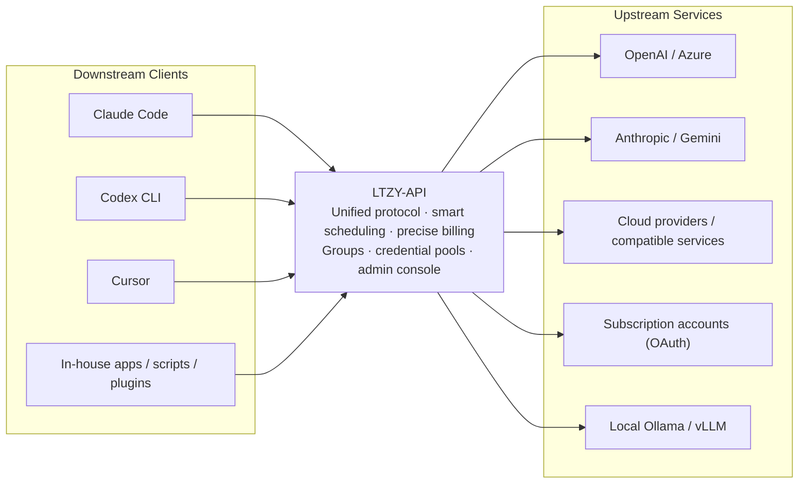
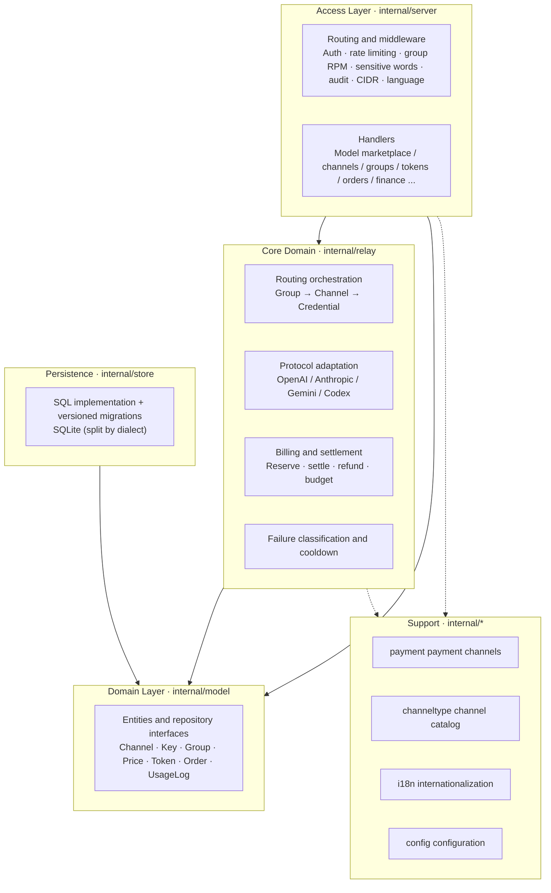
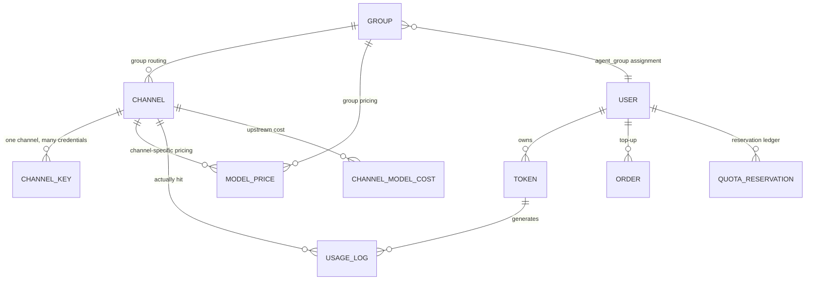
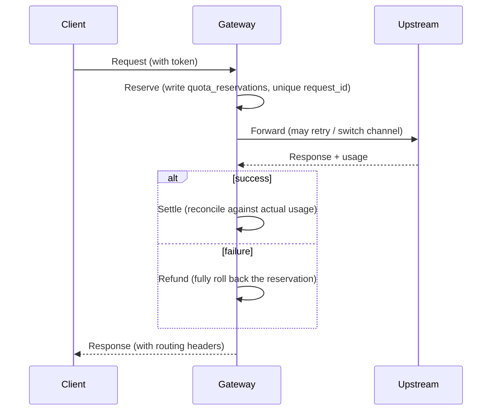

<div align="center">


# LTZY-API

**Bring every AI upstream you own into a single entry point.**

Self-hosted LLM Gateway · OpenAI-compatible API · AI usage management system


[简体中文](README.md) · [English](README.en.md) · [Français](README.fr.md) · [Русский](README.ru.md) · [Español](README.es.md) · [العربية](README.ar.md)

> Formerly known as **AQUA-API** — renamed to **LTZY-API** in Oct 2026. Old links redirect automatically.

</div>

---

## Official Address

| Channel | Address |
| --- | --- |
| Official website (live demo) | https://ltzy.top |
| Source repository | https://github.com/LTZY-ACU/LTZY-API |
| Issues | https://github.com/LTZY-ACU/LTZY-API/issues |

> **This repository is the sole authoritative source of the official address.** If the domain ever changes, it is updated here first and only then propagated anywhere else.
> As a result, bookmarking this repository is more reliable than bookmarking a domain.

### Anti-Impersonation Notice

- This project **does not provide and has not authorized** any "top-up on your behalf", "managed operation", or "official shared subscription" service. The server code is fully open source
  ([MIT License](LICENSE)), so anyone can self-host it — **being able to run it does not make it official**.
- Trust only the addresses in the table above. Any other domain is unrelated to this project, even if the interface looks identical.
- The official team will never privately message you to ask for your account password, payment credentials, or verification code.
- Using this project means you accept the [User Notice and Disclaimer](DISCLAIMER.md); for brand boundaries see the [Brand and Trademark Notice](TRADEMARK.md).
- Before contributing, read the [Contributing Guide](CONTRIBUTING.md) (Fork + PR model, `main` branch protected).

### Links Won't Open?

It is common for social apps (QQ / WeChat, etc.) to falsely flag sites like this. If it happens:

1. Switch browsers, or switch networks (mobile data ↔ home broadband) and try again;
2. **Share this repository's address instead of the bare domain** — links to code-hosting platforms are far less likely to be blocked,
   and the other party can confirm the latest official address from the repository itself;
3. If it is indeed a false flag, follow the platform's prompts to file an appeal.

> Questions are welcome in the community group: **QQ group 1103667832** (the "Join Group" entry at the top right of the site's home page).

---

## Table of Contents

- [Official Address](#official-address)
- [Disclaimer](#disclaimer)
- [What Is This](#what-is-this)
- [Why LTZY-API](#why-ltzy-api)
- [Feature Overview](#feature-overview)
- [Core Features](#core-features)
- [System Architecture](#system-architecture)
- [Core Data Model](#core-data-model)
- [Full Request Lifecycle](#full-request-lifecycle)
- [Supported Protocols and Upstreams](#supported-protocols-and-upstreams)
- [API Reference](#api-reference)
- [Permissions and Roles](#permissions-and-roles)
- [Billing and Accounting Details](#billing-and-accounting-details)
- [Tech Stack](#tech-stack)
- [Quick Start](#quick-start)
- [Configuration](#configuration)
- [Integration Examples](#integration-examples)
- [Operations Guide](#operations-guide)
- [Internationalization](#internationalization)
- [Security](#security)
- [Deployment and Capacity](#deployment-and-capacity)
- [FAQ](#faq)
- [Glossary](#glossary)
- [Roadmap](#roadmap)
- [Development](#development)
- [Contributing](#contributing)
- [License](#license)

---

## Disclaimer

**Before using this project, please read the [User Notice and Disclaimer](DISCLAIMER.md).**
This project is intended solely for lawful technical research and internal management; users must comply with
the laws and regulations of their jurisdiction and the terms of any upstream service they connect to.
The authors accept no liability for any loss arising from the use of this project.

For brand and trademark boundaries, see the [Brand and Trademark Notice](TRADEMARK.md).

---

## What Is This

LTZY-API is a **self-hosted LLM API gateway** and, at the same time, an **AI usage management system**.

The upstreams you hold are usually a jumble of mutually incompatible things: official OpenAI keys, Azure, Claude, Gemini, various cloud vendors,
all kinds of OpenAI-compatible services, subscription accounts (Claude / Codex / Gemini), and locally run Ollama / vLLM.
Your downstreams are various applications: Claude Code, Codex CLI, Cursor, in-house apps, scripts, and plugins.

LTZY-API sits in the middle and turns this jumble into **one entry point, one protocol, and one clear set of books**.



The core problems it solves come down to three words: **unified** (protocol and entry point), **reliable** (automatic failure avoidance), and **accountable** (every cent is traceable).

---

## Why LTZY-API

Gateways are plentiful; what is scarce is one you can trust with your books. Every row below was shaped by a real-world pitfall.

| Concern | Common practice | LTZY-API |
| --- | --- | --- |
| Upstream keys | Stored in plaintext; the console can read them back | Encrypted at rest with AES-256-GCM; the master key is injected only from an environment variable, so a compromised console cannot export plaintext |
| Encryption master key | Written into the config file alongside everything else | A field of the same name in the config file is ignored outright; it can only come from an environment variable, so it never leaks with the repository |
| Upstream failures | A few consecutive failures disable a key forever, shrinking the pool | Failure classification + half-open cooldown: rate limiting is only a temporary sidestep that auto-recovers on expiry; a credential is retired only when the upstream explicitly reports revocation |
| Retry policy | Retry everything, or retry nothing | Classified by failure type: 429 cools down and switches key, 5xx switches channel, 401/403 gets a long cooldown, moderation switches model, empty 200 degrades, and upstream `Retry-After` is honored |
| Rate limiting and concurrency | One global threshold; throttle one, throttle all | Metered per credential (weight / priority / per-minute cap / in-flight count); a group can set a requests-per-minute plan |
| Quota | Checked once before and once after a request; concurrency overspends | Reserve → settle → refund; available quota = quota − used − in-flight, so concurrency can never go negative |
| Periodic budget | Only a total quota; you find out you overspent after the fact | Token-level rolling-window budgets (daily / weekly / monthly); exceeding one trips an automatic breaker |
| Streaming billing | Reads only the first bytes of the response; a long answer bills 0 | Parses SSE incrementally, so `usage` is captured even when it arrives in the final frame of the stream |
| Protocols | OpenAI-compatible only | All three downstream protocols — OpenAI / Anthropic / Gemini — are supported, while upstream adapters are chosen by channel type |
| Audience segmentation | A key is a permission, so free and paid users cannot be separated | Groups decide available channels and prices, and a key may select a group: on the same upstream, free and paid audiences keep separate books |
| Reseller wholesale | Discounts tracked by hand; the books never reconcile | Reseller groups: the marketplace shows a struck-through list price plus a discounted price per reseller identity; the discount is the group multiplier, and the marketplace price and the actual charge come from the same source |
| Pricing flexibility | One price per model, impossible to change | Prices are configurable across three dimensions — model × group × channel; each ledger entry records a price-version snapshot, so old entries can be recomputed after a price change |
| Cost visibility | Revenue only; no idea whether it is profitable | True-cost reconciliation reports aggregate revenue, cost, and gross margin by group / channel / model, with wholesale prices costed both per-token and per-call |
| Operations | Someone has to watch for channels going down | A channel health panel plus automatic disabling by success rate; the admin console supports tightening access with a CIDR whitelist |
| Compliance | A one-line disclaimer is deemed enough | A site-wide compliance notice system: a policy section, model badges, a first-visit confirmation dialog, and a top-up page notice |
| Deployment | Requires a database, Redis, and a build toolchain | A single binary + SQLite, with the frontend embedded, zero CGO, and no gcc |

---

## Feature Overview

The full capability boundary in one table (details follow in later sections).

| Module | Capability |
| --- | --- |
| Protocol ingress | OpenAI-compatible · Anthropic · Gemini · Codex / Responses; all four inbound types can be enabled at once |
| Upstream adaptation | OpenAI-compatible · Azure OpenAI · Anthropic · Gemini · Codex · subscription accounts; 80 channel types are registered in the catalog, 39 of them implemented |
| Channel routing | Group routing · channel-level model branching · credential-level group and model branching · time-window rules · channel-level circuit-breaker skipping |
| Credential scheduling | Sequential / round-robin / weighted random / least-recently-used / fewest-in-flight; weight · priority · per-minute cap · in-flight count · cooldown deadline |
| Failure handling | Failure-classified retries · channel × model cooldown · exponential backoff · honoring `Retry-After` · session stickiness · half-open recovery |
| Billing | Usage-based (separate input / output / cache prices) · per-call · wildcard matching · channel-specific prices · group multiplier · price-version snapshot |
| Quota and risk control | Three-stage reserve / settle / refund · token- and user-level quotas · token periodic budgets (daily / weekly / monthly) · idempotent request ledger |
| Groups and resellers | Group entity · billing multiplier · unlock threshold · group RPM · admin-only distribution · reseller wholesale tiers and marketplace discounted prices |
| Payments and accounting | Manual / EPay / Stripe / official Alipay / official WeChat Pay · redemption codes · idempotent order crediting · late-payment backfill |
| User system | Registration · email-code login and password reset · session cookies · time-limited trial credit · referral rebates · daily check-in |
| Admin console | Model marketplace · channels and key pools · groups · prices · tokens · users · orders · redemption codes · usage logs · audit |
| Value-added features | Async tasks · corpus co-building · bulk email · site announcements · sensitive words · model mapping · OAuth subscription accounts |
| Observability | Channel health panel · retry-rate alerts · cost reconciliation reports · routing response headers · maintenance overview and backups |
| Security | Keys encrypted at rest · log redaction · CIDR whitelist · plaintext-retrieval audit · privilege-escalation protection |
| Internationalization | 6 languages on both the server and the frontend · this document is available in the six official UN languages |
| Deployment | Single binary · Docker · systemd · embedded frontend · maintenance-free SQLite |

---

## Core Features

### Gateway and Forwarding

- **Three downstream protocols**: OpenAI-compatible (`/v1/chat/completions`, `/v1/models`, `/v1/embeddings`),
  Anthropic (`/v1/messages`), and Gemini (`/v1beta`) — all three inbound protocols can take over their respective clients directly
- **Upstream adapters**: OpenAI-compatible, Azure OpenAI (deployment name + api-version), Anthropic, Gemini,
  Codex / Responses, and various subscription accounts
- **Unified intermediate representation**: everything converges internally on the OpenAI protocol (N×1); adding an upstream means writing only the "in", adding a downstream only the "out"
- **Bidirectional streaming conversion**: upstream Anthropic / Gemini SSE events ↔ OpenAI `chat.completion.chunk`, including tool calls
- **300-second upstream timeout**: long LLM answers are not cut off
- **Errors passed through verbatim**: real upstream errors (including RFC7807 `detail` and OpenAI `error.message`) are returned as-is, never swallowed
- **Observable routing response headers**: `X-Routed-Via` (the channel actually hit), `X-Fallback-Attempts` (number of fallback attempts), and
  `X-Upstream` (the actual upstream model name) — no packet capture needed to debug

### Credential Pools and Smart Scheduling

- **Five strategies**: sequential / round-robin / weighted random / least-recently-used / fewest-in-flight (default), switchable per channel
- **Per-credential parameters**: weight, priority, per-minute cap, in-flight count, and cooldown deadline, all tunable key by key in the console
- **Failure classification drives retries**:
  - `429`: switch key and place that key in a short cooldown (exponential backoff), honoring upstream `Retry-After`
  - `5xx` / timeout: retry on another channel
  - `401 / 403 / 402`: long cooldown (never retire rashly, to avoid a momentary risk-control glitch killing a good key)
  - content moderation block: switch model
  - `200` with empty content: treated as a failure and degraded
- **Channel × model cooldown**: a failure cools down only "this channel × this model" without dragging down other models on the same channel
- **Session stickiness**: the same session (`X-Session-Id`) sticks to the same credential to improve upstream cache hit rate, falling back automatically when the target fails
- **Channel-level circuit breaker**: when every credential on a channel is out of balance / quota, routing skips it proactively and logs the event, instead of selecting it and failing afterward
- **Multiple input modes**: single entry / bulk paste / all-in-one

### Billing and Accounting

- **Formula**: `quota = (input tokens × input price + output tokens × output price) / 1,000,000`, with per-call pricing also supported
- **Pricing rules**: matched by model name or wildcard pattern; attachable to a group, or given a dedicated price for a specific channel
- **Separate cache price**: tokens hitting the upstream cache are billed at their own unit price (falling back to the input price when unconfigured)
- **Quota safety**: the three-stage reserve + settle + refund flow, with an idempotent ledger guaranteeing "credited at most once"
- **Price-version snapshot**: each usage log records the pricing-rule version in force at the time, so old entries can still be recomputed at the old price after a change
- **Periodic budget**: a token can be set to "spend at most N quota per period", with lazy reset when the window expires, without relying on a scheduled job
- **Payment channels**: manual confirmation / EPay / Stripe / official Alipay (RSA2) / official WeChat Pay (APIv3 + platform-certificate signature verification + AES-GCM)
- **Order accounting**: callback signature verification, idempotent crediting, late-payment backfill, and manual order supplementing and closing
- **Redemption codes**: generated in bulk; concurrent redemption is a single-transaction atomic decrement, so 10 concurrent attempts on the same code succeed only once

### Groups, Pricing, and the Reseller System

- **A group is a first-class entity**: display name, billing multiplier, unlock threshold, and per-minute request cap
- **Admin-only groups**: wholesale prices / reseller tiers are completely invisible to regular users and can only be assigned by an administrator
- **Reseller wholesale tiers**: a user assigned to a reseller group sees their own tier's models and prices in the marketplace,
  displayed as a struck-through list price plus an orange discounted price
- **Marketplace price = actual charge**: the reseller marketplace price and the billing come from the same set of pricing rules
- **Group reference counting**: before deleting a group, you are told how many channels and pricing rules are affected
- **Public price estimation**: `GET /api/models/quote` (no login required) returns an estimated cost for a given token count

### Operations and Admin Console

- **Model marketplace**: faceted filtering + linked facet counts + search + sorting + both card and list views +
  a detail dialog (price table, effective time, runnable cURL, and cost estimator)
- **Channel management**: create, update, delete, connectivity liveness checks, a key-pool drawer, one-click fetching of the upstream model list, and upstream cost accounting (per-token / per-call)
- **Channel health panel**: success rate, number of keys in cooldown, and remaining balance at a glance; supports automatic disabling by success rate
- **Financial reconciliation reports**: aggregate revenue, cost, gross margin, and gross margin rate by group / channel / model
- **Retry-rate alerts**: for each discount group, track `r = upstream calls / billed requests` and alert when it crosses the break-even line
- **Tokens**: quota / expiry / model whitelist / owning group / periodic budget / audited plaintext retrieval
- **User system**: registration, email-code login and password reset, and issuing and expiring time-limited trial credit
- **Referrals and check-in**: invite codes, a ledger of registration and top-up rewards, and daily check-in
- **Site announcements / operation audit / sensitive words / SMTP / async tasks / bulk email / corpus co-building**
- **Other console areas**: model metadata and mapping, OAuth subscription accounts, and maintenance overview with database backups

### Frontend and Themes

- **Three themes**: light / dark / navy, switchable at any time with the preference persisted locally
- **Six-language interface**: 简体中文, English, Français, Русский, Español, العربية (with RTL layout)
- **Mobile**: bottom navigation, tables automatically degrading to cards, safe-area handling, and bottom-sheet dialogs

---

## System Architecture

A layered design with one-way dependencies; circular dependencies between packages under `internal/` are prohibited.



| Layer | Directory | Responsibility | What it does not do |
| --- | --- | --- | --- |
| Access layer | `internal/server` | Routing, middleware, request validation, DTO conversion | Does not write SQL directly and does not implement forwarding logic |
| Core domain | `internal/relay` | Routing, protocol conversion, forwarding, billing and settlement, failure handling | Is unaware of HTTP details and depends only on `model` interfaces |
| Domain layer | `internal/model` | Entity, rule, and repository-interface definitions | Does not write SQL and is unaware of HTTP |
| Persistence | `internal/store` | Repository implementations, migration execution, aggregate queries | Carries no business rules |
| Support | `payment` / `channeltype` / `i18n` / `config` | Payment adapters, channel catalog, copy, configuration | Does not depend back on the upper layers |

> Adding an upstream: register the type in `internal/channeltype/catalog.go`; if the protocol differs, add an adapter under `internal/relay/`.
> Adding a data table: create a new incrementally numbered script under `internal/store/migrations/sqlite/` (append-only, never modify),
> then sync the `model` entities and the `store` column list.

---

## Core Data Model



| Entity | Key fields | Description |
| --- | --- | --- |
| `model_groups` | `ratio` multiplier · `rpm_limit` per-minute cap · `unlock_min_recharge_cents` threshold · `admin_only` admin-only distribution | The carrier for audiences and reseller tiers; the multiplier is the discount |
| `channels` | `group_names` servable groups · `models` supported models · `key_strategy` scheduling strategy · retry and cooldown policy | "Whether this upstream can be used" |
| `channel_keys` | encrypted key · `group_names` / `models` branching · `weight` / `priority` / `rpm_limit` / `in_flight` · `cooldown_until` · subscription quota window | "Which key to use when going through this upstream" |
| `model_prices` | `model` · `group_name` · `channel_id` (0 = any channel) · input / cache / output / per-call price · billing method | Price lookup precedence: channel-specific price → group default price |
| `tokens` | `remain_quota` / `unlimited_quota` · `group_name` · `budget_quota` / `budget_period` / `budget_window_*` | Downstream credential + periodic budget |
| `quota_reservations` | `request_id` unique index · `status` state machine · `reserved` / `settled` | The idempotency gate, guaranteeing at-most-once crediting |
| `usage_logs` | actual channel / upstream model · token breakdown · `quota` · `price_version` price snapshot | The basis for reconciliation and recomputation |
| `channel_model_costs` | per-token / per-call cost rules | The input for cost reconciliation |
| `payment_orders` | `trade_no` · amount · state machine | Top-up orders |
| `users` | quota · `agent_group` reseller group · role | Account and reseller affiliation |

---

## Full Request Lifecycle

The path a single `/v1/chat/completions` call takes through the gateway, useful for debugging and for further development.

```mermaid
flowchart TD
    S["Client request"] --> P1["① Auth and rate limiting"]
    P1 --> P1a["TokenAuth: validate the token (enabled / expired / model whitelist / group)"]
    P1a --> P1b["Reserve quota (step one of reserve → settle → refund)"]
    P1b --> P1c["Group RPM gate (passes for free when rpm_limit = 0)"]
    P1c --> P1d["Upfront sensitive-word filtering"]

    P1d --> P2["② Routing"]
    P2 --> P2a["Filter available channels by group (enabled state / model support / time-window rules)"]
    P2a --> P2b["Channel-level circuit-breaker check: skip when every credential is out of balance"]
    P2b --> P2c["Pick a credential within the channel: failure cooldown + channel × model cooldown + session stickiness + five strategies"]

    P2c --> P3["③ Forwarding and adaptation"]
    P3 --> P3a["Inbound protocol → internal OpenAI representation → upstream adapter"]
    P3a --> P3b["Bidirectional streaming conversion (SSE frame level)"]
    P3b --> P3c["Failure-classified handling: 429 switch key / 5xx switch channel / moderation switch model / empty 200 degrade"]

    P3c --> P4["④ Write-back and accounting"]
    P4 --> P4a["Inject observability headers (X-Routed-Via / X-Fallback-Attempts / X-Upstream)"]
    P4a --> P4b["Settle quota: reconcile on success, full refund on failure"]
    P4b --> P4c["Write the usage log (actual channel / upstream model / price-version snapshot)"]
    P4c --> P4d["Update credential runtime state (last used / cooldown / failure count / balance)"]
```



---

## Supported Protocols and Upstreams

**Downstream (how applications connect to this site)**: OpenAI-compatible · Anthropic · Gemini

**Upstream (how this site connects to others)**: **80** channel types are registered in the catalog, organized into 8 categories:

| Category | Description |
| --- | --- |
| Text LLMs | OpenAI / Azure / Anthropic / Gemini / DeepSeek / Kimi / Zhipu / Tongyi / SiliconFlow / OpenRouter / Groq / Together / Mistral / xAI / Ollama / vLLM, etc. |
| Aggregators | Various aggregation relays |
| Subscription accounts | Claude / Codex / Gemini subscription accounts (OAuth refresh) |
| Self-hosted | Local and private deployments |
| Image | Image-generation upstreams |
| Video | Video-generation upstreams |
| Audio | Speech upstreams |
| Embedding | Embedding upstreams |

> **Honest disclosure**: of the 80 types, **39 already have a completed protocol adapter and authentication implementation** (`Available: true`) and can be selected directly;
> the rest are marked "coming soon" in the console and cannot be selected, so you never configure halfway only to find it will not work.
> The whitelist of implemented protocols and authentication methods is pinned by `internal/channeltype/catalog_test.go` to prevent mislabeling.

---

## API Reference

### Gateway Endpoints (Downstream Protocols)

| Method | Path | Description |
| --- | --- | --- |
| POST | `/v1/chat/completions` | OpenAI-compatible chat (streaming supported) |
| POST | `/v1/embeddings` | Embeddings |
| GET | `/v1/models` | List of available models |
| POST | `/v1/messages` | Anthropic protocol (Claude Code connects directly) |
| POST | `/v1/responses` | OpenAI Responses / Codex protocol |
| POST | `/v1beta/models/*action` | Gemini protocol |
| POST | `/v1/images/generations` | Image generation (OpenAI-compatible passthrough) |
| POST | `/v1/audio/speech` | Text-to-speech (binary audio stream passthrough) |
| POST | `/v1/audio/transcriptions` · `/v1/audio/translations` | Speech recognition / translation (multipart passthrough) |
| POST | `/v1/tasks` | Submit an async generation task |
| GET | `/v1/tasks` · `/v1/tasks/:ref` | Task list and detail |

### Public Endpoints (No Login Required)

| Method | Path | Description |
| --- | --- | --- |
| GET | `/healthz` | Health check (includes database and migration version) |
| GET | `/api/status` | Site info (includes quota exchange rate and compliance info) |
| GET | `/api/models` | Model marketplace (with reseller view) |
| GET | `/api/models/quote` | Public price estimation |
| GET | `/api/announcements` | Site announcements |
| GET | `/api/payment/public` | Public payment parameters |
| POST/GET | `/api/payments/:method/notify` | Payment callback (signature verification per channel) |
| GET | `/sitemap.xml` · `/robots.txt` | SEO |

### Account Endpoints

| Method | Path | Description |
| --- | --- | --- |
| POST | `/api/auth/register` | Registration |
| POST | `/api/auth/login` · `/api/auth/admin-login` | Password login / admin console login |
| POST | `/api/auth/email-code` · `/api/auth/email-login` | Email verification code and code-based login |
| POST | `/api/auth/password-reset` | Reset password |
| GET | `/api/install/status` · POST `/api/install` | Installation wizard |
| GET | `/api/auth/me` · POST `/api/auth/logout` | Current identity / logout |

### User Portal `/api/user`

Token CRUD and plaintext retrieval (`/tokens`, `/tokens/:id/key`), selectable groups (`/groups`), usage and logs
(`/usage`, `/logs`), tasks (`/tasks`), orders (`/orders`, `/orders/:tradeNo`), redemption (`/redeem`),
referrals and rewards (`/referral`, `/referral/rewards`), check-in (`/checkin`), a finance overview (`/finance`),
and trial credit (`/trial`).

### Admin Console `/api/admin`

| Group | Representative endpoints |
| --- | --- |
| Overview | `/dashboard` · `/maintenance/overview` · `/maintenance/backup` |
| Channels | `/channels` CRUD · `/channels/:id/test` liveness check · `/channels/:id/keys` key pool · `/channels/:id/costs` cost · `/channels/:id/mappings` model mapping · `/fetch-models` fetch models · `/channel-types` |
| Groups and pricing | `/groups` CRUD · `/prices` CRUD · `/prices/quote` estimation |
| Tokens and users | `/tokens` CRUD and plaintext · `/users` CRUD |
| Content and operations | `/announcements` · `/broadcasts` bulk send · `/sensitive-words` · `/corpus/*` corpus · `/trial-grants` |
| Accounting | `/orders` · `mark-paid` / `close` · `/redeem-codes` · `/finance/reconciliation` cost reconciliation |
| System | `/settings` · `/smtp` and test sending · `/oauth-providers` · `/audit-logs` · `/logs` · `/tasks` |

> The complete set of 140+ endpoints is defined by `internal/server/router.go`; admin endpoints are protected by session authentication by default,
> with an optional CIDR whitelist on top.

---

## Permissions and Roles

| Role | Identity | Visibility | Typical capabilities |
| --- | --- | --- | --- |
| Guest | Not logged in | Model marketplace (public prices), public estimation, announcements | Learn prices, estimate costs |
| Regular user | Session cookie | Own tokens / usage / orders / referrals / check-in | Create tokens, top up, view bills |
| Reseller user | User assigned an `agent_group` | The marketplace shows their own tier's models and discounted prices | Calls billed at the wholesale discount |
| Administrator | Administrator role | The entire console (with optional CIDR whitelist) | Channels, pricing, users, orders, finance |
| Super administrator | Created by the installation wizard | The entire console + system settings and maintenance | Site configuration, backups, SMTP, OAuth |

> Privilege-escalation protection: plaintext token retrieval requires an ownership check plus an audit record; a reseller tier is visible only to its owner;
> switching a token's group requires validating "the group exists + the user has met the unlock threshold".

---

## Billing and Accounting Details

### Quota Formula

```
Usage-based: quota = (input tokens × input price + cache tokens × cache price + output tokens × output price) / 1,000,000
Per-call: quota = per-call price × count
Actual charge = quota × group multiplier / 100
```

All amounts use **int64 integer "quota"** throughout, converted to RMB by the site's exchange rate only at the presentation layer, eliminating floating-point drift.
Free models / unpriced models **skip the reservation** and are never blocked by the quota wall.

### Three-Stage Settlement



### Pricing Precedence

```
Channel-specific price (channel_id = that channel)   ← highest
        ↓ otherwise falls back to
Group default price (channel_id = 0)
```

### Cost and Gross Margin

```
Gross margin = sales revenue (quota actually charged to users) − upstream cost (costed by channel cost rules)
```

Cost reconciliation reports aggregate by group / channel / model; **requests with no recorded cost are flagged separately**,
otherwise that portion of cost counts as 0 and the report skews optimistic.

---

## Tech Stack

| Layer | Selection | Description |
| --- | --- | --- |
| Backend | Go 1.27 + Gin v1.12 | Single binary, zero CGO (SQLite uses the pure-Go `modernc.org/sqlite`) |
| Database | SQLite | Embedded and maintenance-free; migration scripts are split by dialect, leaving room for extension |
| Frontend | Next.js 16.3 (static export) + React 19 + Tailwind CSS v4 + TypeScript 5 | Build output `web/dist` is embedded into the binary via `go:embed` |
| Charts | ECharts 5 | Console statistics charts |

<div align="center">


</div>

> The frontend uses `output: 'export'` static export and has **no separate frontend hosting**: the UI and the API share the same origin and port,
> so deployment needs only a single binary.

---

## Quick Start

> This section only covers the shortest path. **The complete deployment guide** (production systemd setup, Nginx/Caddy reverse proxy with HTTPS, upgrade & rollback, CLI and environment variable reference, FAQ) is available in [DEPLOYMENT.md](DEPLOYMENT.md) (in Chinese).

### Option 1: Docker Compose (Recommended)

```bash
git clone https://github.com/LTZY-ACU/LTZY-API.git && cd LTZY-API
cp .env.example .env

docker build -t ltzy-api:local .          # First build (frontend + backend + runtime image)
docker run --rm ltzy-api:local -gen-key   # Print a master key and put it into AQUA_APP_KEY in .env

docker compose up -d
```

Open `http://127.0.0.1:8787` in a browser. Data lands in `./data` on the host; to migrate servers, just package that directory.

### Option 2: docker run (Without Compose)

```bash
docker build -t ltzy-api:local .

docker run -d --name ltzy-api \
  -p 8787:8787 \
  -e AQUA_APP_KEY="<your master key>" \
  -e AQUA_SERVER_LISTEN=0.0.0.0:8787 \
  -v "$PWD/data:/data" \
  --restart unless-stopped \
  ltzy-api:local
```

### Option 3: Single Binary (Linux Server / systemd)

```bash
go build -o aqua ./cmd/ltzy           # Pure Go, zero CGO, no gcc required

./aqua -gen-key                        # Generate the encryption master key (generate only, never written to disk)

sudo useradd -r -s /usr/sbin/nologin aqua
sudo mkdir -p /opt/aqua /etc/aqua /var/lib/aqua
sudo cp aqua /opt/aqua/aqua && sudo chown aqua:aqua /opt/aqua/aqua

sudo cp .env /etc/aqua/aqua.env        # Fill in the real key
sudo chmod 600 /etc/aqua/aqua.env && sudo chown root:root /etc/aqua/aqua.env

sudo cp aqua-api.service /etc/systemd/system/
sudo systemctl daemon-reload && sudo systemctl enable --now aqua-api
sudo systemctl status aqua-api
```

**Upgrade**: replace `/opt/aqua/aqua` and run `sudo systemctl restart aqua-api`; database migrations run automatically at startup.

> It is advisable to keep the previous binary (for example `aqua.bak-<timestamp>`). Rolling back is just a `cp` of the old file followed by a restart;
> database migrations only add columns and never drop them, so they are forward-compatible.

### Option 4: Run from Source (Development)

```bash
# Frontend (optional: web/dist in the repo is a placeholder; the real UI is only embedded after a build)
cd web && npm ci && npm run build && cd ..

go build -o bin/aqua ./cmd/ltzy
export AQUA_APP_KEY="<your master key>"      # Windows: $env:AQUA_APP_KEY="..."
./bin/aqua -config ./aqua.json          # Without -config, defaults and environment variables are used
curl http://127.0.0.1:8787/healthz
```

> **The frontend is embedded**: `go:embed` packs `web/dist` into the binary, so deployment needs a single file.
> If you run `go build` without building the frontend, the UI is a placeholder page, but the API remains fully functional.

### First Use (Installation Wizard)

Opening the site for the first time launches the installation wizard: create a super-administrator account → fill in site information → (optionally) configure payment and email channels.
You can also log into the admin panel from a separate console entry point.

### Reverse Proxy

When serving externally, put Nginx or Caddy in front and enable HTTPS. Two common pitfalls:

```nginx
location / {
    proxy_pass http://127.0.0.1:8787;
    proxy_http_version 1.1;

    # 1) Buffering must be off for streaming, or the frontend waits for the whole generation before showing text
    proxy_buffering off;
    proxy_cache off;

    # 2) The timeout must exceed the gateway's upstream timeout (default 300s), or a long answer is cut off by the reverse proxy first
    proxy_read_timeout 600s;
    proxy_send_timeout 600s;

    proxy_set_header Host $host;
    proxy_set_header X-Real-IP $remote_addr;
    proxy_set_header X-Forwarded-For $proxy_add_x_forwarded_for;
    proxy_set_header X-Forwarded-Proto $scheme;
}
```

> If the domain sits behind Cloudflare's orange-cloud proxy, note that CF origin fetches have a hard 100-second limit and return 524 beyond it.
> To fully use the 300-second timeout, add a grey-cloud (DNS only) record that connects directly to the origin.

---

## Configuration

Precedence: **defaults < config file < environment variables**.

### Environment Variables

| Variable | Required | Description |
| --- | --- | --- |
| `AQUA_APP_KEY` | Yes | Encryption master key; it can only come from an environment variable (a field of the same name in the config file is ignored). Generate it with `aqua -gen-key` |
| `AQUA_SERVER_LISTEN` | No | Listen address, default `127.0.0.1:8787`; inside a container it must be `0.0.0.0:8787` |
| `AQUA_SERVER_MODE` | No | `debug` / `release` / `test` |
| `AQUA_DATABASE_DRIVER` | No | Currently `sqlite` |
| `AQUA_DATABASE_DSN` | No | SQLite file path, default `./data/aqua.db` (the parent directory is created automatically) |
| `AQUA_RELAY_GROUP` | No | The gateway's default group (which group tokens without a group use), default `default` |
| `AQUA_ADMIN_ALLOW_CIDRS` | No | Admin console access whitelist, comma-separated CIDRs (e.g. `10.0.0.0/8,1.2.3.4/32`). Empty means unrestricted |
| `AQUA_CHANNEL_AUTO_DISABLE_MIN_REQUESTS` | No | Minimum sample size for automatic channel disabling; `0` turns it off (disabled by default) |
| `AQUA_CHANNEL_AUTO_DISABLE_SUCCESS_RATE` | No | Success-rate floor (e.g. `0.9`); a channel is disabled when it falls below this with enough samples |
| `AQUA_CHANNEL_AUTO_DISABLE_WINDOW_MINUTES` | No | Statistical window (minutes) |
| `AQUA_SMTP_HOST` | No | SMTP server address (for email codes and notifications; can also be configured in the console) |
| `AQUA_SMTP_PORT` | No | SMTP port, default `465` |
| `AQUA_SMTP_USERNAME` | No | SMTP username |
| `AQUA_SMTP_PASSWORD` | No | SMTP password; it can only come from an environment variable |
| `AQUA_SMTP_FROM` | No | Sender address |
| `AQUA_SMTP_FROM_NAME` | No | Sender display name, default `LTZY-API` |
| `AQUA_EPAY_KEY` | No | EPay merchant key (MD5 signature) |
| `AQUA_STRIPE_SECRET_KEY` | No | Stripe Secret Key |
| `AQUA_STRIPE_WEBHOOK_SECRET` | No | Stripe Webhook signing secret |
| `AQUA_ALIPAY_PRIVATE_KEY` | No | Alipay application private key (RSA2; supports PEM and raw base64) |
| `AQUA_ALIPAY_PUBLIC_KEY` | No | Alipay public key |
| `AQUA_WECHATPAY_APIV3_KEY` | No | WeChat Pay APIv3 key (32 bytes) |
| `AQUA_WECHATPAY_PRIVATE_KEY` | No | WeChat Pay merchant private key (PEM) |
| `AQUA_WECHATPAY_PLATFORM_PUBLIC_KEY` | No | WeChat Pay platform certificate public key, used to verify callback signatures |
| `AQUA_LOG_LEVEL` | No | `debug` / `info` / `warn` / `error` |
| `AQUA_LOG_FORMAT` | No | `text` / `json` |

See [`.env.example`](.env.example) for a complete example.

### Config File

```json
{
  "server":   { "listen": "127.0.0.1:8787", "mode": "release" },
  "database": { "driver": "sqlite", "dsn": "./data/aqua.db" },
  "log":      { "level": "info", "format": "text" }
}
```

### Two Security Rules

1. **Key-like configuration never enters the database.** Payment, SMTP, and the encryption master key can only be injected via environment variables; only operational parameters
   (gateway address, merchant IDs, exchange rates, limits, toggles) go into the database and can be edited in the console. Even if the database is dumped entirely,
   not a single directly usable credential is exposed.
2. **Always back up the master key separately.** Once it changes, every upstream key in the database can no longer be decrypted and must be re-entered.

---

## Integration Examples

Any OpenAI-compatible client works: point its Base URL here and replace the key with an LTZY-API token.

### curl

```bash
curl https://your-domain/v1/chat/completions \
  -H "Authorization: Bearer sk-your-token" \
  -H "Content-Type: application/json" \
  -d '{
    "model": "your-model-name",
    "messages": [{"role": "user", "content": "Hello"}],
    "stream": true
  }'
```

### OpenAI SDK (Python)

```python
from openai import OpenAI

client = OpenAI(
    base_url="https://your-domain/v1",
    api_key="sk-your-token",
)
resp = client.chat.completions.create(
    model="your-model-name",
    messages=[{"role": "user", "content": "Hello"}],
)
print(resp.choices[0].message.content)
```

### Claude Code / Anthropic Clients

LTZY-API natively supports the Anthropic protocol and can take over Claude Code's traffic directly:

```bash
export ANTHROPIC_BASE_URL=https://your-domain
export ANTHROPIC_AUTH_TOKEN=sk-your-token
claude
```

### Other Clients

For Cursor, Codex CLI, Cherry Studio, NextChat, LobeChat, Immersive Translate, and the like, choose
"OpenAI-compatible / custom OpenAI endpoint" and fill in the Base URL and token above.

### Cost Estimation (No Token Required)

```bash
curl "https://your-domain/api/models/quote?model=your-model-name&prompt_tokens=1000&completion_tokens=500"
```

---

## Operations Guide

### How Groups and Channels Relate

- **A channel** decides "whether this request can use this upstream": which models it claims to support and which groups it belongs to.
- **A credential** (each key under a channel) decides "which key to use when going through this upstream", and can further restrict which groups and models it serves.
- **A token** may specify its group; if it does not, it falls into the gateway's default group (`AQUA_RELAY_GROUP`).

> The most common pitfall: after moving a channel to a new group, forgetting to sync the default group makes every
> "token without a group" immediately report "no available channel".

### How to Configure a Reseller Wholesale Tier

1. In the console's "Groups", create a reseller tier (e.g. `agent`), set its billing multiplier to the wholesale discount
   (e.g. `60` meaning 60% of the list price), and turn on "admin-only distribution";
2. In "Prices", configure a price list for that reseller tier, or reuse the same rules and let the multiplier apply the discount;
3. In "Users", assign the reseller account's `agent_group` to that tier;
4. After the reseller logs in, the model marketplace automatically switches to their tier, showing a struck-through list price plus a discounted price, from the same source as the actual charge.

### Quota and Budget

- **Total quota**: at both the token and user levels, where `-1` means unlimited;
- **Periodic budget**: set "spend at most N yuan per period" on a token, with the period chosen from daily / weekly / monthly; exceeding it within the window returns 429,
  and it resets automatically when the window expires.

### Channel Governance Recommendations

- Keep at least 3 keys per channel to avoid a single-point rate limit;
- For upstreams that throttle easily, lower the per-key per-minute cap and let the scheduler rotate keys;
- Watch the channel health panel for success rates; enable automatic disabling by success rate when needed;
- Periodically review requests marked "no recorded cost" to keep cost reports trustworthy.

---

## Internationalization

| Aspect | Support | Description |
| --- | --- | --- |
| Frontend UI | 简体中文 · English · Français · Русский · Español · العربية | Six languages, including RTL layout |
| Server-side copy | The same six | Error messages localized by `Accept-Language` |
| This document | The same six | See the language switcher in the header |

> This document covers the **six official languages of the United Nations** (Chinese, English, French, Russian, Spanish, and Arabic).
> If you need only some of them, delete the corresponding `README.<language>.md` and the rest are unaffected.

---

## Security

- **Keys encrypted at rest**: upstream keys are encrypted with AES-256-GCM and the master key is injected only from an environment variable (a field of the same name in the config file is ignored)
- **Log redaction**: logs output only "whether a credential was injected" plus the upstream host and path, not even the query string
- **CIDR whitelist**: `AQUA_ADMIN_ALLOW_CIDRS` restricts admin-console sources; anything outside the whitelist is rejected
- **Plaintext-retrieval audit**: token plaintext goes through a dedicated endpoint and writes an audit log (who, when, and which one)
- **Privilege-escalation protection**: a reseller tier is visible only to its owner; switching a token's group validates existence and the unlock threshold; a mismatched owner uniformly returns 404
- **Idempotency**: the request ledger uses a `request_id` unique index as a gate, so retries / disconnects / duplicate callbacks credit at most once
- **Passwords and sessions**: passwords are salted and hashed; sessions use server-verified signed cookies
- **Content safety**: upfront sensitive-word filtering plus word-list management
- **Backups**: a database backup and backup-file verification entry point

---

## Deployment and Capacity

| Scenario | Recommendation |
| --- | --- |
| Local trial | Run the single binary directly with SQLite in `./data` |
| Single-host production | Managed by systemd + Nginx/Caddy reverse proxy + HTTPS; keep the previous binary for rollback |
| Containerized | Multi-stage Dockerfile; mount a `/data` volume; inject keys via environment variables |
| Backups | Stop the service and copy, or hot-back-up `aqua.db` with `VACUUM INTO`, and **back up `AQUA_APP_KEY` as well** |
| Capacity | Single-host SQLite is sufficient for small-to-medium scale; the storage layer already leaves a dialect seam for a smooth migration to an external database later |
| Scaling | The gateway is stateless and can run multiple instances, but **session stickiness is in-process**, degrading to best-effort across instances |

---

## FAQ

**What should I do if `/healthz` returns 503?**
It returns 503 when the database is unavailable. Check the logs for database errors; in the SQLite case, check the data-directory permissions first.

**Why can't I see channel key plaintext in the console?**
This is by design. Keys are stored as AES-256-GCM ciphertext and the UI shows only a mask, so a compromised console cannot export usable credentials.
To rotate a key, simply overwrite it with the new one.

**After moving a channel to a new group, every token reports "no available channel"?**
This is the easiest pitfall to hit. The gateway has a default group (`AQUA_RELAY_GROUP`) that decides where
"tokens without a group" look for channels. After migrating a channel to a new group, you must update this default group accordingly and restart, or old tokens immediately lose access.

**Why is a free model still blocked by the quota?**
A model matching no pricing rule skips the reservation and normally should not be blocked. If it is, check whether a wildcard pricing rule
(such as `*`) is configured for the group, which makes the model "priced" and thus subject to the quota check.

**Frequent 429s or timeouts from upstream?**
A 429 is a credential-level failure: the gateway retries with another key and places that key in a short cooldown (exponential backoff, auto-recovering on expiry).
If it happens often, there are usually too few keys or the upstream rate limit is low; add keys to the channel or lower the per-key per-minute cap.

**A group has a per-minute cap and users are getting 429s — what now?**
The response body's `error.code` is `quota.group_rpm_exceeded`, indicating the group's per-minute cap.
Raise the cap or move the user to a group without a rate limit.

**A reseller says "I see the discounted price but I'm charged the list price"?**
Normally this cannot happen: the reseller marketplace price and the billing come from the same set of pricing rules. Check two things:
first, that the reseller account's `agent_group` is indeed assigned to that reseller tier; second, that the group chosen when the reseller created the token is that tier.
If both are correct and it still mismatches, please file an Issue.

**How do I back up data?**
In the SQLite case: stop the service (or hot-back-up with `VACUUM INTO`) → copy `aqua.db` → also back up `AQUA_APP_KEY`.
Without the master key, the upstream keys in the backup are just a pile of undecryptable bytes.

**Is MySQL or PostgreSQL supported?**
Currently SQLite is the default and the only supported option, which already covers self-hosted and small-to-medium scenarios. The storage layer has left a dialect seam,
so adding another database later does not require rewriting the business layer.

**How do I add a new upstream channel type?**
Register the type metadata in `internal/channeltype/catalog.go` and confirm it falls within the implemented whitelist in `catalog_test.go`.
If the protocol differs, add an adapter under `internal/relay/`.

**Why can't I see my configured upstream keys in the logs?**
This too is by design: logs output only "whether a credential was injected" plus the upstream host and path, not even the URL's query string.

**How do I know which channel a request used and how many fallbacks it went through?**
The response headers carry `X-Routed-Via`, `X-Fallback-Attempts`, and `X-Upstream`; the usage log also records the actual channel and upstream model name.

---

## Glossary

| Term | Meaning |
| --- | --- |
| Channel | One upstream service (including base_url, protocol, authentication, and available models) |
| Channel Key | An upstream key under a channel; weight, rate limit, and availability scope can be set independently |
| Group | The carrier for audiences and prices; decides available channels and the billing multiplier |
| Reseller tier | An admin-only group whose multiplier expresses the wholesale discount |
| Quota | The site's accounting unit (an integer); converted to RMB by the exchange rate only for display |
| Token | The API key issued for downstream use (starting with `sk-`) |
| Reserve · Settle · Refund | The three-stage quota flow that prevents overspending under concurrency |
| Periodic budget | A token's quota cap over a day / week / month, tripping a breaker when exceeded |
| Cooldown | A temporarily unavailable credential state that auto-recovers on expiry |
| Retire | A permanently unavailable credential (only when the upstream explicitly reports revocation) |
| Circuit-breaker skip | Proactively skipping a channel when the whole channel is unavailable |
| Price-version snapshot | The pricing-rule version recorded at accounting time, used for later recomputation |
| Cost | The upstream procurement cost, used for gross-margin reconciliation |
| Routing response headers | `X-Routed-Via` and the others, used to observe the actual routing and fallbacks |

---

## Roadmap

- [x] Protocol interconversion (OpenAI ↔ Anthropic ↔ Gemini), bidirectional streaming conversion including tool calls
- [x] Five credential-pool scheduling strategies, half-open cooldown, session stickiness, in-flight counting
- [x] The reserve / settle / refund quota system; incremental parsing of streaming usage
- [x] Groups and multipliers, model marketplace, redemption codes, five payment channels, async tasks
- [x] Single-binary + Docker deployment with an embedded frontend
- [x] Browser installation wizard + a separate super-admin entry point; admin operation audit and site announcements
- [x] Email-code login and password reset; referral rebates and check-in; time-limited trial credit
- [x] Failure-classified retries, channel × model cooldown, and honoring upstream `Retry-After`
- [x] Token rolling-window budgets (daily / weekly / monthly)
- [x] Group requests-per-minute plans (RPM) and channel-level balance circuit-breaker skipping
- [x] Reseller wholesale tiers with marketplace discounted-price display and a public price-estimation endpoint
- [x] True-cost reconciliation reports (revenue − cost − margin) and price-version snapshots
- [x] Channel health panel with automatic disabling by success rate and an admin-side CIDR whitelist
- [x] Three themes (light / dark / navy) and a site-wide compliance notice system
- [x] AWS Bedrock and Google Vertex signature authentication (SigV4 / service-account JWT)
- [x] A generic async task upstream adapter (template-driven, works with any image / video / music generation service); vendor-specific adapters are added on demand
- [x] A UI for entering channel-specific prices (model × group × channel)
- [x] Visualization of subscription-account quota windows (dual 5-hour / weekly windows)

---

## Development

```bash
go build ./...       # Compile
go test ./...        # Test
gofmt -w .           # Format

cd web && npm ci && npm run type-check && npm run build   # Frontend
```

Directory structure (the repository root is the code directory):

```
cmd/ltzy/              Program entry point (assembly only, no business logic)
internal/config/       Configuration loading and validation
internal/model/        Domain models and repository interfaces (no SQL)
internal/store/        Persistence implementation (SQL + versioned migrations, split by dialect)
internal/server/       HTTP layer (routing / middleware / handlers)
internal/relay/        Protocol adaptation and forwarding (core domain: routing / billing / cooldown)
internal/payment/      Payment channel adapters
internal/channeltype/  Upstream/downstream type registry (80 types)
internal/i18n/         Server-side multilingual copy
web/                   Frontend (Next.js; build output embedded into the binary)
assets/                Documentation badges and icons
Dockerfile             Multi-stage build: frontend → backend → minimal runtime image
aqua-api.service       systemd unit (bare-metal deployment)
```

### Engineering Conventions (Mandatory)

1. **Small, incremental commits**: commit immediately after each independently describable step; do not save everything for one final commit;
   every commit should compile and be revertible. The full commit timeline is the evidence chain of the project's creation process, so squashing is prohibited.
2. **Comments as structured documentation**: at the top of every source file, write the three parts "intent / flow / extension",
   describing what the code does, how data flows, and where to extend it; write only technical reasons, not personal reflections.
3. **Keys never enter the database, the disk, or the logs** — see "Two Security Rules" above.
4. **Originality red line**: reading, researching, and learning from any public project (including reference implementations) to understand features and algorithmic ideas
   is allowed; but verbatim copying of its code, comments, constant tables, or naming style is prohibited. The test is simple:
   can you independently explain the design trade-offs of this implementation without the reference project?

See [`AGENTS.md`](AGENTS.md) and [`CONTRIBUTING.md`](CONTRIBUTING.md) for details.

---

## Contributing

- The `main` branch is protected and only maintainers can push to it; external contributions always go through Fork + Pull Request.
- On your fork you can freely develop on any number of `feature/*` and `fix/*` branches,
  and when you want to merge into the main repository, open a PR to be reviewed and merged (no squash, preserving the commit timeline).
- Commit conventions, the verification checklist, and Issue / PR templates are in [CONTRIBUTING.md](CONTRIBUTING.md).

---

## License

The source code is licensed under the [MIT License](LICENSE).

> Subject to compliance with the license, you may freely copy, use, modify, and distribute this software, including for commercial purposes;
> redistribution must retain the copyright and license notices. The license grants no trademark rights.

Companion files:

| File | Purpose |
| --- | --- |
| [LICENSE](LICENSE) | Full license text (MIT License) |
| [DISCLAIMER.md](DISCLAIMER.md) | User notice and disclaimer |
| [TRADEMARK.md](TRADEMARK.md) | Brand and trademark notice |
| [NOTICE](NOTICE) | Copyright notice, originality time anchors, and distribution obligations |
| [CONTRIBUTING.md](CONTRIBUTING.md) | Contribution guide (Fork + PR collaboration model) |
| [AGENTS.md](AGENTS.md) | Code guide (for AI assistants and developers) |

---

<div align="center">

**If this project saved you time on reconciliation, a Star is welcome ⭐**

[Live Demo](https://ltzy.top) · [Open an Issue](https://github.com/LTZY-ACU/LTZY-API/issues) · [GitHub](https://github.com/LTZY-ACU/LTZY-API) · [English](README.en.md)

</div>
