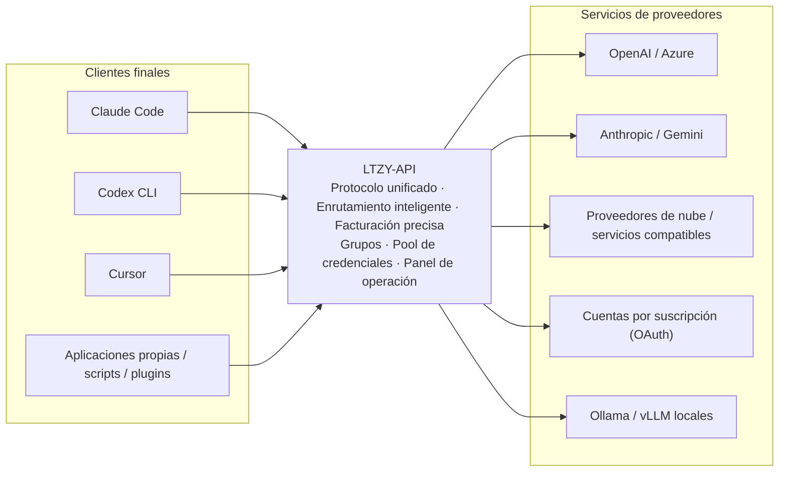
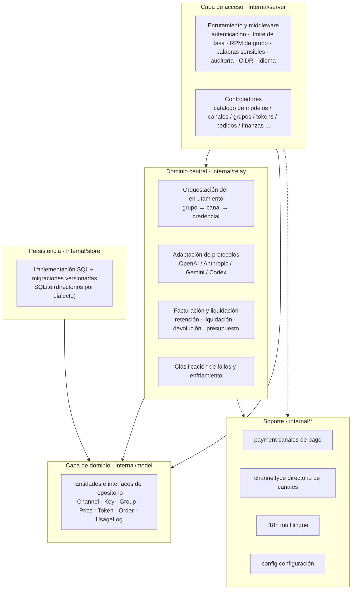
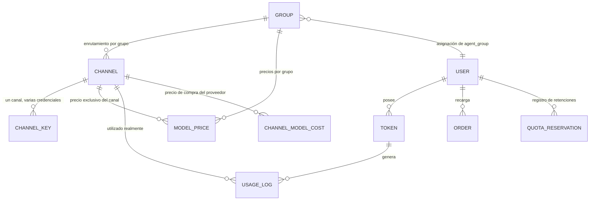
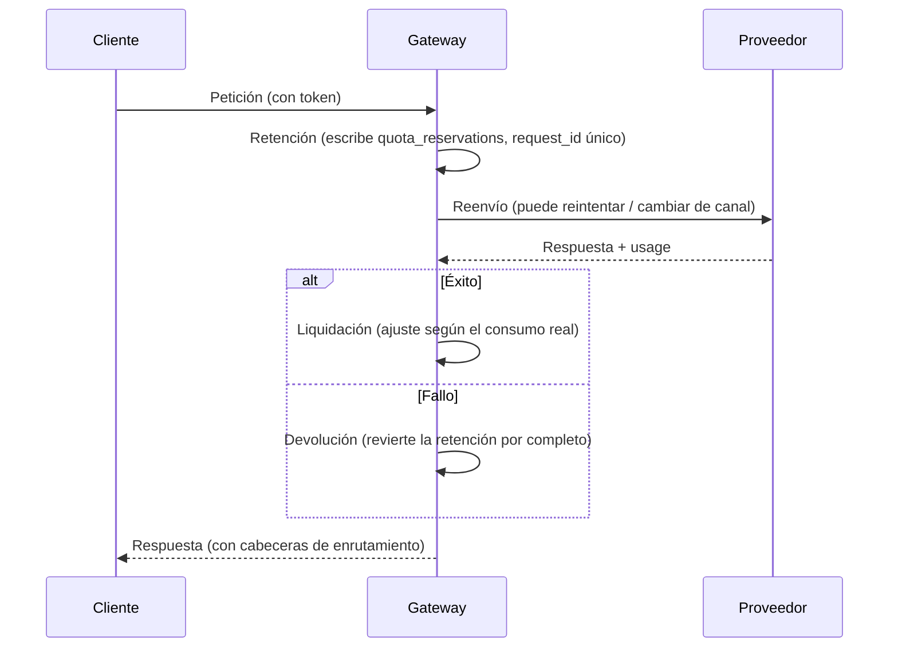

<div align="center">


# LTZY-API

**Todos tus proveedores de IA, bajo un solo punto de entrada.**

Gateway de API LLM autoalojado · Sistema de gestión del uso de IA

Self-hosted LLM Gateway · OpenAI-compatible API


[简体中文](README.md) · [English](README.en.md) · [Français](README.fr.md) · [Русский](README.ru.md) · [Español](README.es.md) · [العربية](README.ar.md)

> Anteriormente conocido como **AQUA-API** — renombrado a **LTZY-API** en octubre de 2026. Los enlaces antiguos redirigen automáticamente.

</div>

---

## Direcciones oficiales

| Canal | Dirección |
| --- | --- |
| Sitio oficial (demostración en línea) | https://ltzy.top |
| Repositorio de código | https://github.com/LTZY-ACU/LTZY-API |
| Reportar un problema (Issues) | https://github.com/LTZY-ACU/LTZY-API/issues |

> **Este repositorio es la única fuente autoritativa de las direcciones oficiales.** Si el dominio cambia,
> se actualizará aquí primero y después se sincronizará en cualquier otro lugar.
> Por eso, guardar este repositorio es más fiable que guardar un dominio.

### Aviso antifalsificación

- Este proyecto **no ofrece ni autoriza** ningún servicio de «recarga por terceros», «gestión delegada»
  o «suscripción compartida oficial». El código del servidor es totalmente abierto
  ([Licencia MIT](LICENSE)) y cualquiera puede autoalojarlo —— **que funcione no significa que sea oficial**.
- Solo son válidas las direcciones de la tabla anterior. Cualquier otro dominio, aunque su interfaz sea idéntica, no tiene relación con este proyecto.
- El equipo oficial nunca solicitará por chat tu contraseña, tu clave de pago ni códigos de verificación.
- El uso de este proyecto implica la aceptación de la [Guía para el usuario y exención de responsabilidad](DISCLAIMER.md); los límites de marca se detallan en la [Declaración de marca y marcas comerciales](TRADEMARK.md).
- Antes de contribuir, lee la [Guía de contribución](CONTRIBUTING.md) (modelo Fork + PR, rama `main` protegida).

### ¿Los enlaces no abren?

Es habitual que el software de mensajería (QQ, WeChat, etc.) bloquee estos sitios por error. Si te ocurre:

1. Cambia de navegador o de red (datos móviles ↔ banda ancha doméstica) y vuelve a intentarlo;
2. **Comparte la dirección de este repositorio en lugar del dominio directo** —— los enlaces a plataformas
   de alojamiento de código tienen mucha menos probabilidad de ser bloqueados, y la otra persona podrá
   confirmar por sí misma desde el repositorio la dirección más reciente del sitio oficial;
3. Si confirmas que es un bloqueo erróneo, envía una apelación siguiendo las indicaciones de la plataforma.

> Si tienes problemas, únete al grupo de intercambio: **grupo de QQ 1103667832** (entrada «Unirse al chat» en la esquina superior derecha de la página de inicio).

---

## Índice

- [Direcciones oficiales](#direcciones-oficiales)
- [Exención de responsabilidad](#exención-de-responsabilidad)
- [Qué es esto](#qué-es-esto)
- [Por qué elegirlo](#por-qué-elegirlo)
- [Visión general de funciones](#visión-general-de-funciones)
- [Características principales](#características-principales)
- [Arquitectura del sistema](#arquitectura-del-sistema)
- [Modelo de datos principal](#modelo-de-datos-principal)
- [Ciclo de vida completo de una petición](#ciclo-de-vida-completo-de-una-petición)
- [Protocolos y proveedores compatibles](#protocolos-y-proveedores-compatibles)
- [Resumen de la API](#resumen-de-la-api)
- [Permisos y roles](#permisos-y-roles)
- [Reglas de facturación y contabilidad](#reglas-de-facturación-y-contabilidad)
- [Stack tecnológico](#stack-tecnológico)
- [Inicio rápido](#inicio-rápido)
- [Configuración](#configuración)
- [Ejemplos de integración](#ejemplos-de-integración)
- [Guía de operación](#guía-de-operación)
- [Internacionalización](#internacionalización)
- [Seguridad](#seguridad)
- [Despliegue y capacidad](#despliegue-y-capacidad)
- [Preguntas frecuentes](#preguntas-frecuentes)
- [Glosario](#glosario)
- [Hoja de ruta](#hoja-de-ruta)
- [Desarrollo](#desarrollo)
- [Cómo contribuir](#cómo-contribuir)
- [Licencia](#licencia)

---

## Exención de responsabilidad

**Antes de usar este proyecto, lee la [Guía para el usuario y exención de responsabilidad](DISCLAIMER.md).**
Este proyecto está destinado únicamente a la investigación técnica legítima y a la gestión interna;
el usuario debe cumplir las leyes y normativas de su jurisdicción, así como los términos de los
servicios de los proveedores a los que se conecte. El autor no asume ninguna responsabilidad por
las pérdidas derivadas del uso de este proyecto.

Los límites de marca se detallan en la [Declaración de marca y marcas comerciales](TRADEMARK.md).

---

## Qué es esto

LTZY-API es un **gateway de API LLM autoalojado** y, a la vez, un **sistema de gestión del uso de IA**.

Tus proveedores suelen ser un conjunto de elementos incompatibles entre sí: claves oficiales de OpenAI,
Azure, Claude, Gemini, distintos proveedores de nube, diversos servicios compatibles con OpenAI,
cuentas por suscripción (Claude / Codex / Gemini) y despliegues locales de Ollama / vLLM.
Y tus clientes son aplicaciones de todo tipo: Claude Code, Codex CLI, Cursor, aplicaciones propias, scripts, plugins.

LTZY-API se sitúa en medio y ordena todo ese conjunto en **un único punto de entrada, un conjunto de protocolos y unas cuentas claras**.



Resuelve tres problemas fundamentales con tres palabras: **unificación** (protocolos y punto de entrada), **fiabilidad** (evitación automática de fallos) y **contabilidad verificable** (cada céntimo queda registrado).

---

## Por qué elegirlo

No faltan gateways similares; lo que escasea es uno **en el que puedas confiar tus cuentas con tranquilidad**. Cada punto siguiente nace de haber sufrido los problemas.

| Aspecto | Práctica habitual | LTZY-API |
| --- | --- | --- |
| Claves de proveedores | Se guardan en claro en la base de datos; el panel permite recuperarlas en claro | Se almacenan cifradas con AES-256-GCM y la clave maestra solo se inyecta desde variables de entorno; aunque el panel sea comprometido, no se pueden extraer en claro |
| Clave maestra de cifrado | Se escribe también en el archivo de configuración | El campo con el mismo nombre en el archivo de configuración se ignora; solo se admite por variable de entorno, por lo que no se filtra con el repositorio |
| Fallos de proveedores | Se desactivan de forma permanente tras fallos consecutivos y el pool se reduce con el uso | Clasificación de fallos + enfriamiento con semi-apertura: un límite de tasa solo provoca una evitación temporal que se recupera al expirar; solo se retira una credencial cuando el proveedor declara explícitamente su revocación |
| Estrategia de reintentos | Se reintenta todo, o no se reintenta nada | Se ramifica según el tipo de fallo: 429 enfria y cambia de clave, 5xx cambia de canal, 401/403 enfriamiento largo, moderación de contenido cambia de modelo, 200 vacío degrada; y se respeta el `Retry-After` del proveedor |
| Límites de tasa y concurrencia | Un único umbral global: si se limita, se limita todo | Cómputo independiente por credencial (peso / prioridad / límite por minuto / peticiones en vuelo); los grupos pueden definir un cupo de peticiones por minuto |
| Cuota | Se consulta una vez antes y otra después: con concurrencia se puede sobregirar | Retención → liquidación → devolución; cuota disponible = cuota − usado − en vuelo; ni en concurrencia se puede quedar en negativo |
| Presupuesto por periodo | Solo cuota total: te enteras cuando ya te has pasado | Presupuesto de ventana móvil a nivel de token (diario / semanal / mensual); al superar el límite dentro de la ventana, se corta automáticamente |
| Facturación en streaming | Se leen solo los primeros bytes de la respuesta; las respuestas largas se cobran como 0 | Análisis incremental de SSE: aunque `usage` aparezca en el último fotograma del flujo, se captura |
| Protocolos | Solo compatibilidad con OpenAI | En el lado del cliente se cubren los tres protocolos OpenAI / Anthropic / Gemini, y en el lado del proveedor se elige el adaptador según el tipo de canal |
| Segmentación de usuarios | La clave es el permiso: no se distingue entre gratuitos y de pago | El grupo determina los canales y precios disponibles, y la clave puede elegir grupo: con el mismo proveedor, los usuarios gratuitos y los de pago llevan cuentas separadas |
| Compra para revendedores | Los descuentos se anotan a mano y las cuentas no cuadran | Grupos de agente: el catálogo muestra, según la identidad del revendedor, «precio original tachado + precio con descuento»; el descuento es el multiplicador del grupo y el precio del catálogo procede de la misma fuente que el cargo real |
| Flexibilidad de precios | Un precio por modelo, imposible de cambiar | Los precios son configurables en tres dimensiones «modelo × grupo × canal»; cada registro contable guarda una instantánea de la versión de precios, de modo que las cuentas antiguas pueden recalcularse tras un cambio de precio |
| Visibilidad de costes | Solo se ve el ingreso, sin saber si se gana o se pierde | Informe de conciliación de costes reales: agrega ingresos, costes y margen bruto por grupo / canal / modelo; el precio de compra se puede calcular tanto por consumo como por uso |
| Operación y mantenimiento | Si un canal cae, hay que vigilarlo manualmente | Panel de salud de canales + desactivación automática según la tasa de éxito; el panel de administración admite listas blancas CIDR para restringir el acceso |
| Cumplimiento normativo | Se resuelve con una sola línea de exención de responsabilidad | Un sistema de avisos de cumplimiento en todo el sitio: sección de declaración del acuerdo + insignias de modelos + ventana de confirmación en la primera visita + avisos en la página de recarga |
| Despliegue | Requiere instalar base de datos, Redis y entorno de compilación | Un único binario + SQLite, frontend embebido, cero CGO, sin necesidad de gcc |

---

## Visión general de funciones

Una sola tabla para ver todo el alcance funcional (los detalles se explican en las secciones siguientes).

| Módulo | Capacidad |
| --- | --- |
| Protocolos de entrada | Compatible con OpenAI · Anthropic · Gemini · Codex / Responses; los cuatro tipos de entrada pueden activarse a la vez |
| Adaptación de proveedores | Compatible con OpenAI · Azure OpenAI · Anthropic · Gemini · Codex · cuentas por suscripción; el directorio registra 79 tipos de canal, de los cuales 37 están implementados |
| Enrutamiento de canales | Enrutamiento por grupo · bifurcación de modelos a nivel de canal · bifurcación de grupos y modelos a nivel de credencial · reglas por franja horaria · omisión por corte de circuito a nivel de canal |
| Programación de credenciales | Secuencial / por turnos / aleatorio ponderado / menos usada recientemente / menos peticiones en vuelo; peso · prioridad · límite por minuto · peticiones en vuelo · fin del enfriamiento |
| Gestión de fallos | Reintento por clasificación de fallos · enfriamiento a nivel de canal×modelo · retroceso exponencial · respeto del `Retry-After` · afinidad de sesión · recuperación con semi-apertura |
| Facturación | Por consumo (tres precios: entrada / salida / caché) · por uso · coincidencia con comodines · precio exclusivo del canal · multiplicador de grupo · instantánea de versión de precios |
| Cuota y control de riesgos | Flujo de tres fases: retención / liquidación / devolución · cuota en dos niveles: token y usuario · presupuesto por periodo del token (diario / semanal / mensual) · registro idempotente de peticiones |
| Grupos y agentes | Entidad de grupo · multiplicador de facturación · umbral de desbloqueo · RPM del grupo · distribución solo desde el panel · nivel de compra para revendedores y precio con descuento en el catálogo |
| Pagos y contabilidad | Manual / EPay / Stripe / Alipay oficial / WeChat Pay oficial · códigos de canje · registro idempotente de pedidos · registro tardío de pagos demorados |
| Sistema de usuarios | Registro · inicio de sesión y restablecimiento de contraseña con código por correo · cookie de sesión · cuota de prueba por tiempo limitado · recompensas por invitación · registro de asistencia diario |
| Panel de operación | Catálogo de modelos · canales y pool de claves · grupos · precios · tokens · usuarios · pedidos · códigos de canje · registros de llamadas · auditoría |
| Capacidades adicionales | Tareas asíncronas · contribución de corpus · envío masivo de correos · anuncios del sitio · palabras sensibles · mapeo de modelos · cuentas por suscripción OAuth |
| Observabilidad | Panel de salud de canales · alertas de tasa de reintentos · informes de conciliación de costes · cabeceras de enrutamiento en la respuesta · resumen de operación y mantenimiento con copias de seguridad |
| Seguridad | Claves cifradas en la base de datos · anonimización de registros · listas blancas CIDR · auditoría de recuperación en claro · protección contra escalada de privilegios |
| Internacionalización | 6 idiomas tanto en el servidor como en el frontend · este documento se ofrece en los seis idiomas oficiales de las Naciones Unidas |
| Despliegue | Un único binario · Docker · systemd · frontend embebido · SQLite sin mantenimiento |

---

## Características principales

### Gateway y reenvío

- **Tres protocolos de cliente**: compatible con OpenAI (`/v1/chat/completions`, `/v1/models`, `/v1/embeddings`),
  Anthropic (`/v1/messages`), Gemini (`/v1beta`) —— los tres protocolos de entrada pueden encargarse directamente de sus respectivos clientes
- **Adaptadores de proveedores**: compatible con OpenAI, Azure OpenAI (nombre de despliegue + api-version), Anthropic, Gemini,
  Codex / Responses y diversos tipos de cuentas por suscripción
- **Representación intermedia unificada**: internamente todo converge al protocolo OpenAI (N×1); para añadir un proveedor solo se escribe la «entrada», y para añadir un cliente solo se escribe la «salida»
- **Conversión bidireccional en streaming**: eventos SSE de Anthropic / Gemini ↔ `chat.completion.chunk` de OpenAI, incluida la llamada a herramientas
- **Tiempo de espera de 300 segundos hacia el proveedor**: las respuestas largas del modelo no se cortan
- **Transmisión de errores tal cual**: los errores reales del proveedor (incluidos `detail` según RFC7807 y `error.message` de OpenAI) se devuelven sin ocultarlos
- **Cabeceras de enrutamiento observables en la respuesta**: `X-Routed-Via` (canal realmente utilizado), `X-Fallback-Attempts` (número de intentos de degradación),
  `X-Upstream` (nombre real del modelo en el proveedor); no hace falta capturar tráfico para diagnosticar problemas

### Pool de credenciales y programación inteligente

- **Cinco estrategias**: secuencial / por turnos / aleatorio ponderado / menos usada recientemente / menos peticiones en vuelo (predeterminada), conmutable a nivel de canal
- **Parámetros a nivel de credencial**: peso, prioridad, límite por minuto, peticiones en vuelo y fin del enfriamiento, ajustables una a una desde el panel
- **Reintentos guiados por la clasificación de fallos**:
  - `429`: cambiar de clave y ponerla en enfriamiento breve (retroceso exponencial), respetando el `Retry-After` del proveedor
  - `5xx` / tiempo de espera: reintentar en otro canal
  - `401 / 403 / 402`: enfriamiento largo (no se retira a la ligera, para evitar que un control de riesgo momentáneo elimine una buena clave)
  - bloqueo por moderación de contenido: cambiar de modelo
  - `200` con contenido vacío: se trata como fallo y se degrada
- **Enfriamiento a nivel de canal × modelo**: un fallo solo enfría «ese canal × ese modelo», sin afectar a los demás modelos del mismo canal
- **Afinidad de sesión**: una misma sesión (`X-Session-Id`) usa siempre la misma credencial para mejorar la tasa de aciertos de caché del proveedor; si el objetivo falla, se degrada automáticamente
- **Corte de circuito a nivel de canal**: cuando se agotan el saldo / la cuota de todas las credenciales de un canal, el enrutador lo omite y lo registra, en lugar de seleccionarlo y fallar después
- **Varias formas de alta**: individual / pegado por lotes / todo en uno

### Facturación y contabilidad

- **Fórmula**: `cuota = (tokens de entrada × precio de entrada + tokens de salida × precio de salida) / 1,000,000`, con soporte adicional de tarifa por uso
- **Reglas de precios**: coincidencia por nombre de modelo o patrón con comodines; se pueden asociar a un grupo o configurar un precio exclusivo para un canal concreto
- **Precio de caché separado**: los tokens que aciertan en la caché del proveedor se facturan con una tarifa propia (si no está configurada, se usa el precio de entrada)
- **Seguridad de la cuota**: flujo de tres fases: retención + liquidación + devolución; el registro idempotente garantiza «como máximo un cargo»
- **Instantánea de versión de precios**: cada registro de llamada guarda la versión vigente de las reglas de precios; tras cambiar los precios, las cuentas antiguas pueden recalcularse con los precios antiguos
- **Presupuesto por periodo**: un token puede fijar «gastar como máximo N de cuota por periodo»; la ventana se restablece de forma diferida al expirar, sin depender de tareas programadas
- **Canales de pago**: confirmación manual / EPay / Stripe / Alipay oficial (RSA2) / WeChat Pay oficial (APIv3 + verificación de firma con certificado de plataforma + AES-GCM)
- **Contabilidad de pedidos**: verificación de firma del callback, registro idempotente, registro tardío de pagos demorados, alta y cierre manual de pedidos
- **Códigos de canje**: generación por lotes; el canje concurrente es una deducción atómica en una sola transacción, de modo que 10 canjes simultáneos del mismo código solo tienen éxito una vez

### Sistema de grupos, precios y agentes

- **El grupo es una entidad de primer nivel**: nombre visible, multiplicador de facturación, umbral de desbloqueo y límite de peticiones por minuto
- **Grupos distribuidos solo desde el panel**: los precios mayoristas / niveles de agente son totalmente invisibles para los usuarios normales y solo puede asignarlos un administrador
- **Nivel de compra para revendedores**: el usuario asignado a un grupo de agente ve en el catálogo de modelos los modelos y precios de su propio nivel,
  y se muestran como «precio original tachado + precio con descuento en naranja»
- **Precio del catálogo = cargo real**: el precio del catálogo para el agente y la facturación proceden del mismo conjunto de reglas de precios
- **Estadísticas de referencias de grupos**: antes de eliminar un grupo se informa de cuántos canales y reglas de precios se ven afectados
- **Cálculo público de precios**: `GET /api/models/quote` (sin inicio de sesión); basta introducir el número de tokens para obtener el coste estimado

### Operación y panel de administración

- **Catálogo de modelos**: filtros facetados + contadores facetados enlazados + búsqueda + ordenación + doble vista de tarjetas y lista +
  ventana de detalles (tabla de precios, vigencia, cURL listo para ejecutar, calculadora de costes)
- **Gestión de canales**: alta, baja y modificación; prueba de conectividad; panel lateral del pool de claves; obtención de la lista de modelos del proveedor con un clic; cálculo del precio de compra del proveedor (por consumo / por uso)
- **Panel de salud de canales**: tasa de éxito, número de claves en enfriamiento y saldo restante de un vistazo; admite desactivación automática según la tasa de éxito
- **Informe de conciliación financiera**: agrega ingresos, costes, margen bruto y tasa de margen por grupo / canal / modelo
- **Alertas de tasa de reintentos**: calcula por grupo de descuento `r = llamadas al proveedor / peticiones facturadas` y avisa cuando se supera el punto de equilibrio
- **Tokens**: cuota / caducidad / lista blanca de modelos / grupo al que pertenece / presupuesto por periodo / recuperación en claro sujeta a auditoría
- **Sistema de usuarios**: registro, inicio de sesión y restablecimiento de contraseña con código por correo, concesión de cuota de prueba por tiempo limitado y recuperación al expirar
- **Invitaciones y asistencia**: código de invitación, registro de recompensas por registro y recarga, registro de asistencia diario
- **Anuncios del sitio / auditoría de operaciones / palabras sensibles / SMTP / tareas asíncronas / envío masivo de correos / contribución de corpus**
- **Resto del panel**: metadatos y mapeo de modelos, cuentas por suscripción OAuth, resumen de operación y mantenimiento con copia de seguridad de la base de datos

### Frontend y temas

- **Tres temas**: claro / oscuro / azul oscuro, conmutable en cualquier momento y preferencia guardada localmente
- **Interfaz en seis idiomas**: chino simplificado, English, Français, Русский, Español, العربية (con diseño RTL)
- **Móvil**: navegación inferior, conversión automática de tablas en tarjetas, adaptación a las zonas seguras y ventanas emergentes desde la parte inferior

---

## Arquitectura del sistema

Diseño por capas con dependencias unidireccionales; se prohíben las dependencias cíclicas entre paquetes de `internal/`.



| Capa | Directorio | Responsabilidad | Qué no hace |
| --- | --- | --- | --- |
| Capa de acceso | `internal/server` | Enrutamiento, middleware, validación de peticiones, conversión de DTO | No escribe SQL directamente ni implementa la lógica de reenvío |
| Dominio central | `internal/relay` | Enrutamiento, conversión de protocolos, reenvío, liquidación de facturación, gestión de fallos | No conoce los detalles de HTTP y solo depende de las interfaces de `model` |
| Capa de dominio | `internal/model` | Definición de entidades, reglas e interfaces de repositorio | No escribe SQL ni conoce HTTP |
| Persistencia | `internal/store` | Implementación de repositorios, ejecución de migraciones, consultas agregadas | No contiene reglas de negocio |
| Soporte | `payment` / `channeltype` / `i18n` / `config` | Adaptación de pagos, directorio de canales, textos, configuración | No depende de las capas superiores |

> Añadir un proveedor: registra el tipo en `internal/channeltype/catalog.go`; si el protocolo es distinto, añade un adaptador en `internal/relay/`.
> Añadir una tabla: crea un nuevo script con numeración incremental en `internal/store/migrations/sqlite/` (solo se añade, no se modifica),
> y luego sincroniza la entidad de `model` y la lista de columnas de `store`.

---

## Modelo de datos principal



| Entidad | Campos clave | Descripción |
| --- | --- | --- |
| `model_groups` | `ratio` multiplicador · `rpm_limit` límite por minuto · `unlock_min_recharge_cents` umbral · `admin_only` distribución solo desde el panel | Soporte de segmentos de usuarios y niveles de agente; el multiplicador es el descuento |
| `channels` | `group_names` grupos a los que puede servir · `models` modelos compatibles · `key_strategy` estrategia de programación · política de reintentos y enfriamiento | «Si se puede usar este proveedor» |
| `channel_keys` | clave cifrada · bifurcación de `group_names` / `models` · `weight` / `priority` / `rpm_limit` / `in_flight` · `cooldown_until` · ventana de cuota de suscripción | «Cuál usar al llamar a este proveedor» |
| `model_prices` | `model` · `group_name` · `channel_id` (0 = sin restricción de canal) · precios de entrada / caché / salida / por uso · método de facturación | Prioridad de selección de precio: precio exclusivo del canal → precio predeterminado del grupo |
| `tokens` | `remain_quota` / `unlimited_quota` · `group_name` · `budget_quota` / `budget_period` / `budget_window_*` | Credencial del cliente + presupuesto por periodo |
| `quota_reservations` | `request_id` índice único · `status` máquina de estados · `reserved` / `settled` | Compuerta idempotente que garantiza como máximo un cargo |
| `usage_logs` | canal real / modelo del proveedor · detalle de tokens · `quota` · `price_version` instantánea de precios | Base para la conciliación y el recálculo |
| `channel_model_costs` | reglas de precio de compra por consumo / por uso | Entrada para la conciliación de costes |
| `payment_orders` | `trade_no` · importe · máquina de estados | Pedidos de recarga |
| `users` | cuota · `agent_group` grupo de agente · rol | Cuenta y pertenencia a grupo de agente |

---

## Ciclo de vida completo de una petición

Ruta que sigue una llamada a `/v1/chat/completions` dentro del gateway, útil para diagnosticar problemas y para desarrollos posteriores.

```mermaid
flowchart TD
    S["Petición del cliente"] --> P1["① Autenticación y límite de tasa"]
    P1 --> P1a["TokenAuth: validar el token (activo / caducado / lista blanca de modelos / grupo al que pertenece)"]
    P1a --> P1b["Retención de cuota (primer paso de retención → liquidación → devolución)"]
    P1b --> P1c["Compuerta de RPM del grupo (si rpm_limit = 0, se permite sin coste)"]
    P1c --> P1d["Filtrado previo de palabras sensibles"]

    P1d --> P2["② Enrutamiento"]
    P2 --> P2a["Filtrar canales disponibles por grupo (estado activo / compatibilidad de modelo / reglas por franja horaria)"]
    P2a --> P2b["Comprobación de corte de circuito a nivel de canal: si se agotan todas las credenciales → omitir"]
    P2b --> P2c["Elegir credencial dentro del canal: enfriamiento por fallo + enfriamiento canal×modelo + afinidad de sesión + cinco estrategias"]

    P2c --> P3["③ Reenvío y adaptación"]
    P3 --> P3a["Protocolo de entrada → representación interna OpenAI → adaptador del proveedor"]
    P3a --> P3b["Conversión bidireccional en streaming (a nivel de fotograma SSE)"]
    P3b --> P3c["Gestión por clasificación de fallos: 429 → cambiar clave / 5xx → cambiar canal / moderación → cambiar modelo / 200 vacío → degradar"]

    P3c --> P4["④ Escritura de respuesta y contabilidad"]
    P4 --> P4a["Inyectar cabeceras de respuesta observables (X-Routed-Via / X-Fallback-Attempts / X-Upstream)"]
    P4a --> P4b["Liquidar la cuota: en caso de éxito, ajustar según el consumo real; en caso de fallo, devolver el total"]
    P4b --> P4c["Escribir el registro de llamada (canal real / modelo del proveedor / instantánea de versión de precios)"]
    P4c --> P4d["Actualizar el estado operativo de la credencial (último uso / enfriamiento / contador de fallos / saldo)"]
```



---

## Protocolos y proveedores compatibles

**Cliente (cómo se conectan las aplicaciones a este sitio)**: compatible con OpenAI · Anthropic · Gemini

**Proveedores (cómo se conecta este sitio a otros)**: en el directorio hay registrados **79 tipos** de canal, organizados en 8 categorías:

| Categoría | Descripción |
| --- | --- |
| Grandes modelos de texto | OpenAI / Azure / Anthropic / Gemini / DeepSeek / Kimi / Zhipu / Tongyi / SiliconFlow / OpenRouter / Groq / Together / Mistral / xAI / Ollama / vLLM, etc. |
| Servicios agregadores | Diversos intermediarios agregadores |
| Cuentas por suscripción | Cuentas por suscripción de Claude / Codex / Gemini, etc. (renovación OAuth) |
| Autoalojados | Despliegues locales y privados |
| Imagen | Proveedores de generación de imágenes |
| Vídeo | Proveedores de generación de vídeo |
| Audio | Proveedores de voz |
| Embeddings | Proveedores de tipo Embedding |

> **Aviso honesto**: de los 79 tipos, **37 ya cuentan con adaptador de protocolo e implementación de autenticación**
> (`Available: true`) y pueden usarse directamente; el resto se marca en el panel como «próximamente» y no se puede
> seleccionar, para que no descubras a mitad de configuración que no funciona.
> La lista blanca de protocolos y autenticaciones ya implementados está fijada por `internal/channeltype/catalog_test.go`,
> para evitar marcados erróneos.

---

## Resumen de la API

### Endpoints del gateway (protocolos de cliente)

| Método | Ruta | Descripción |
| --- | --- | --- |
| POST | `/v1/chat/completions` | Conversación compatible con OpenAI (admite streaming) |
| POST | `/v1/embeddings` | Vectorización |
| GET | `/v1/models` | Lista de modelos disponibles |
| POST | `/v1/messages` | Protocolo Anthropic (conexión directa de Claude Code) |
| POST | `/v1/responses` | Protocolo OpenAI Responses / Codex |
| POST | `/v1beta/models/*action` | Protocolo Gemini |
| POST | `/v1/tasks` | Enviar una tarea de generación asíncrona |
| GET | `/v1/tasks` · `/v1/tasks/:ref` | Lista y detalle de tareas |

### Endpoints públicos (sin inicio de sesión)

| Método | Ruta | Descripción |
| --- | --- | --- |
| GET | `/healthz` | Comprobación de estado (incluye base de datos y versión de migración) |
| GET | `/api/status` | Información del sitio (incluye tasa de conversión de cuota e información de cumplimiento) |
| GET | `/api/models` | Catálogo de modelos (con vista de agente) |
| GET | `/api/models/quote` | Cálculo público de precios |
| GET | `/api/announcements` | Anuncios del sitio |
| GET | `/api/payment/public` | Parámetros de pago públicos |
| POST/GET | `/api/payments/:method/notify` | Callback de pago (verificación de firma según el canal) |
| GET | `/sitemap.xml` · `/robots.txt` | SEO |

### Endpoints de cuenta

| Método | Ruta | Descripción |
| --- | --- | --- |
| POST | `/api/auth/register` | Registro |
| POST | `/api/auth/login` · `/api/auth/admin-login` | Inicio de sesión con contraseña / acceso al panel de administración |
| POST | `/api/auth/email-code` · `/api/auth/email-login` | Código por correo e inicio de sesión con código |
| POST | `/api/auth/password-reset` | Restablecer contraseña |
| GET | `/api/install/status` · POST `/api/install` | Asistente de instalación |
| GET | `/api/auth/me` · POST `/api/auth/logout` | Identidad actual / cerrar sesión |

### Portal del usuario `/api/user`

Alta, baja, modificación y consulta de tokens, y recuperación en claro (`/tokens`, `/tokens/:id/key`), grupos seleccionables (`/groups`), uso y registros
(`/usage`, `/logs`), tareas (`/tasks`), pedidos (`/orders`, `/orders/:tradeNo`), canje (`/redeem`),
invitaciones y recompensas (`/referral`, `/referral/rewards`), asistencia (`/checkin`), resumen financiero (`/finance`),
y cuota de prueba (`/trial`).

### Panel de administración `/api/admin`

| Grupo | Endpoints representativos |
| --- | --- |
| Resumen | `/dashboard` · `/maintenance/overview` · `/maintenance/backup` |
| Canales | `/channels` alta, baja, modificación y consulta · `/channels/:id/test` prueba de conectividad · `/channels/:id/keys` pool de claves · `/channels/:id/costs` precio de compra · `/channels/:id/mappings` mapeo de modelos · `/fetch-models` obtener modelos · `/channel-types` |
| Grupos y precios | `/groups` alta, baja, modificación y consulta · `/prices` alta, baja, modificación y consulta · `/prices/quote` cálculo |
| Tokens y usuarios | `/tokens` alta, baja, modificación, consulta y texto en claro · `/users` alta, baja, modificación y consulta |
| Contenido y operación | `/announcements` · `/broadcasts` envío masivo · `/sensitive-words` · `/corpus/*` corpus · `/trial-grants` |
| Contabilidad | `/orders` · `mark-paid` / `close` · `/redeem-codes` · `/finance/reconciliation` conciliación de costes |
| Sistema | `/settings` · `/smtp` y prueba de envío · `/oauth-providers` · `/audit-logs` · `/logs` · `/tasks` |

> El listado completo de más de 140 endpoints se rige por `internal/server/router.go`; los endpoints de administración
> están protegidos por defecto mediante autenticación de sesión y pueden reforzarse además con una lista blanca CIDR.

---

## Permisos y roles

| Rol | Identificación | Alcance visible | Capacidades típicas |
| --- | --- | --- | --- |
| Visitante | Sin iniciar sesión | Catálogo de modelos (precios públicos), cálculo público, anuncios | Consultar precios y calcular costes |
| Usuario normal | Cookie de sesión | Sus propios tokens / uso / pedidos / invitaciones / asistencia | Crear tokens, recargar, consultar facturas |
| Usuario agente | Al usuario se le asigna un `agent_group` | El catálogo muestra los modelos y precios con descuento de **su propio nivel** | Llamar con el descuento de compra; las cuentas se calculan con el descuento |
| Administrador | Rol de administrador | Todo el panel (puede reforzarse con lista blanca CIDR) | Canales, precios, usuarios, pedidos, finanzas |
| Superadministrador | Creado en el asistente de instalación | Todo el panel + configuración y mantenimiento del sistema | Configuración del sitio, copias de seguridad, SMTP, OAuth |

> Protección contra escalada de privilegios: la recuperación del token en claro requiere verificación de pertenencia + registro de auditoría;
> el nivel de agente solo es visible para su titular; el cambio de grupo de un token exige verificar «que el grupo existe + que el usuario ha alcanzado el umbral de desbloqueo».

---

## Reglas de facturación y contabilidad

### Fórmula de la cuota

```
Por consumo: cuota = (tokens de entrada × precio de entrada + tokens de caché × precio de caché + tokens de salida × precio de salida) / 1,000,000
Por uso: cuota = precio por uso × número de usos
Cargo real = cuota × multiplicador del grupo / 100
```

Los importes se manejan en todo momento como **«cuota» entera de tipo int64**; solo la capa de presentación los convierte
a RMB según la tasa de conversión del sitio, eliminando la deriva de punto flotante.
Los modelos gratuitos / sin precio **omiten la retención** y no se ven bloqueados por el muro de cuota.

### Liquidación en tres fases



### Prioridad de precios

```
Precio exclusivo del canal (channel_id = ese canal)   ← máxima
        ↓ si no existe, se recurre a
Precio predeterminado del grupo (channel_id = 0)
```

### Coste y margen bruto

```
Margen bruto = ingreso por ventas (cuota realmente cargada al usuario) − coste del proveedor (calculado según las reglas de precio de compra del canal)
```

El informe de conciliación de costes agrega por grupo / canal / modelo; las **peticiones sin precio de compra registrado se marcan por separado**,
ya que de lo contrario su coste se contaría como 0 y el informe sería demasiado optimista.

---

## Stack tecnológico

| Capa | Elección | Descripción |
| --- | --- | --- |
| Backend | Go 1.27 + Gin v1.12 | Un único binario, cero CGO (SQLite usa el `modernc.org/sqlite` totalmente en Go) |
| Base de datos | SQLite | Embebida y sin mantenimiento; los scripts de migración se organizan por dialecto y ya se ha dejado una costura de extensión |
| Frontend | Next.js 16.3 (exportación estática) + React 19 + Tailwind CSS v4 + TypeScript 5 | El artefacto de compilación `web/dist` se integra en el binario mediante `go:embed` |
| Gráficos | ECharts 5 | Gráficos estadísticos del panel |

<div align="center">


</div>

> El frontend usa exportación estática `output: 'export'` y **no tiene un alojamiento de frontend independiente**:
> la interfaz y la API comparten origen y puerto, por lo que el despliegue requiere solo un archivo binario.

---

## Inicio rápido

> Esta sección solo cubre el camino más corto. **La guía de despliegue completa** (instalación systemd en producción, proxy inverso Nginx/Caddy con HTTPS, actualización y reversión, referencia de CLI y variables de entorno, preguntas frecuentes) está disponible en [DEPLOYMENT.md](DEPLOYMENT.md) (en chino).

### Opción 1: Docker Compose (recomendada)

```bash
git clone https://github.com/LTZY-ACU/LTZY-API.git && cd LTZY-API
cp .env.example .env

docker build -t ltzy-api:local .          # Primera compilación (frontend + backend + imagen de ejecución)
docker run --rm ltzy-api:local -gen-key   # Imprime una clave maestra; cópiala en AQUA_APP_KEY de .env

docker compose up -d
```

Abre `http://127.0.0.1:8787` en el navegador. Los datos se guardan en `./data` del host; para migrar de servidor basta con empaquetar ese directorio.

### Opción 2: docker run (sin usar compose)

```bash
docker build -t ltzy-api:local .

docker run -d --name ltzy-api \
  -p 8787:8787 \
  -e AQUA_APP_KEY="<tu clave maestra>" \
  -e AQUA_SERVER_LISTEN=0.0.0.0:8787 \
  -v "$PWD/data:/data" \
  --restart unless-stopped \
  ltzy-api:local
```

### Opción 3: binario único (servidor Linux / systemd)

```bash
go build -o aqua ./cmd/ltzy           # Totalmente en Go, cero CGO, sin necesidad de gcc

./aqua -gen-key                        # Genera la clave maestra de cifrado (solo la genera, no la guarda)

sudo useradd -r -s /usr/sbin/nologin aqua
sudo mkdir -p /opt/aqua /etc/aqua /var/lib/aqua
sudo cp aqua /opt/aqua/aqua && sudo chown aqua:aqua /opt/aqua/aqua

sudo cp .env /etc/aqua/aqua.env        # Introduce las claves reales
sudo chmod 600 /etc/aqua/aqua.env && sudo chown root:root /etc/aqua/aqua.env

sudo cp aqua-api.service /etc/systemd/system/
sudo systemctl daemon-reload && sudo systemctl enable --now aqua-api
sudo systemctl status aqua-api
```

**Actualización**: tras reemplazar `/opt/aqua/aqua`, ejecuta `sudo systemctl restart aqua-api`; las migraciones de la base de datos se ejecutan automáticamente al arrancar.

> Se recomienda conservar el binario de la versión anterior (por ejemplo, `aqua.bak-<marca de tiempo>`). Para revertir basta con `cp`
> del archivo antiguo y reiniciar; las migraciones de la base de datos solo añaden columnas, nunca las eliminan, por lo que son compatibles hacia delante.

### Opción 4: ejecución directa desde el código fuente (desarrollo)

```bash
# Frontend (opcional: el web/dist del repositorio es un marcador de posición; la interfaz real solo se integra tras compilarla)
cd web && npm ci && npm run build && cd ..

go build -o bin/aqua ./cmd/ltzy
export AQUA_APP_KEY="<tu clave maestra>"      # Windows: $env:AQUA_APP_KEY="..."
./bin/aqua -config ./aqua.json          # Sin -config se usan los valores predeterminados y las variables de entorno
curl http://127.0.0.1:8787/healthz
```

> **El frontend va embebido**: `go:embed` integra `web/dist` en el binario, así que el despliegue solo necesita un archivo.
> Si ejecutas `go build` sin compilar el frontend, la interfaz será una página de marcador de posición, pero la API funcionará por completo.

### Primer uso (asistente de instalación)

La primera vez que abras el sitio entrarás en el asistente de instalación: crear la cuenta de superadministrador → rellenar la información del sitio → (opcional) configurar los canales de pago y correo.
También puedes iniciar sesión en el panel de administración desde una entrada independiente.

### Proxy inverso

Al ofrecer el servicio al exterior se recomienda anteponer Nginx o Caddy y habilitar HTTPS. Dos puntos en los que es fácil tropezar:

```nginx
location / {
    proxy_pass http://127.0.0.1:8787;
    proxy_http_version 1.1;

    # 1) Las respuestas en streaming deben desactivar el búfer; de lo contrario, el cliente esperaría a que se genere todo el texto para mostrarlo carácter a carácter
    proxy_buffering off;
    proxy_cache off;

    # 2) El tiempo de espera debe ser mayor que el del proveedor en el gateway (300 segundos por defecto); de lo contrario, las respuestas largas serán cortadas antes por el proxy inverso
    proxy_read_timeout 600s;
    proxy_send_timeout 600s;

    proxy_set_header Host $host;
    proxy_set_header X-Real-IP $remote_addr;
    proxy_set_header X-Forwarded-For $proxy_add_x_forwarded_for;
    proxy_set_header X-Forwarded-Proto $scheme;
}
```

> Si el dominio está detrás del proxy de nube naranja de Cloudflare, ten en cuenta que el retorno al origen de CF tiene un límite estricto de 100 segundos y devuelve 524 si se supera.
> Para aprovechar los 300 segundos de tiempo de espera completos, añade un registro de nube gris (DNS only) que conecte directamente con el servidor de origen.

---

## Configuración

Prioridad: **valores predeterminados < archivo de configuración < variables de entorno**.

### Variables de entorno

| Variable | Obligatoria | Descripción |
| --- | --- | --- |
| `AQUA_APP_KEY` | Sí | Clave maestra de cifrado; solo puede pasarse por variable de entorno (el campo con el mismo nombre en el archivo de configuración se ignora). Genérala con `aqua -gen-key` |
| `AQUA_SERVER_LISTEN` | No | Dirección de escucha; valor predeterminado `127.0.0.1:8787`; dentro de un contenedor debe ser `0.0.0.0:8787` |
| `AQUA_SERVER_MODE` | No | `debug` / `release` / `test` |
| `AQUA_DATABASE_DRIVER` | No | Actualmente `sqlite` |
| `AQUA_DATABASE_DSN` | No | Ruta del archivo SQLite; valor predeterminado `./data/aqua.db` (el directorio superior se crea automáticamente) |
| `AQUA_RELAY_GROUP` | No | Grupo predeterminado del gateway (qué grupo usan los tokens sin grupo); valor predeterminado `default` |
| `AQUA_ADMIN_ALLOW_CIDRS` | No | Lista blanca de acceso al panel de administración, CIDR separados por comas (por ejemplo, `10.0.0.0/8,1.2.3.4/32`). Vacío significa sin restricción |
| `AQUA_CHANNEL_AUTO_DISABLE_MIN_REQUESTS` | No | Número mínimo de muestras para la desactivación automática de canales; `0` desactiva la función (desactivada por defecto) |
| `AQUA_CHANNEL_AUTO_DISABLE_SUCCESS_RATE` | No | Límite inferior de la tasa de éxito (por ejemplo, `0.9`); por debajo de él y con muestras suficientes, se desactiva el canal |
| `AQUA_CHANNEL_AUTO_DISABLE_WINDOW_MINUTES` | No | Ventana de estadísticas (minutos) |
| `AQUA_SMTP_HOST` | No | Dirección del servidor SMTP (para códigos por correo y notificaciones; también configurable en el panel) |
| `AQUA_SMTP_PORT` | No | Puerto SMTP; valor predeterminado `465` |
| `AQUA_SMTP_USERNAME` | No | Nombre de usuario SMTP |
| `AQUA_SMTP_PASSWORD` | No | Contraseña SMTP; solo puede pasarse por variable de entorno |
| `AQUA_SMTP_FROM` | No | Dirección del remitente |
| `AQUA_SMTP_FROM_NAME` | No | Nombre visible del remitente; valor predeterminado `LTZY-API` |
| `AQUA_EPAY_KEY` | No | Clave de comerciante de EPay (firma MD5) |
| `AQUA_STRIPE_SECRET_KEY` | No | Stripe Secret Key |
| `AQUA_STRIPE_WEBHOOK_SECRET` | No | Clave de firma del Stripe Webhook |
| `AQUA_ALIPAY_PRIVATE_KEY` | No | Clave privada de la aplicación de Alipay (RSA2; admite PEM y base64 sin envoltorio) |
| `AQUA_ALIPAY_PUBLIC_KEY` | No | Clave pública de Alipay |
| `AQUA_WECHATPAY_APIV3_KEY` | No | Clave APIv3 de WeChat Pay (32 bytes) |
| `AQUA_WECHATPAY_PRIVATE_KEY` | No | Clave privada del comerciante de WeChat Pay (PEM) |
| `AQUA_WECHATPAY_PLATFORM_PUBLIC_KEY` | No | Clave pública del certificado de plataforma de WeChat Pay, usada para verificar la firma del callback |
| `AQUA_LOG_LEVEL` | No | `debug` / `info` / `warn` / `error` |
| `AQUA_LOG_FORMAT` | No | `text` / `json` |

Encuentra un ejemplo completo en [`.env.example`](.env.example).

### Archivo de configuración

```json
{
  "server":   { "listen": "127.0.0.1:8787", "mode": "release" },
  "database": { "driver": "sqlite", "dsn": "./data/aqua.db" },
  "log":      { "level": "info", "format": "text" }
}
```

### Dos reglas de seguridad inquebrantables

1. **Las configuraciones de tipo clave nunca entran en la base de datos**. La clave maestra de cifrado y los secretos de pago y SMTP
   solo se inyectan desde variables de entorno; solo los parámetros operativos (dirección del gateway, número de comerciante, tipo de cambio, límites,
   interruptores) entran en la base de datos y son editables desde el panel. Aunque se sustraiga por completo la base de datos,
   no se obtiene ninguna credencial utilizable directamente.
2. **Haz siempre una copia de seguridad aparte de la clave maestra**. Si cambia, todas las claves de proveedor de la base de datos
   dejarán de poder descifrarse y habrá que volver a introducirlas.

---

## Ejemplos de integración

Con cualquier cliente compatible con OpenAI, basta con apuntar la Base URL a este sitio y sustituir la Key por un token de LTZY-API.

### curl

```bash
curl https://tu-dominio/v1/chat/completions \
  -H "Authorization: Bearer sk-tu-token" \
  -H "Content-Type: application/json" \
  -d '{
    "model": "tu-nombre-de-modelo",
    "messages": [{"role": "user", "content": "Hola"}],
    "stream": true
  }'
```

### OpenAI SDK (Python)

```python
from openai import OpenAI

client = OpenAI(
    base_url="https://tu-dominio/v1",
    api_key="sk-tu-token",
)
resp = client.chat.completions.create(
    model="tu-nombre-de-modelo",
    messages=[{"role": "user", "content": "Hola"}],
)
print(resp.choices[0].message.content)
```

### Claude Code / cliente Anthropic

LTZY-API admite de forma nativa el protocolo Anthropic y puede encargarse directamente del tráfico de Claude Code:

```bash
export ANTHROPIC_BASE_URL=https://tu-dominio
export ANTHROPIC_AUTH_TOKEN=sk-tu-token
claude
```

### Otros clientes

Cursor, Codex CLI, Cherry Studio, NextChat, LobeChat, traducción inmersiva, etc.: selecciona
«Compatible con OpenAI / interfaz OpenAI personalizada» e introduce la Base URL y el token anteriores.

### Calcular el coste (sin token)

```bash
curl "https://tu-dominio/api/models/quote?model=tu-nombre-de-modelo&prompt_tokens=1000&completion_tokens=500"
```

---

## Guía de operación

### Relación entre grupos y canales

- **El canal** determina «si esta petición puede usar este proveedor»: qué modelos declara admitir y a qué grupos pertenece;
- **La credencial** (cada key del canal) determina «cuál usar al llamar a este proveedor» y además puede limitar qué grupos y modelos sirve;
- **El token** puede especificar el grupo al que pertenece; si no lo hace, cae en el grupo predeterminado del gateway (`AQUA_RELAY_GROUP`).

> El error más frecuente: tras mover un canal a un nuevo grupo, si olvidas sincronizar el grupo predeterminado, todos los
> «tokens sin grupo» empezarán de inmediato a devolver «no hay canales disponibles».

### Cómo configurar el nivel de compra para revendedores

1. En «Grupos» del panel, crea un nivel de agente (por ejemplo, `agent`), fija el multiplicador de facturación como descuento de compra
   (por ejemplo, `60` significa un descuento del 40 %, es decir, se paga el 60 %) y activa «distribución solo desde el panel»;
2. En «Precios», configura la tarifa para ese nivel de agente; también puedes reutilizar las mismas reglas y aplicar el descuento mediante el multiplicador;
3. En «Usuarios», asigna el `agent_group` de la cuenta del revendedor a ese nivel;
4. Cuando el revendedor inicie sesión, el catálogo de modelos cambiará automáticamente a su propio nivel, mostrando «precio original tachado + precio con descuento», con el mismo origen que el cargo real.

### Cuota y presupuesto

- **Cuota total**: en dos niveles, token y usuario; `-1` significa sin límite;
- **Presupuesto por periodo**: en el token se fija «gastar como máximo N yuanes por periodo»; el periodo puede ser diario / semanal / mensual;
  al superar el límite dentro de la ventana se devuelve 429 y la ventana se restablece automáticamente al expirar.

### Recomendaciones para la gestión de canales

- Al menos 3 claves por canal para evitar el límite de tasa de un único punto;
- En proveedores propensos al límite de tasa, reduce el límite por minuto de cada clave y deja que el planificador cambie de key;
- Consulta el panel de salud de canales para vigilar la tasa de éxito; si es necesario, activa la desactivación automática según la tasa de éxito;
- Revisa periódicamente las peticiones «sin precio de compra registrado» para que el informe de costes sea fiable.

---

## Internacionalización

| Nivel | Compatibilidad | Descripción |
| --- | --- | --- |
| Interfaz de frontend | chino simplificado · English · Français · Русский · Español · العربية | Seis idiomas, con diseño RTL |
| Textos del servidor | Los mismos seis | Los mensajes de error se localizan según `Accept-Language` |
| Este documento | Los mismos seis | Véase el selector de idioma del encabezado |

> Este documento cubre **los seis idiomas oficiales de las Naciones Unidas** (chino, inglés, francés, ruso, español y árabe).
> Si solo necesitas algunos, basta con eliminar el `README.<idioma>.md` correspondiente; los demás no se verán afectados.

---

## Seguridad

- **Claves cifradas en la base de datos**: las claves de proveedor se cifran con AES-256-GCM y la clave maestra solo se inyecta desde variables de entorno (el campo con el mismo nombre en el archivo de configuración se ignora)
- **Anonimización de registros**: los registros solo indican «si se ha inyectado la credencial», además del host y la ruta del proveedor; ni siquiera se registra la cadena de consulta
- **Listas blancas CIDR**: `AQUA_ADMIN_ALLOW_CIDRS` restringe el origen del panel de administración; todo lo que quede fuera de la lista se rechaza
- **Auditoría de recuperación en claro**: el token en claro pasa por un endpoint independiente y genera un registro de auditoría (quién, cuándo y cuál se recuperó)
- **Protección contra escalada de privilegios**: el nivel de agente solo es visible para su titular; el cambio de grupo de un token verifica su existencia y el umbral de desbloqueo; las pertenencias que no coinciden devuelven siempre 404
- **Idempotencia contra duplicados**: el registro de peticiones usa el índice único `request_id` como compuerta; reintentos / desconexiones / callbacks duplicados generan como máximo un cargo
- **Contraseñas y sesiones**: las contraseñas se guardan con hash con sal; las sesiones usan cookies firmadas verificadas por el servidor
- **Seguridad de contenido**: filtrado previo de palabras sensibles + gestión del diccionario
- **Copias de seguridad**: se ofrece una entrada para la copia de seguridad de la base de datos y la verificación de los archivos de copia

---

## Despliegue y capacidad

| Escenario | Recomendación |
| --- | --- |
| Prueba local | Ejecutar directamente el binario único; SQLite en `./data` |
| Producción en una sola máquina | Gestión con systemd + proxy inverso Nginx/Caddy + HTTPS; conservar el binario de la versión anterior para revertir |
| Contenedores | Dockerfile multi-etapa; volumen de datos montado en `/data`; claves inyectadas por variables de entorno |
| Copias de seguridad | Copia con el servicio detenido o copia en caliente de `aqua.db` con `VACUUM INTO`, **y copia simultánea de `AQUA_APP_KEY`** |
| Capacidad | SQLite en una sola máquina basta para escalas pequeñas y medianas; la capa de almacenamiento ya deja una costura de dialecto para integrar después una base de datos externa sin sobresaltos |
| Escalado horizontal | El gateway es sin estado y admite varias instancias, pero la **afinidad de sesión es intraproceso**, por lo que con varias instancias se degrada a un mejor esfuerzo |

---

## Preguntas frecuentes

**¿Qué hago si `/healthz` devuelve 503?**
Devuelve 503 cuando la base de datos no está disponible. Revisa los errores de base de datos en los registros;
en el caso de SQLite, comprueba primero los permisos del directorio de datos.

**¿Por qué el panel no muestra las claves de canal en claro?**
Es un diseño deliberado. Las claves se guardan cifradas con AES-256-GCM, la interfaz solo muestra una máscara y,
aunque el panel sea comprometido, no se pueden extraer credenciales utilizables. Cuando necesites cambiarlas, basta con sobrescribirlas con la nueva clave.

**Tras cambiar un canal a un nuevo grupo, ¿todos los tokens devuelven «no hay canales disponibles»?**
Es el error más fácil de cometer. El gateway tiene un grupo predeterminado (`AQUA_RELAY_GROUP`) que decide dónde buscan canal
los «tokens sin grupo». Tras migrar un canal a un nuevo grupo, hay que modificar ese grupo predeterminado y reiniciar;
de lo contrario, los tokens antiguos quedarán desconectados de inmediato.

**¿Por qué un modelo gratuito sigue bloqueado por la cuota?**
Los modelos que no coinciden con ninguna regla de precios omiten la retención y, en principio, no deberían bloquearse.
Si se bloquean, comprueba si el grupo tiene configurada una regla de precios con comodín (por ejemplo, `*`);
eso convierte al modelo en «con precio» y activa la evaluación de cuota.

**¿El proveedor devuelve 429 o tiempos de espera con frecuencia?**
El 429 es un fallo a nivel de credencial: se cambia de clave y se reintenta, poniendo esa clave en enfriamiento breve
(retroceso exponencial, con recuperación automática al expirar). Si es frecuente, normalmente se debe a que hay pocas claves
o el límite del proveedor es bajo; añade claves en el canal o reduce el límite por minuto de cada clave.

**Un grupo tiene un límite por minuto y el usuario recibe 429, ¿qué hago?**
El `error.code` del cuerpo de respuesta es `quota.group_rpm_exceeded`, que indica que se ha superado el límite por minuto del grupo.
Aumenta el límite o mueve al usuario a un grupo sin límite de tasa.

**El agente dice que «ve el precio con descuento pero se le cobra el precio original»?**
Normalmente no ocurre: el precio del catálogo del agente y la facturación proceden del mismo conjunto de reglas de precios. Confirma dos puntos:
primero, que el `agent_group` de la cuenta del agente esté realmente asignado a ese nivel; segundo, que el grupo elegido al crear el token sea ese nivel de agente.
Si ambos son correctos y aun así no coincide, abre un Issue.

**¿Cómo hago copias de seguridad de los datos?**
En el caso de SQLite: detener el servicio (o copia en caliente con `VACUUM INTO`) → copiar `aqua.db` → copiar también `AQUA_APP_KEY`.
Sin la clave maestra, las claves de proveedor de la copia no son más que bytes imposibles de descifrar.

**¿Admite MySQL o PostgreSQL?**
Actualmente solo admite SQLite de forma predeterminada, lo que ya cubre escenarios de autoalojamiento y de escala pequeña y mediana.
La capa de almacenamiento ya deja una costura de dialecto, por lo que una integración posterior no requiere reescribir la capa de negocio.

**¿Cómo añado un nuevo tipo de canal de proveedor?**
Registra los metadatos del tipo en `internal/channeltype/catalog.go` y confirma que entra en la lista blanca
de implementados de `catalog_test.go`. Si el protocolo es distinto, añade un adaptador en `internal/relay/`.

**¿Por qué no veo en los registros las claves de proveedor que configuré?**
También es un diseño deliberado: los registros solo indican «si se ha inyectado la credencial», además del host y la ruta del proveedor;
ni siquiera se registra la cadena de consulta de la URL.

**¿Cómo sé por qué canal pasó una petición y cuántas veces se degradó?**
En las cabeceras de respuesta están `X-Routed-Via`, `X-Fallback-Attempts` y `X-Upstream`; el registro de llamada también guarda el canal real y el nombre del modelo del proveedor.

---

## Glosario

| Término | Significado |
| --- | --- |
| Canal / Channel | Un servicio de proveedor (con base_url, protocolo, autenticación y modelos disponibles) |
| Credencial / Channel Key | Una clave de proveedor dentro de un canal; puede tener peso, límite de tasa y alcance propios |
| Grupo / Group | Soporte de segmentos de usuarios y precios; determina los canales disponibles y el multiplicador de facturación |
| Nivel de agente | Grupo distribuido solo desde el panel, cuyo multiplicador representa el descuento de compra |
| Cuota / Quota | Unidad contable interna del sitio (entero); al mostrarla se convierte a RMB según la tasa de conversión |
| Token / Token | API Key entregada al cliente (comienza por `sk-`) |
| Retención · liquidación · devolución | Flujo de cuota en tres fases para evitar sobregiros en concurrencia |
| Presupuesto por periodo | Límite de cuota del token por día / semana / mes; al superarlo se corta |
| Enfriamiento / Cooldown | Estado de indisponibilidad temporal de una credencial, con recuperación automática al expirar |
| Retirada / Retire | Credencial permanentemente no disponible (solo cuando el proveedor declara explícitamente su revocación) |
| Omisión por corte de circuito | Cuando un canal es totalmente inutilizable, el enrutador lo omite de forma activa |
| Instantánea de versión de precios | Versión de las reglas de precios registrada al contabilizar, usada para recálculos posteriores |
| Precio de compra / Cost | Coste de adquisición del proveedor, usado para la conciliación del margen bruto |
| Cabeceras de enrutamiento en la respuesta | `X-Routed-Via`, etc., para observar el enrutamiento real y la degradación |

---

## Hoja de ruta

- [x] Conversión mutua de protocolos (OpenAI ↔ Anthropic ↔ Gemini), con conversión bidireccional en streaming que incluye llamada a herramientas
- [x] Cinco estrategias de programación del pool de credenciales, enfriamiento con semi-apertura, afinidad de sesión y recuento de peticiones en vuelo
- [x] Sistema de cuota con retención / liquidación / devolución; análisis incremental del uso en streaming
- [x] Grupos y multiplicadores, catálogo de modelos, códigos de canje, cinco canales de pago, tareas asíncronas
- [x] Despliegue con binario único + Docker, frontend embebido
- [x] Asistente de instalación en el navegador + entrada independiente del superadministrador; auditoría de operaciones de administración, anuncios del sitio
- [x] Inicio de sesión y restablecimiento de contraseña con código por correo; recompensas por invitación y asistencia; cuota de prueba por tiempo limitado
- [x] Reintentos guiados por clasificación de fallos, enfriamiento canal × modelo, respeto del `Retry-After` del proveedor
- [x] Presupuesto de ventana móvil del token (diario / semanal / mensual)
- [x] Cupo de peticiones por minuto del grupo (RPM), omisión por corte de circuito de saldo a nivel de canal
- [x] Nivel de compra para revendedores con comparación de precio con descuento en el catálogo, endpoint público de cálculo de precios
- [x] Informe de conciliación de costes reales (ingresos − costes − margen bruto), instantánea de versión de precios
- [x] Panel de salud de canales y desactivación automática según la tasa de éxito, lista blanca CIDR en el plano de administración
- [x] Tres temas (claro / oscuro / azul oscuro), sistema de avisos de cumplimiento en todo el sitio
- [x] Autenticación por firma de AWS Bedrock y Google Vertex (SigV4 / JWT de cuenta de servicio)
- [x] Adaptador asíncrono genérico (guiado por configuración; sirve para cualquier servicio de generación de imagen / vídeo / audio); los adaptadores específicos de cada proveedor se añaden según necesidad
- [x] Interfaz de entrada del precio exclusivo del canal (modelo × grupo × canal)
- [x] Visualización de la ventana de cuota de las cuentas por suscripción (doble ventana: 5 horas / semanal)

---

## Desarrollo

```bash
go build ./...       # Compilar
go test ./...        # Probar
gofmt -w .           # Formatear

cd web && npm ci && npm run type-check && npm run build   # Frontend
```

Estructura de directorios (la raíz de este repositorio es el directorio de código):

```
cmd/ltzy/              Punto de entrada del programa (solo ensamblaje, sin lógica de negocio)
internal/config/       Carga y validación de la configuración
internal/model/        Modelo de dominio e interfaces de repositorio (sin SQL)
internal/store/        Implementación de persistencia (SQL + migraciones versionadas, directorios por dialecto)
internal/server/       Capa HTTP (enrutamiento / middleware / controladores)
internal/relay/        Adaptación de protocolos y reenvío (dominio central: enrutamiento / facturación / enfriamiento)
internal/payment/      Adaptación de canales de pago
internal/channeltype/  Registro de tipos de proveedor y cliente (79 tipos)
internal/i18n/         Textos multilingües del servidor
web/                   Frontend (Next.js; el artefacto de compilación se integra en el binario)
assets/                Insignias e iconos de la documentación
Dockerfile             Compilación multi-etapa: frontend → backend → imagen de ejecución mínima
aqua-api.service       Unidad systemd (despliegue en servidor físico)
```

### Convenciones de ingeniería (obligatorias)

1. **Commits pequeños**: cada paso pequeño que pueda describirse de forma independiente se confirma de inmediato; se prohíbe
   acumular todo para un único commit final. Cada commit debe poder compilarse y revertirse. La línea temporal completa de
   commits es la cadena de pruebas del proceso creativo del proyecto, por lo que se prohíbe el squash.
2. **Los comentarios son documentación estructurada**: en la cabecera de cada archivo fuente se escriben tres secciones,
   «intención / flujo / extensión», que describen qué hace el código, cómo fluyen los datos y hacia dónde se extiende;
   solo se indican razones técnicas, no opiniones personales.
3. **Las claves no entran en la base de datos, no se guardan en disco ni aparecen en los registros**; véase más arriba «Dos reglas de seguridad inquebrantables».
4. **Línea roja de originalidad**: se permite leer, estudiar y aprender de cualquier proyecto público (incluidas implementaciones
   de referencia) para comprender funciones e ideas algorítmicas; pero se prohíbe copiar y pegar literalmente su código, comentarios,
   tablas de constantes y estilo de nomenclatura. El criterio es sencillo:
   poder explicar de forma independiente las decisiones de diseño de esta implementación sin depender del proyecto de referencia.

Consulta [`AGENTS.md`](AGENTS.md) y [`CONTRIBUTING.md`](CONTRIBUTING.md) para más detalles.

---

## Cómo contribuir

- La rama `main` está protegida y solo los mantenedores pueden hacer push; toda contribución externa sigue el modelo Fork + Pull Request.
- En tu fork puedes crear tantas ramas `feature/*` y `fix/*` como quieras para desarrollar con libertad;
  cuando quieras integrarlas en el repositorio principal, envía un PR que se fusionará tras la revisión (sin squash, conservando la línea temporal de commits).
- Consulta [CONTRIBUTING.md](CONTRIBUTING.md) para las normas de commit, la lista de verificación y las plantillas de Issue / PR.

---

## Licencia

El código fuente se distribuye bajo la [Licencia MIT](LICENSE).

> Siempre que cumplas esta licencia, puedes copiar, usar, modificar y distribuir libremente este software, incluido su uso comercial;
> al redistribuirlo debes conservar los avisos de derechos de autor y de licencia. Esta licencia no concede ningún derecho de marca.

Archivos complementarios:

| Archivo | Función |
| --- | --- |
| [LICENSE](LICENSE) | Texto completo de la licencia (Licencia MIT) |
| [DISCLAIMER.md](DISCLAIMER.md) | Guía para el usuario y exención de responsabilidad |
| [TRADEMARK.md](TRADEMARK.md) | Declaración de marca y marcas comerciales |
| [NOTICE](NOTICE) | Aviso de derechos de autor, anclajes temporales de originalidad y obligaciones de distribución |
| [CONTRIBUTING.md](CONTRIBUTING.md) | Guía de contribución (modelo de colaboración Fork + PR) |
| [AGENTS.md](AGENTS.md) | Guía de código (para asistentes de IA y desarrolladores) |

---

<div align="center">

**Si este proyecto te ha ahorrado tiempo de conciliación, ¡dale una Star ⭐!**

[Demostración en línea](https://ltzy.top) · [Enviar Issue](https://github.com/LTZY-ACU/LTZY-API/issues) · [GitHub](https://github.com/LTZY-ACU/LTZY-API) · [English](README.en.md)

</div>
