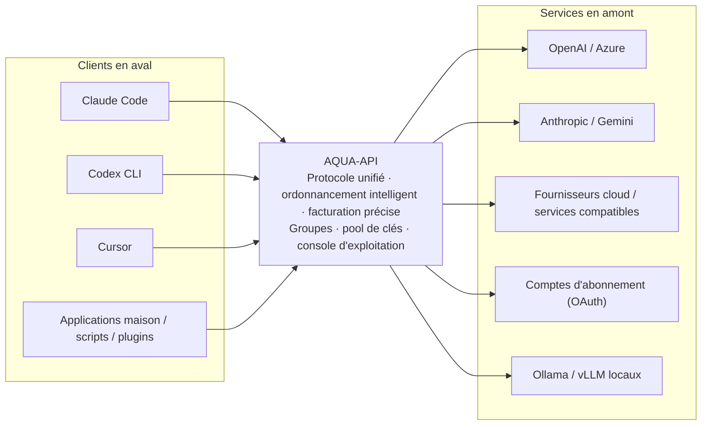
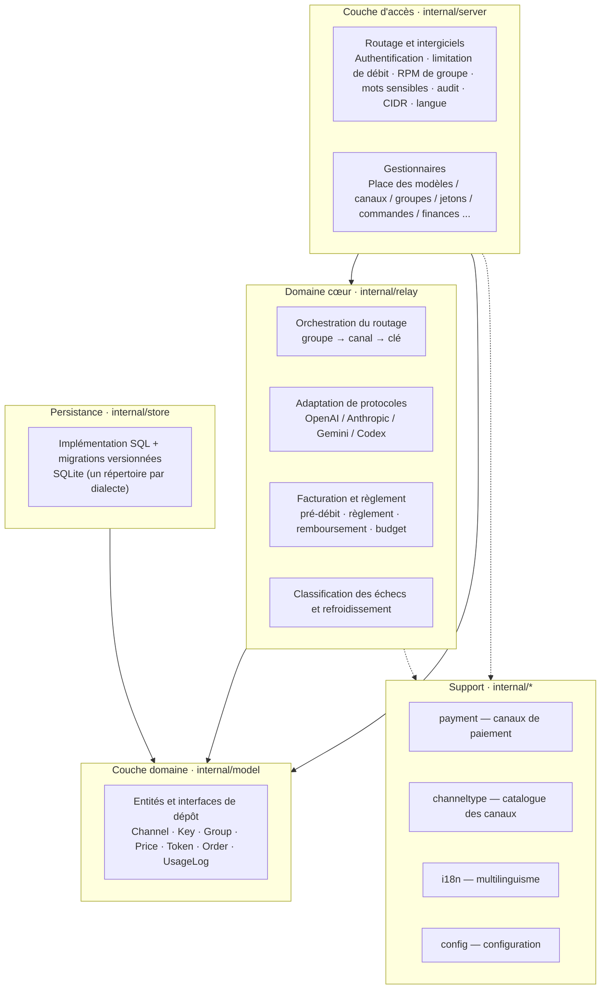
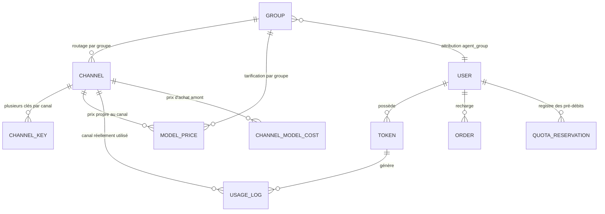
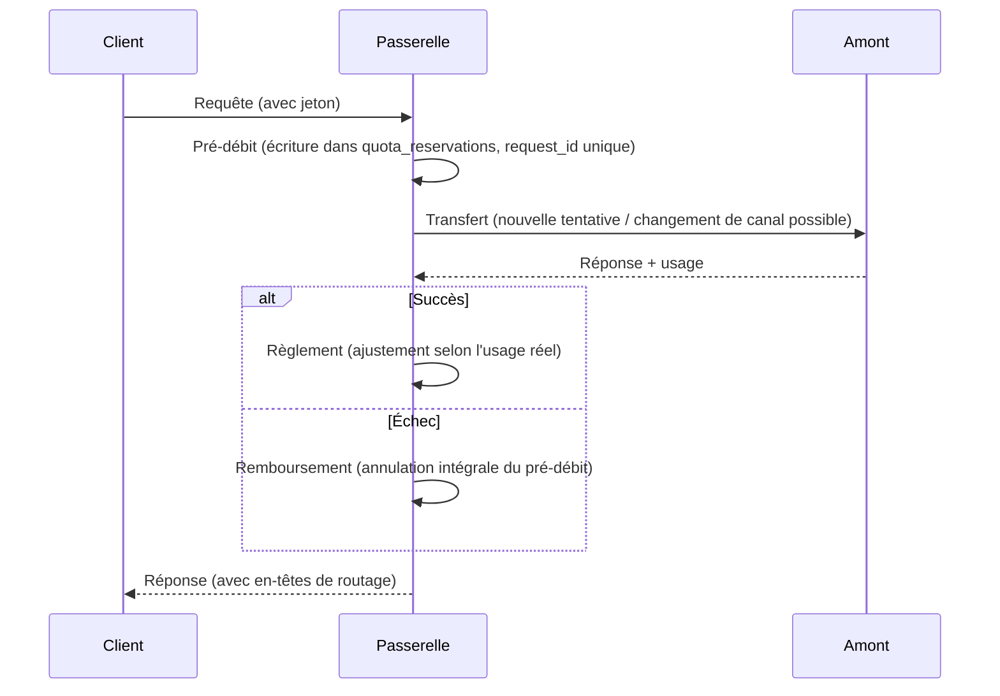

<div align="center">


# AQUA-API

**Réunir tous vos fournisseurs d'IA en amont derrière un seul point d'entrée.**

Passerelle LLM API auto-hébergée · Système de gestion de l'usage de l'IA


[简体中文](README.md) · [English](README.en.md) · [Français](README.fr.md) · [Русский](README.ru.md) · [Español](README.es.md) · [العربية](README.ar.md)

</div>

---

## Adresses officielles

| Canal | Adresse |
| --- | --- |
| Site officiel (démonstration en ligne) | https://aqua.is3.cc |
| Dépôt de code | https://github.com/LTZY-ACU/AQUA-API |
| Signaler un problème (Issues) | https://github.com/LTZY-ACU/AQUA-API/issues |

> **Ce dépôt est la seule source faisant autorité pour les adresses officielles.** En cas de changement de domaine, la mise à jour se fait d'abord ici, avant d'être propagée partout ailleurs.
> Il est donc plus fiable de mettre ce dépôt en favori que de mettre un nom de domaine en favori.

### Avertissement anti-contrefaçon

- Ce projet **ne fournit ni n'autorise** aucun service de « recharge pour le compte d'autrui », d'« exploitation déléguée » ou de « partage de compte officiel ». Le code côté serveur est entièrement open source
  ([licence MIT](LICENSE)) et chacun peut le déployer pour son propre compte — **le faire fonctionner ≠ être l'officiel**.
- Ne reconnaissez que les adresses du tableau ci-dessus. Tout autre domaine, même avec une interface identique, n'a aucun lien avec ce projet.
- L'équipe officielle ne vous demandera jamais, en message privé, votre identifiant, votre mot de passe, votre code de paiement ou votre code de vérification.
- L'utilisation de ce projet vaut acceptation de la [Notice d'utilisation et clause de non-responsabilité](DISCLAIMER.md) ; pour les limites de la marque, voir la [Déclaration de marque et de droits](TRADEMARK.md).
- Avant de contribuer, lisez d'abord le [Guide de contribution](CONTRIBUTING.md) (modèle Fork + PR, la branche `main` est protégée).

### Un lien ne s'ouvre pas ?

Il est courant que ce type de site soit bloqué à tort par les messageries (QQ / WeChat, etc.). Dans ce cas :

1. Changez de navigateur, ou basculez de réseau (données mobiles ↔ fibre domestique) et réessayez ;
2. **Partagez l'adresse de ce dépôt plutôt que le domaine brut** — les liens vers une plateforme d'hébergement de code ont bien moins de chances d'être bloqués à tort,
   et votre interlocuteur pourra y vérifier lui-même la dernière adresse officielle ;
3. Si le blocage est bien confirmé comme une erreur, il suffit de suivre la procédure de recours indiquée par la plateforme.

> En cas de problème, rejoignez notre groupe d'échange : **groupe QQ 1103667832** (entrée « Rejoindre le groupe » en haut à droite de la page d'accueil du site).

---

## Sommaire

- [Adresses officielles](#adresses-officielles)
- [Clause de non-responsabilité](#clause-de-non-responsabilité)
- [De quoi s'agit-il](#de-quoi-sagit-il)
- [Pourquoi choisir AQUA-API](#pourquoi-choisir-aqua-api)
- [Vue d'ensemble des fonctionnalités](#vue-densemble-des-fonctionnalités)
- [Fonctionnalités clés](#fonctionnalités-clés)
- [Architecture du système](#architecture-du-système)
- [Modèle de données principal](#modèle-de-données-principal)
- [Cycle de vie complet d'une requête](#cycle-de-vie-complet-dune-requête)
- [Protocoles et fournisseurs pris en charge](#protocoles-et-fournisseurs-pris-en-charge)
- [Aperçu des interfaces](#aperçu-des-interfaces)
- [Rôles et permissions](#rôles-et-permissions)
- [Facturation et comptabilité en détail](#facturation-et-comptabilité-en-détail)
- [Pile technologique](#pile-technologique)
- [Démarrage rapide](#démarrage-rapide)
- [Configuration](#configuration)
- [Exemples d'intégration](#exemples-dintégration)
- [Guide d'exploitation](#guide-dexploitation)
- [Internationalisation](#internationalisation)
- [Sécurité](#sécurité)
- [Déploiement et capacité](#déploiement-et-capacité)
- [Questions fréquentes](#questions-fréquentes)
- [Glossaire](#glossaire)
- [Feuille de route](#feuille-de-route)
- [Développement](#développement)
- [Contribuer](#contribuer)
- [Licence](#licence)

---

## Clause de non-responsabilité

**Avant d'utiliser ce projet, veuillez lire la [Notice d'utilisation et clause de non-responsabilité](DISCLAIMER.md).**
Ce projet est destiné exclusivement à la recherche technique licite et à la gestion interne ; les utilisateurs doivent respecter les lois et réglementations de leur
région ainsi que les conditions des services amont auxquels ils se connectent. L'auteur décline toute responsabilité pour les pertes résultant de l'utilisation de ce projet.

Pour les limites de la marque et des droits, voir la [Déclaration de marque et de droits](TRADEMARK.md).

---

## De quoi s'agit-il

AQUA-API est une **passerelle LLM API auto-hébergée**, doublée d'un **système de gestion de l'usage de l'IA**.

Vos fournisseurs en amont forment généralement un ensemble d'éléments incompatibles entre eux : clés officielles OpenAI, Azure, Claude, Gemini, divers fournisseurs cloud,
divers services compatibles OpenAI, comptes issus d'abonnements (Claude / Codex / Gemini), ainsi que des instances locales Ollama / vLLM.
En aval, vous avez toutes sortes d'applications : Claude Code, Codex CLI, Cursor, applications maison, scripts, plugins.

AQUA-API se place au milieu et transforme cet ensemble en **un point d'entrée unique, un protocole unique et une comptabilité limpide**.



Les problèmes résolus par AQUA-API se résument à trois mots : **unification** (protocole et point d'entrée), **fiabilité** (évitement automatique des pannes) et **traçabilité comptable** (chaque centime justifiable).

---

## Pourquoi choisir AQUA-API

Les passerelles comparables ne manquent pas ; ce qui manque, c'est celle à laquelle on peut **confier ses comptes en toute sérénité**. Chaque ligne ci-dessous découle d'un enseignement tiré du terrain.

| Point d'attention | Pratique courante | AQUA-API |
| --- | --- | --- |
| Clés amont | Stockées en clair dans la base, la console peut les réafficher en clair | Chiffrées en AES-256-GCM avant stockage, la clé maître provient uniquement de variables d'environnement ; même en cas de compromission de la console, aucun clair n'est exfiltrable |
| Clé maître de chiffrement | Écrite dans le fichier de configuration | Le champ homonyme du fichier de configuration est purement et simplement ignoré ; elle ne peut provenir que d'une variable d'environnement et ne fuit pas avec le dépôt |
| Panne amont | Désactivation définitive dès des échecs consécutifs, le pool se réduit à l'usage | Classification des échecs + refroidissement semi-ouvert : une limitation de débit n'entraîne qu'un évitement temporaire, avec rétablissement automatique à l'échéance ; la clé n'est retirée définitivement que lorsque l'amont déclare explicitement sa révocation |
| Stratégie de nouvelle tentative | Toujours réessayer, ou jamais | Aiguillage par type d'échec : 429 → refroidissement et changement de clé, 5xx → changement de canal, 401/403 → refroidissement prolongé, modération de contenu → changement de modèle, 200 vide → dégradation, tout en respectant l'en-tête `Retry-After` de l'amont |
| Limitation de débit et concurrence | Un seul seuil global : tout est limité dès qu'un seul l'est | Comptage indépendant par clé (poids / priorité / plafond par minute / requêtes en cours) ; un groupe peut disposer d'un forfait de requêtes par minute |
| Quota | Vérifié une fois avant et une fois après la requête, un dépassement est possible en concurrence | Pré-débit → règlement → remboursement ; quota disponible = quota − consommé − en cours ; même en concurrence, on ne peut pas descendre sous zéro |
| Budget périodique | Seulement un quota global, on ne s'en aperçoit qu'après dépassement | Budget à fenêtre glissante au niveau du jeton (jour / semaine / mois), coupure automatique en cas de dépassement dans la fenêtre |
| Facturation en flux | Lecture des seuls premiers octets de la réponse, une longue réponse est facturée 0 | Analyse incrémentale du SSE ; même si `usage` n'apparaît que dans la dernière trame du flux, il est récupéré |
| Protocoles | Compatible OpenAI uniquement | Les trois protocoles en aval (OpenAI / Anthropic / Gemini) sont disponibles ; en amont, l'adaptateur est choisi selon le type de canal |
| Segmentation des utilisateurs | La clé fait office de droit, impossible de distinguer gratuit et payant | Le groupe détermine les canaux disponibles et les prix, le jeton peut choisir son groupe : sur un même amont, les utilisateurs gratuits et payants tiennent des comptes distincts |
| Approvisionnement des revendeurs | Remises notées à la main, comptes incohérents | Groupes revendeurs : la place du marché affiche, selon l'identité du revendeur, « prix public barré + prix remisé » ; la remise correspond au coefficient du groupe et le prix affiché a la même source que la facturation réelle |
| Souplesse tarifaire | Un prix unique par modèle, impossible à faire évoluer | Prix configurables selon trois dimensions « modèle × groupe × canal » ; chaque ligne de compte conserve un instantané de la version tarifaire, les anciens comptes restent recalculables après un changement de prix |
| Visibilité des coûts | Seuls les revenus sont connus, impossible de savoir si l'on gagne | Rapport de rapprochement des coûts réels : revenus, coûts et marge brute agrégés par groupe / canal / modèle ; le prix d'achat peut être calculé à l'usage comme au forfait |
| Exploitation | Un canal tombé dépend d'une surveillance humaine | Tableau de santé des canaux + désactivation automatique selon le taux de réussite ; la console d'administration prend en charge une liste blanche CIDR pour restreindre l'accès |
| Conformité | Une simple clause de non-responsabilité | Système d'avertissement de conformité couvrant tout le site : rubrique de déclaration du protocole + badges des modèles + fenêtre de confirmation à la première visite + rappel sur la page de recharge |
| Déploiement | Nécessite d'installer une base de données, Redis et une chaîne de compilation | Binaire unique + SQLite, frontend déjà intégré, zéro CGO, aucun besoin de gcc |

---

## Vue d'ensemble des fonctionnalités

Un seul tableau pour embrasser tout le périmètre fonctionnel (les détails figurent dans les sections suivantes).

| Module | Capacités |
| --- | --- |
| Accès aux protocoles | Compatible OpenAI · Anthropic · Gemini · Codex / Responses ; les quatre types d'entrée peuvent être activés simultanément |
| Adaptation amont | Compatible OpenAI · Azure OpenAI · Anthropic · Gemini · Codex · comptes d'abonnement ; 79 types de canaux référencés dans le catalogue, 37 déjà implémentés |
| Routage des canaux | Routage par groupe · branchement de modèles au niveau du canal · regroupement et branchement de modèles au niveau de la clé · règles horaires · contournement par disjonction au niveau du canal |
| Ordonnancement des clés | Séquentiel / tourniquet / aléatoire pondéré / plus ancienne utilisation / moins de requêtes en cours ; poids · priorité · plafond par minute · requêtes en cours · fin de refroidissement |
| Gestion des pannes | Nouvelle tentative par catégorie d'échec · refroidissement canal×modèle · repli exponentiel · respect de `Retry-After` · affinité de session · rétablissement semi-ouvert |
| Facturation | À l'usage (trois prix : entrée / sortie / cache) · au forfait · correspondance par joker · prix propre au canal · coefficient de groupe · instantané de version tarifaire |
| Quota et maîtrise du risque | Pré-débit / règlement / remboursement en trois temps · double niveau de quota (jeton et utilisateur) · budget périodique du jeton (jour / semaine / mois) · registre de requêtes idempotent |
| Groupes et revendeurs | Entité de groupe · coefficient de facturation · seuil de déblocage · RPM du groupe · distribution réservée à la console · palier revendeur et prix remisé sur la place du marché |
| Paiement et comptabilité | Manuel / Yi Pay / Stripe / Alipay officiel / WeChat Pay officiel · codes d'échange · crédit idempotent des commandes · enregistrement des paiements tardifs |
| Système d'utilisateurs | Inscription · connexion et réinitialisation du mot de passe par code e-mail · cookie de session · quota d'essai limité dans le temps · parrainage et prime · pointage quotidien |
| Console d'exploitation | Place du marché des modèles · canaux et pool de clés · groupes · prix · jetons · utilisateurs · commandes · codes d'échange · journaux d'appel · audit |
| Capacités à valeur ajoutée | Tâches asynchrones · contribution de corpus · envoi d'e-mails en masse · annonces du site · mots sensibles · mappage de modèles · comptes d'abonnement OAuth |
| Observabilité | Tableau de santé des canaux · alerte sur le taux de nouvelle tentative · rapport de rapprochement des coûts · en-têtes de réponse de routage · vue d'exploitation et sauvegarde |
| Sécurité | Chiffrement des clés avant stockage · anonymisation des journaux · liste blanche CIDR · audit de la récupération en clair · protection contre les élévations de privilèges |
| Internationalisation | 6 langues côté serveur et côté frontend · ce document existe dans les six langues officielles de l'ONU |
| Déploiement | Binaire unique · Docker · systemd · frontend intégré · SQLite sans maintenance |

---

## Fonctionnalités clés

### Passerelle et transfert

- **Trois protocoles en aval** : compatible OpenAI (`/v1/chat/completions`, `/v1/models`, `/v1/embeddings`),
  Anthropic (`/v1/messages`), Gemini (`/v1beta`) — les trois protocoles entrants peuvent directement prendre en charge les clients correspondants
- **Adaptateurs amont** : compatible OpenAI, Azure OpenAI (nom de déploiement + api-version), Anthropic, Gemini,
  Codex / Responses, ainsi que divers comptes d'abonnement
- **Représentation intermédiaire unifiée** : en interne, tout converge vers le protocole OpenAI (N×1) ; ajouter un amont ne demande que d'écrire l'« entrée », ajouter un aval que d'écrire la « sortie »
- **Conversion bidirectionnelle en flux** : événements SSE d'Anthropic / Gemini en amont ↔ `chat.completion.chunk` d'OpenAI, appels d'outils compris
- **Délai d'attente amont de 300 secondes** : les longues réponses des grands modèles ne sont pas interrompues
- **Transmission fidèle des erreurs** : les erreurs réelles de l'amont (y compris `detail` au format RFC7807 et `error.message` d'OpenAI) sont renvoyées telles quelles, sans être masquées
- **En-têtes de réponse de routage observables** : `X-Routed-Via` (canal réellement atteint), `X-Fallback-Attempts` (nombre de tentatives de repli),
  `X-Upstream` (nom réel du modèle amont) ; plus besoin de capturer le trafic pour diagnostiquer

### Pool de clés et ordonnancement intelligent

- **Cinq stratégies** : séquentielle / tourniquet / aléatoire pondéré / plus ancienne utilisation / moins de requêtes en cours (par défaut), commutables au niveau du canal
- **Paramètres au niveau de la clé** : poids, priorité, plafond par minute, requêtes en cours, fin de refroidissement ; réglables clé par clé dans la console
- **Nouvelle tentative guidée par la catégorie d'échec** :
  - `429` : changer de clé et placer cette clé en refroidissement court (repli exponentiel), en respectant le `Retry-After` de l'amont
  - `5xx` / délai d'attente : changer de canal et réessayer
  - `401 / 403 / 402` : refroidissement prolongé (pour ne pas retirer trop vite une bonne clé victime d'un contrôle de risque ponctuel)
  - Interception par la modération de contenu : changer de modèle
  - `200` mais contenu vide : considéré comme un échec et dégradé
- **Refroidissement au niveau canal × modèle** : un échec ne refroidit que « ce canal × ce modèle », sans affecter les autres modèles du même canal
- **Affinité de session** : une même session (`X-Session-Id`) reste fixée sur la même clé afin d'améliorer le taux de succès du cache amont ; en cas d'indisponibilité de la cible, dégradation automatique
- **Disjonction au niveau du canal** : lorsqu'un canal a épuisé le solde / le quota de toutes ses clés, le routage le contourne activement et le journalise, plutôt que de le sélectionner pour échouer ensuite
- **Saisies multiples** : à l'unité / collage en masse / multifusion

### Facturation et comptabilité

- **Formule** : `quota = (jetons d'entrée × prix d'entrée + jetons de sortie × prix de sortie) / 1 000 000`, la facturation au forfait étant également prise en charge
- **Règles de prix** : correspondance par nom de modèle ou par motif joker, rattachables à un groupe, ou prix propre à un canal donné
- **Séparation du prix de cache** : les jetons ayant atteint le cache amont sont facturés à un prix unitaire distinct (retour au prix d'entrée si non configuré)
- **Sécurité du quota** : pré-débit + règlement + remboursement en trois temps, avec un registre idempotent garantissant « au plus un crédit »
- **Instantané de version tarifaire** : chaque journal d'appel consigne la version des règles de tarification en vigueur ; après un changement de prix, les anciens comptes restent recalculables à l'ancien prix
- **Budget périodique** : un jeton peut fixer « au plus N de quota par période », la fenêtre se réinitialise paresseusement à l'échéance, sans dépendre d'une tâche planifiée
- **Canaux de paiement** : confirmation manuelle / Yi Pay / Stripe / Alipay officiel (RSA2) / WeChat Pay officiel (APIv3 + vérification de signature par certificat de plateforme + AES-GCM)
- **Comptabilité des commandes** : vérification de signature des rappels, crédit idempotent, enregistrement des paiements tardifs, régularisation et clôture manuelles
- **Codes d'échange** : génération en masse ; l'échange concurrent est un débit atomique en transaction unique : 10 échanges simultanés du même code ne réussiront qu'une seule fois

### Groupes, tarification et système de revendeurs

- **Le groupe est une entité de premier ordre** : nom d'affichage, coefficient de facturation, seuil de déblocage, plafond de requêtes par minute
- **Groupes distribués uniquement par la console** : les tarifs de gros / paliers revendeurs sont totalement invisibles pour les utilisateurs ordinaires et ne peuvent être attribués que par un administrateur
- **Palier revendeur** : l'utilisateur affecté à un groupe revendeur voit sur la place du marché des modèles et des prix correspondant à son propre palier,
  présentés en regard « prix d'origine barré + prix remisé en orange »
- **Prix de la place = débit réel** : le prix affiché au revendeur et la facturation proviennent du même jeu de règles de prix
- **Statistiques de référence des groupes** : avant de supprimer un groupe, l'impact sur le nombre de canaux et de règles de prix est signalé
- **Simulation tarifaire publique** : `GET /api/models/quote` (sans connexion), indiquer le nombre de jetons renvoie le coût estimé

### Exploitation et console

- **Place du marché des modèles** : filtres à facettes + compteurs synchronisés + recherche + tri + double vue carte et liste +
  fenêtre de détail (tableau des prix, date d'effet, cURL directement exécutable, simulateur de coût)
- **Gestion des canaux** : création, modification, suppression, test de connectivité, tiroir du pool de clés, récupération en un clic de la liste des modèles amont, calcul du prix d'achat amont (à l'usage / au forfait)
- **Tableau de santé des canaux** : taux de réussite, nombre de clés en refroidissement, solde restant, le tout en un écran ; désactivation automatique selon le taux de réussite
- **Rapport de rapprochement financier** : revenus, coûts, marge brute et taux de marge agrégés par groupe / canal / modèle
- **Alerte sur le taux de nouvelle tentative** : statistique `r = nombre d'appels amont / nombre de requêtes facturées` par groupe remisé, alerte dès que le seuil de rentabilité est franchi
- **Jetons** : quota / expiration / liste blanche de modèles / groupe d'appartenance / budget périodique / récupération en clair auditée
- **Système d'utilisateurs** : inscription, connexion et réinitialisation du mot de passe par code e-mail, attribution d'un quota d'essai limité dans le temps et récupération à l'échéance
- **Parrainage et pointage** : code de parrainage, registre des primes d'inscription et de recharge, pointage quotidien
- **Annonces du site / audit des opérations / mots sensibles / SMTP / tâches asynchrones / envoi d'e-mails en masse / contribution de corpus**
- **Autres volets de la console** : métadonnées et mappage des modèles, comptes d'abonnement OAuth, vue d'exploitation et sauvegarde de la base de données

### Frontend et thèmes

- **Trois thèmes** : clair / sombre / bleu profond, commutables à tout moment, préférence conservée localement
- **Interface en six langues** : 简体中文, English, Français, Русский, Español, العربية (mise en page RTL incluse)
- **Mobile** : navigation inférieure, transformation automatique des tableaux en cartes, adaptation aux zones sûres, fenêtres surgissant par le bas

---

## Architecture du système

Conception en couches, dépendances unidirectionnelles ; les dépendances circulaires entre les paquets de `internal/` sont interdites.



| Couche | Répertoire | Responsabilités | Ce qu'elle ne fait pas |
| --- | --- | --- | --- |
| Couche d'accès | `internal/server` | Routage, intergiciels, validation des requêtes, conversion des DTO | N'écrit pas directement de SQL, n'implémente pas la logique de transfert |
| Domaine cœur | `internal/relay` | Routage, conversion de protocoles, transfert, facturation et règlement, traitement des échecs | Ne connaît pas les détails HTTP, ne dépend que des interfaces de `model` |
| Couche domaine | `internal/model` | Entités, règles, définitions des interfaces de dépôt | N'écrit pas de SQL, ne connaît pas HTTP |
| Persistance | `internal/store` | Implémentation des dépôts, exécution des migrations, requêtes agrégées | Ne porte pas de règles métier |
| Support | `payment` / `channeltype` / `i18n` / `config` | Adaptation des paiements, catalogue des canaux, textes, configuration | Ne dépend pas en retour des couches supérieures |

> Ajouter un amont : référencer le type dans `internal/channeltype/catalog.go` ; si le protocole diffère, ajouter un adaptateur dans `internal/relay/`.
> Ajouter une table : créer dans `internal/store/migrations/sqlite/` un nouveau script à numéro croissant (ajout uniquement, jamais de modification),
> puis synchroniser l'entité `model` et la liste des colonnes de `store`.

---

## Modèle de données principal



| Entité | Champs clés | Description |
| --- | --- | --- |
| `model_groups` | `ratio` coefficient · `rpm_limit` plafond par minute · `unlock_min_recharge_cents` seuil · `admin_only` distribution réservée à la console | Support des segments d'utilisateurs et des paliers revendeurs ; le coefficient fait office de remise |
| `channels` | `group_names` groupes desservis · `models` modèles pris en charge · `key_strategy` stratégie d'ordonnancement · politiques de nouvelle tentative et de refroidissement | « Cet amont est-il empruntable » |
| `channel_keys` | clé chiffrée · branchement `group_names` / `models` · `weight` / `priority` / `rpm_limit` / `in_flight` · `cooldown_until` · fenêtre de quota d'abonnement | « Quelle clé utiliser pour emprunter cet amont » |
| `model_prices` | `model` · `group_name` · `channel_id` (0 = tous canaux) · prix entrée / cache / sortie / au forfait · mode de facturation | Priorité d'application du prix : prix propre au canal → prix par défaut du groupe |
| `tokens` | `remain_quota` / `unlimited_quota` · `group_name` · `budget_quota` / `budget_period` / `budget_window_*` | Identifiant en aval + budget périodique |
| `quota_reservations` | index unique `request_id` · machine à états `status` · `reserved` / `settled` | Portillon idempotent garantissant au plus un crédit |
| `usage_logs` | canal réel / modèle amont · détail des jetons · `quota` · `price_version` instantané de tarification | Base du rapprochement et du recalcul |
| `channel_model_costs` | règles de prix d'achat à l'usage / au forfait | Entrée du rapprochement des coûts |
| `payment_orders` | `trade_no` · montant · machine à états | Commandes de recharge |
| `users` | quota · `agent_group` groupe revendeur · rôle | Compte et rattachement revendeur |

---

## Cycle de vie complet d'une requête

Le chemin parcouru par un appel `/v1/chat/completions` à l'intérieur de la passerelle, utile pour diagnostiquer les problèmes et poursuivre le développement.

```mermaid
flowchart TD
    S["Requête du client"] --> P1["① Authentification et limitation de débit"]
    P1 --> P1a["TokenAuth : validation du jeton (activé / expiré / liste blanche de modèles / groupe d'appartenance)"]
    P1a --> P1b["Pré-débit du quota (première étape : pré-débit → règlement → remboursement)"]
    P1b --> P1c["Portillon RPM du groupe (rpm_limit = 0 : passage à coût nul)"]
    P1c --> P1d["Filtrage préalable des mots sensibles"]

    P1d --> P2["② Routage"]
    P2 --> P2a["Filtrage des canaux disponibles par groupe (état d'activation / prise en charge des modèles / règles horaires)"]
    P2a --> P2b["Vérification de disjonction au niveau du canal : toutes les clés ont-elles épuisé leur solde → contournement"]
    P2b --> P2c["Sélection de la clé dans le canal : refroidissement sur échec + refroidissement canal×modèle + affinité de session + cinq stratégies"]

    P2c --> P3["③ Transfert et adaptation"]
    P3 --> P3a["Protocole entrant → représentation interne OpenAI → adaptateur amont"]
    P3a --> P3b["Conversion bidirectionnelle en flux (au niveau de la trame SSE)"]
    P3b --> P3c["Traitement par catégorie d'échec : 429 → changer de clé / 5xx → changer de canal / modération → changer de modèle / 200 vide → dégradation"]

    P3c --> P4["④ Réponse et comptabilisation"]
    P4 --> P4a["Injection des en-têtes de réponse d'observabilité (X-Routed-Via / X-Fallback-Attempts / X-Upstream)"]
    P4a --> P4b["Règlement du quota : ajustement à la hausse ou à la baisse en cas de succès, remboursement intégral en cas d'échec"]
    P4b --> P4c["Écriture du journal d'appel (canal réel / modèle amont / instantané de version tarifaire)"]
    P4c --> P4d["Mise à jour de l'état d'exécution de la clé (dernière utilisation / refroidissement / compteur d'échecs / solde)"]
```



---

## Protocoles et fournisseurs pris en charge

**En aval (comment les applications se connectent à ce site)** : compatible OpenAI · Anthropic · Gemini

**En amont (comment ce site se connecte aux autres)** : le catalogue référence **79** types de canaux, organisés en 8 grandes catégories :

| Catégorie | Description |
| --- | --- |
| Grands modèles textuels | OpenAI / Azure / Anthropic / Gemini / DeepSeek / Kimi / Zhipu / Tongyi / SiliconFlow / OpenRouter / Groq / Together / Mistral / xAI / Ollama / vLLM, etc. |
| Services d'agrégation | Divers relais d'agrégation |
| Comptes d'abonnement | Comptes d'abonnement Claude / Codex / Gemini, etc. (rafraîchissement OAuth) |
| Auto-hébergement | Déploiements locaux et privatisés |
| Image | Fournisseurs de génération d'images |
| Vidéo | Fournisseurs de génération de vidéos |
| Audio | Fournisseurs de synthèse vocale |
| Intégration (Embedding) | Fournisseurs d'embeddings |

> **Note honnête** : sur les 79 types, **37 disposent déjà d'un adaptateur de protocole et d'une implémentation d'authentification** (`Available: true`) et sont directement sélectionnables ;
> les autres types sont marqués « bientôt pris en charge » dans la console et interdits à la sélection, afin que vous ne découvriez pas leur inutilisabilité en cours de configuration.
> La liste blanche des protocoles et modes d'authentification implémentés est verrouillée par `internal/channeltype/catalog_test.go`, pour éviter tout marquage erroné.

---

## Aperçu des interfaces

### Interfaces de la passerelle (protocoles en aval)

| Méthode | Chemin | Description |
| --- | --- | --- |
| POST | `/v1/chat/completions` | Dialogue compatible OpenAI (flux pris en charge) |
| POST | `/v1/embeddings` | Vectorisation |
| GET | `/v1/models` | Liste des modèles disponibles |
| POST | `/v1/messages` | Protocole Anthropic (connexion directe de Claude Code) |
| POST | `/v1/responses` | Protocole OpenAI Responses / Codex |
| POST | `/v1beta/models/*action` | Protocole Gemini |
| POST | `/v1/tasks` | Soumission d'une tâche de génération asynchrone |
| GET | `/v1/tasks` · `/v1/tasks/:ref` | Liste et détail des tâches |

### Interfaces publiques (sans connexion)

| Méthode | Chemin | Description |
| --- | --- | --- |
| GET | `/healthz` | Contrôle de santé (base de données et version de migration incluses) |
| GET | `/api/status` | Informations du site (taux de conversion du quota, informations de conformité) |
| GET | `/api/models` | Place du marché des modèles (vue revendeur) |
| GET | `/api/models/quote` | Simulation tarifaire publique |
| GET | `/api/announcements` | Annonces du site |
| GET | `/api/payment/public` | Paramètres de paiement publics |
| POST/GET | `/api/payments/:method/notify` | Rappel de paiement (vérification de signature par canal) |
| GET | `/sitemap.xml` · `/robots.txt` | SEO |

### Interfaces de compte

| Méthode | Chemin | Description |
| --- | --- | --- |
| POST | `/api/auth/register` | Inscription |
| POST | `/api/auth/login` · `/api/auth/admin-login` | Connexion par mot de passe / connexion à la console d'administration |
| POST | `/api/auth/email-code` · `/api/auth/email-login` | Code e-mail et connexion par code de vérification |
| POST | `/api/auth/password-reset` | Réinitialisation du mot de passe |
| GET | `/api/install/status` · POST `/api/install` | Assistant d'installation |
| GET | `/api/auth/me` · POST `/api/auth/logout` | Identité courante / déconnexion |

### Portail utilisateur `/api/user`

Gestion des jetons (création, lecture, mise à jour, suppression) et récupération en clair (`/tokens`, `/tokens/:id/key`), groupes optionnels (`/groups`), usage et journaux
(`/usage`, `/logs`), tâches (`/tasks`), commandes (`/orders`, `/orders/:tradeNo`), échange (`/redeem`),
parrainage et récompenses (`/referral`, `/referral/rewards`), pointage (`/checkin`), aperçu financier (`/finance`),
quota d'essai (`/trial`).

### Console d'administration `/api/admin`

| Groupe | Points de terminaison représentatifs |
| --- | --- |
| Vue d'ensemble | `/dashboard` · `/maintenance/overview` · `/maintenance/backup` |
| Canaux | `/channels` CRUD · `/channels/:id/test` test de vie · `/channels/:id/keys` pool de clés · `/channels/:id/costs` prix d'achat · `/channels/:id/mappings` mappage de modèles · `/fetch-models` récupération des modèles · `/channel-types` |
| Groupes et tarification | `/groups` CRUD · `/prices` CRUD · `/prices/quote` simulation |
| Jetons et utilisateurs | `/tokens` CRUD et clair · `/users` CRUD |
| Contenu et exploitation | `/announcements` · `/broadcasts` envoi en masse · `/sensitive-words` · `/corpus/*` corpus · `/trial-grants` |
| Comptabilité | `/orders` · `mark-paid` / `close` · `/redeem-codes` · `/finance/reconciliation` rapprochement des coûts |
| Système | `/settings` · `/smtp` et test d'envoi · `/oauth-providers` · `/audit-logs` · `/logs` · `/tasks` |

> La liste complète des plus de 140 points de terminaison fait foi dans `internal/server/router.go` ; les points de terminaison d'administration sont protégés par défaut par l'authentification de session,
> à laquelle peut s'ajouter une liste blanche CIDR.

---

## Rôles et permissions

| Rôle | Détermination de l'identité | Périmètre visible | Capacités typiques |
| --- | --- | --- | --- |
| Visiteur | Non connecté | Place du marché des modèles (prix publics), simulation publique, annonces | Consulter les prix, estimer les coûts |
| Utilisateur ordinaire | Cookie de session | Ses propres jetons / usage / commandes / parrainage / pointage | Créer des jetons, recharger, consulter ses relevés |
| Utilisateur revendeur | Utilisateur affecté à `agent_group` | La place du marché affiche les modèles et prix remisés de **son propre palier** | Appeler au tarif d'achat remisé, comptabilité au taux remisé |
| Administrateur | Rôle administrateur | Toute la console (liste blanche CIDR cumulable) | Canaux, tarification, utilisateurs, commandes, finances |
| Super-administrateur | Créé par l'assistant d'installation | Toute la console + paramètres et maintenance du système | Configuration du site, sauvegarde, SMTP, OAuth |

> Protection contre les élévations de privilèges : la récupération en clair d'un jeton exige une vérification d'appartenance + une écriture d'audit ; le palier revendeur n'est visible que par l'intéressé ;
> le changement de groupe d'un jeton exige la vérification « le groupe existe + l'utilisateur a atteint le seuil de déblocage ».

---

## Facturation et comptabilité en détail

### Formule du quota

```
À l'usage : quota = (jetons d'entrée × prix d'entrée + jetons de cache × prix de cache + jetons de sortie × prix de sortie) / 1 000 000
Au forfait : quota = prix unitaire × nombre d'appels
Crédit réel = quota × coefficient de groupe / 100
```

Les montants sont manipulés de bout en bout en **entiers `int64` (« quota »)** ; seule la couche d'affichage les convertit en yuans selon le taux de conversion du site, ce qui élimine toute dérive en virgule flottante.
Les modèles gratuits / non tarifés **échappent au pré-débit** et ne sont jamais bloqués par le mur de quota.

### Règlement en trois temps



### Priorité de tarification

```
Prix propre au canal (channel_id = ce canal)   ← priorité maximale
        ↓ sinon, repli
Prix par défaut du groupe (channel_id = 0)
```

### Coût et marge brute

```
Marge brute = revenus de vente (quota réellement débité à l'utilisateur) − coût amont (calculé selon les règles de prix d'achat du canal)
```

Le rapport de rapprochement des coûts agrège par groupe / canal / modèle ; **les requêtes sans prix d'achat enregistré sont signalées à part**,
faute de quoi cette part de coût serait comptée à 0 et le rapport serait trop optimiste.

---

## Pile technologique

| Couche | Choix | Description |
| --- | --- | --- |
| Backend | Go 1.27 + Gin v1.12 | Binaire unique, zéro CGO (SQLite utilise `modernc.org/sqlite`, en pur Go) |
| Base de données | SQLite | Embarquée, sans maintenance ; les scripts de migration sont organisés par dialecte, laissant une couture d'extension |
| Frontend | Next.js 16.3 (export statique) + React 19 + Tailwind CSS v4 + TypeScript 5 | Le produit de build `web/dist` est intégré au binaire par `go:embed` |
| Graphiques | ECharts 5 | Graphiques statistiques de la console |

<div align="center">


</div>

> Le frontend utilise l'export statique `output: 'export'`, **sans hébergement frontend distinct** : interface et API partagent la même origine et le même port,
> le déploiement ne nécessite qu'un seul binaire.

---

## Démarrage rapide

### Méthode 1 : Docker Compose (recommandée)

```bash
git clone https://github.com/LTZY-ACU/AQUA-API.git && cd AQUA-API
cp .env.example .env

docker build -t aqua-api:local .          # première construction (frontend + backend + image d'exécution)
docker run --rm aqua-api:local -gen-key   # affiche une clé maître, à reporter dans AQUA_APP_KEY du fichier .env

docker compose up -d
```

Ouvrez `http://127.0.0.1:8787` dans le navigateur. Les données se trouvent dans `./data` sur la machine hôte ; pour migrer de serveur, il suffit d'empaqueter ce répertoire.

### Méthode 2 : docker run (sans compose)

```bash
docker build -t aqua-api:local .

docker run -d --name aqua-api \
  -p 8787:8787 \
  -e AQUA_APP_KEY="<你的主密钥>" \
  -e AQUA_SERVER_LISTEN=0.0.0.0:8787 \
  -v "$PWD/data:/data" \
  --restart unless-stopped \
  aqua-api:local
```

### Méthode 3 : binaire unique (serveur Linux / systemd)

```bash
go build -o aqua ./cmd/aqua           # pur Go, zéro CGO, aucun besoin de gcc

./aqua -gen-key                        # génère la clé maître de chiffrement (génération seule, sans écriture sur disque)

sudo useradd -r -s /usr/sbin/nologin aqua
sudo mkdir -p /opt/aqua /etc/aqua /var/lib/aqua
sudo cp aqua /opt/aqua/aqua && sudo chown aqua:aqua /opt/aqua/aqua

sudo cp .env /etc/aqua/aqua.env        # y saisir la clé réelle
sudo chmod 600 /etc/aqua/aqua.env && sudo chown root:root /etc/aqua/aqua.env

sudo cp aqua-api.service /etc/systemd/system/
sudo systemctl daemon-reload && sudo systemctl enable --now aqua-api
sudo systemctl status aqua-api
```

**Mise à niveau** : remplacez `/opt/aqua/aqua` puis `sudo systemctl restart aqua-api` ; la migration de la base s'exécute automatiquement au démarrage.

> Il est conseillé de conserver le binaire précédent (par exemple `aqua.bak-<horodatage>`). Le retour arrière se limite à un `cp` vers l'ancien fichier puis un redémarrage ;
> les migrations de base ne font qu'ajouter des colonnes, sans en supprimer, ce qui assure la compatibilité ascendante.

### Méthode 4 : exécution directe depuis les sources (développement)

```bash
# Frontend (facultatif : web/dist du dépôt n'est qu'un espace réservé, l'interface définitive doit être construite pour être intégrée)
cd web && npm ci && npm run build && cd ..

go build -o bin/aqua ./cmd/aqua
export AQUA_APP_KEY="<你的主密钥>"      # Windows : $env:AQUA_APP_KEY="..."
./bin/aqua -config ./aqua.json          # sans -config, les valeurs par défaut et les variables d'environnement sont utilisées
curl http://127.0.0.1:8787/healthz
```

> **Le frontend est intégré** : `go:embed` incorpore `web/dist` au binaire, le déploiement ne requiert donc qu'un seul fichier.
> Si vous lancez `go build` sans construire le frontend, l'interface sera une page d'attente, mais l'API reste pleinement fonctionnelle.

### Première utilisation (assistant d'installation)

À la première ouverture du site, l'assistant d'installation se lance : création du compte super-administrateur → saisie des informations du site → (facultatif) configuration des canaux de paiement et d'e-mail.
Il est également possible de se connecter au panneau d'administration via une entrée dédiée depuis la console.

### Reverse proxy

Pour un service exposé, il est conseillé de placer Nginx ou Caddy en amont et d'activer HTTPS. Deux pièges fréquents :

```nginx
location / {
    proxy_pass http://127.0.0.1:8787;
    proxy_http_version 1.1;

    # 1) La réponse en flux impose de désactiver la mise en tampon, sinon le frontend attend la fin de toute la génération avant d'afficher mot à mot
    proxy_buffering off;
    proxy_cache off;

    # 2) Le délai d'attente doit être supérieur au délai amont de la passerelle (300 secondes par défaut), sinon les longues réponses sont coupées d'abord par le reverse proxy
    proxy_read_timeout 600s;
    proxy_send_timeout 600s;

    proxy_set_header Host $host;
    proxy_set_header X-Real-IP $remote_addr;
    proxy_set_header X-Forwarded-For $proxy_add_x_forwarded_for;
    proxy_set_header X-Forwarded-Proto $scheme;
}
```

> Si le domaine est derrière le proxy orange de Cloudflare, notez que le retour à l'origine de CF a une limite stricte de 100 secondes, au-delà de laquelle un 524 est renvoyé.
> Pour profiter pleinement du délai d'attente de 300 secondes, ajoutez un enregistrement en nuage gris (DNS only) pointant directement vers le serveur d'origine.

---

## Configuration

Priorité : **valeurs par défaut < fichier de configuration < variables d'environnement**.

### Variables d'environnement

| Variable | Obligatoire | Description |
| --- | --- | --- |
| `AQUA_APP_KEY` | Oui | Clé maître de chiffrement, uniquement par variable d'environnement (le champ homonyme du fichier de configuration est ignoré). À générer avec `aqua -gen-key` |
| `AQUA_SERVER_LISTEN` | Non | Adresse d'écoute, par défaut `127.0.0.1:8787` ; dans un conteneur, doit être `0.0.0.0:8787` |
| `AQUA_SERVER_MODE` | Non | `debug` / `release` / `test` |
| `AQUA_DATABASE_DRIVER` | Non | Actuellement `sqlite` |
| `AQUA_DATABASE_DSN` | Non | Chemin du fichier SQLite, par défaut `./data/aqua.db` (le répertoire parent est créé automatiquement) |
| `AQUA_RELAY_GROUP` | Non | Groupe par défaut de la passerelle (groupe emprunté par les jetons sans groupe), par défaut `default` |
| `AQUA_ADMIN_ALLOW_CIDRS` | Non | Liste blanche d'accès à la console d'administration, CIDR séparés par des virgules (par ex. `10.0.0.0/8,1.2.3.4/32`). Vide signifie aucune restriction |
| `AQUA_CHANNEL_AUTO_DISABLE_MIN_REQUESTS` | Non | Nombre minimal d'échantillons pour la désactivation automatique d'un canal, `0` désactive la désactivation automatique (désactivée par défaut) |
| `AQUA_CHANNEL_AUTO_DISABLE_SUCCESS_RATE` | Non | Seuil minimal de réussite (par ex. `0.9`) ; en dessous, avec un échantillon suffisant, le canal est désactivé |
| `AQUA_CHANNEL_AUTO_DISABLE_WINDOW_MINUTES` | Non | Fenêtre statistique (en minutes) |
| `AQUA_SMTP_HOST` | Non | Adresse du serveur SMTP (code e-mail et notifications, également configurable dans la console) |
| `AQUA_SMTP_PORT` | Non | Port SMTP, par défaut `465` |
| `AQUA_SMTP_USERNAME` | Non | Nom d'utilisateur SMTP |
| `AQUA_SMTP_PASSWORD` | Non | Mot de passe SMTP, uniquement par variable d'environnement |
| `AQUA_SMTP_FROM` | Non | Adresse de l'expéditeur |
| `AQUA_SMTP_FROM_NAME` | Non | Nom affiché de l'expéditeur, par défaut `AQUA-API` |
| `AQUA_EPAY_KEY` | Non | Clé marchand Yi Pay (signature MD5) |
| `AQUA_STRIPE_SECRET_KEY` | Non | Stripe Secret Key |
| `AQUA_STRIPE_WEBHOOK_SECRET` | Non | Clé de signature Stripe Webhook |
| `AQUA_ALIPAY_PRIVATE_KEY` | Non | Clé privée de l'application Alipay (RSA2, formats PEM et base64 brut pris en charge) |
| `AQUA_ALIPAY_PUBLIC_KEY` | Non | Clé publique Alipay |
| `AQUA_WECHATPAY_APIV3_KEY` | Non | Clé APIv3 de WeChat Pay (32 octets) |
| `AQUA_WECHATPAY_PRIVATE_KEY` | Non | Clé privée marchand WeChat Pay (PEM) |
| `AQUA_WECHATPAY_PLATFORM_PUBLIC_KEY` | Non | Clé publique du certificat de plateforme WeChat Pay, pour vérifier la signature des rappels |
| `AQUA_LOG_LEVEL` | Non | `debug` / `info` / `warn` / `error` |
| `AQUA_LOG_FORMAT` | Non | `text` / `json` |

Un exemple complet figure dans [`.env.example`](.env.example).

### Fichier de configuration

```json
{
  "server":   { "listen": "127.0.0.1:8787", "mode": "release" },
  "database": { "driver": "sqlite", "dsn": "./data/aqua.db" },
  "log":      { "level": "info", "format": "text" }
}
```

### Deux règles de sécurité absolues

1. **Aucune configuration de type clé n'est stockée en base**. Les paiements, SMTP et la clé maître de chiffrement ne peuvent être injectés que par variables
   d'environnement ; seuls les paramètres d'exploitation (adresse de la passerelle, numéro de marchand, taux de change, limites, interrupteurs) vont en base et sont modifiables depuis la console. Même si la base entière
   est exfiltrée, aucun identifiant directement utilisable n'en ressort.
2. **La clé maître doit impérativement être sauvegardée séparément**. Dès qu'elle change, toutes les clés amont de la base deviennent indéchiffrables et doivent être ressaisies.

---

## Exemples d'intégration

Tout client compatible OpenAI : il suffit de pointer l'URL de base vers ce service et de remplacer la clé par un jeton AQUA-API.

### curl

```bash
curl https://你的域名/v1/chat/completions \
  -H "Authorization: Bearer sk-你的令牌" \
  -H "Content-Type: application/json" \
  -d '{
    "model": "你的模型名",
    "messages": [{"role": "user", "content": "你好"}],
    "stream": true
  }'
```

### SDK OpenAI (Python)

```python
from openai import OpenAI

client = OpenAI(
    base_url="https://你的域名/v1",
    api_key="sk-你的令牌",
)
resp = client.chat.completions.create(
    model="你的模型名",
    messages=[{"role": "user", "content": "你好"}],
)
print(resp.choices[0].message.content)
```

### Claude Code / clients Anthropic

AQUA-API prend nativement en charge le protocole Anthropic et peut directement prendre en charge le trafic de Claude Code :

```bash
export ANTHROPIC_BASE_URL=https://你的域名
export ANTHROPIC_AUTH_TOKEN=sk-你的令牌
claude
```

### Autres clients

Cursor, Codex CLI, Cherry Studio, NextChat, LobeChat, Immersive Translate, etc. : choisissez
« compatible OpenAI / interface OpenAI personnalisée », puis renseignez l'URL de base et le jeton ci-dessus.

### Estimer un coût (sans jeton)

```bash
curl "https://你的域名/api/models/quote?model=你的模型名&prompt_tokens=1000&completion_tokens=500"
```

---

## Guide d'exploitation

### Relation entre groupes et canaux

- **Le canal** détermine « cette requête peut-elle emprunter cet amont » : quels modèles il déclare prendre en charge et à quels groupes il appartient ;
- **La clé** (chaque key sous un canal) détermine « quelle clé utiliser pour emprunter cet amont » et peut en outre restreindre les groupes et modèles qu'elle dessert ;
- **Le jeton** peut spécifier son groupe d'appartenance ; à défaut, il tombe dans le groupe par défaut de la passerelle (`AQUA_RELAY_GROUP`).

> Le piège le plus courant : après avoir déplacé un canal vers un nouveau groupe, si l'on oublie de synchroniser le groupe par défaut, tous les « jetons sans groupe » signalent immédiatement
> « aucun canal disponible ».

### Comment configurer un palier revendeur

1. Dans « Groupes » de la console, créez un palier revendeur (par ex. `agent`), fixez le coefficient de facturation au taux d'achat remisé (par ex. `60` pour une remise de 40 %),
   et activez « distribution réservée à la console » ;
2. Dans « Prix », configurez un tarif pour ce palier revendeur, ou réutilisez le même jeu de règles en appliquant la remise via le coefficient ;
3. Dans « Utilisateurs », affectez l'`agent_group` du compte revendeur à ce palier ;
4. Une fois le revendeur connecté, la place du marché des modèles bascule automatiquement sur son palier et affiche « prix d'origine barré + prix remisé », avec la même source que la facturation réelle.

### Quota et budget

- **Quota global** : à deux niveaux, jeton et utilisateur ; `-1` signifie illimité ;
- **Budget périodique** : sur un jeton, fixez « au plus N yuans par période », la période étant le jour / la semaine / le mois ; au-delà dans la fenêtre, un 429 est renvoyé,
  et la fenêtre se réinitialise automatiquement à l'échéance.

### Recommandations de gouvernance des canaux

- Prévoir ≥ 3 clés par canal pour éviter un point unique de limitation ;
- Pour les amonts sujets aux limitations, abaisser le plafond par minute de chaque clé et laisser l'ordonnanceur changer de key ;
- Ouvrir le tableau de santé des canaux et surveiller le taux de réussite ; activer si nécessaire la désactivation automatique selon le taux de réussite ;
- Vérifier régulièrement les requêtes « sans prix d'achat enregistré » pour garantir la fiabilité du rapport de coûts.

---

## Internationalisation

| Niveau | Prise en charge | Description |
| --- | --- | --- |
| Interface frontend | 简体中文 · English · Français · Русский · Español · العربية | Six langues, mise en page RTL incluse |
| Textes côté serveur | Les mêmes six | Les messages d'erreur sont localisés selon `Accept-Language` |
| Ce document | Les mêmes six | Voir le sélecteur de langue en en-tête |

> Ce document couvre les **six langues officielles de l'ONU** (chinois, anglais, français, russe, espagnol, arabe).
> Si vous n'en voulez que quelques-unes, supprimez les `README.<langue>.md` correspondants, les autres restant inchangés.

---

## Sécurité

- **Chiffrement des clés avant stockage** : les clés amont sont chiffrées en AES-256-GCM, la clé maître provient uniquement d'une variable d'environnement (le champ homonyme du fichier de configuration est ignoré)
- **Anonymisation des journaux** : les journaux n'indiquent que « les identifiants ont-ils été injectés » ainsi que l'hôte et le chemin amont, sans même la chaîne de requête
- **Liste blanche CIDR** : `AQUA_ADMIN_ALLOW_CIDRS` restreint la provenance vers la console d'administration ; tout ce qui est hors liste blanche est refusé
- **Audit de la récupération en clair** : le clair d'un jeton passe par une interface dédiée et écrit un journal d'audit (qui, quand, quelle clé)
- **Protection contre les élévations de privilèges** : le palier revendeur n'est visible que par l'intéressé ; le changement de groupe d'un jeton vérifie l'existence et le seuil de déblocage ; toute non-concordance d'appartenance renvoie uniformément 404
- **Idempotence anti-doublon** : le registre de requêtes utilise un index unique sur `request_id` comme portillon, garantissant au plus un crédit en cas de nouvelle tentative, de déconnexion ou de double rappel
- **Mots de passe et sessions** : mots de passe hachés avec sel ; sessions via un cookie signé validé côté serveur
- **Sécurité du contenu** : filtrage préalable des mots sensibles + gestion du lexique
- **Sauvegarde** : point d'entrée de sauvegarde de la base et de vérification des fichiers de sauvegarde

---

## Déploiement et capacité

| Scénario | Recommandation |
| --- | --- |
| Essai local | Binaire unique exécuté directement, SQLite dans `./data` |
| Production sur une seule machine | Hébergement systemd + reverse proxy Nginx/Caddy + HTTPS ; conserver le binaire précédent pour le retour arrière |
| Conteneurisation | Dockerfile multi-étapes ; volume de données monté sur `/data` ; clés injectées par variables d'environnement |
| Sauvegarde | Copie service arrêté ou sauvegarde à chaud de `aqua.db` par `VACUUM INTO`, **en sauvegardant aussi `AQUA_APP_KEY`** |
| Capacité | SQLite sur une seule machine suffit pour une petite ou moyenne échelle ; la couche de stockage laisse une couture de dialecte pour raccorder ensuite une base externe en douceur |
| Montée en charge | La passerelle est sans état et peut tourner en plusieurs instances, mais **l'affinité de session est interne au processus** et se dégrade en simple « meilleur effort » avec plusieurs instances |

---

## Questions fréquentes

**Que faire si `/healthz` renvoie 503 ?**
Un 503 survient lorsque la base de données est indisponible. Consultez les erreurs de base de données dans les journaux ; avec SQLite, vérifiez en priorité les droits sur le répertoire de données.

**Pourquoi la console ne montre-t-elle pas le clair des clés de canal ?**
C'est un choix délibéré. Les clés sont stockées sous forme chiffrée en AES-256-GCM, l'interface n'affiche qu'un masque et aucun identifiant utilisable ne peut être exfiltré même en cas de compromission de la console.
Pour changer de clé, il suffit de l'écraser par la nouvelle.

**Après avoir déplacé un canal vers un nouveau groupe, tous les jetons signalent « aucun canal disponible » ?**
C'est le piège le plus fréquent. La passerelle a un groupe par défaut (`AQUA_RELAY_GROUP`) qui détermine où les « jetons sans groupe » cherchent leurs canaux.
Après la migration d'un canal vers un nouveau groupe, il faut synchroniser ce groupe par défaut et redémarrer, sinon les anciens jetons perdent immédiatement le contact.

**Pourquoi un modèle gratuit est-il quand même bloqué par le quota ?**
Un modèle qui ne correspond à aucune règle de prix échappe au pré-débit et ne devrait pas être bloqué. S'il l'est, vérifiez qu'une règle de prix à joker
(par ex. `*`) n'a pas été configurée dans le groupe : elle rendrait le modèle « tarifé » et le ferait passer par la décision de quota.

**L'amont renvoie fréquemment 429 ou des délais d'attente ?**
Un 429 est un échec au niveau de la clé : la passerelle change de clé et réessaie, et place cette clé en refroidissement court (repli exponentiel, rétablissement automatique à l'échéance).
Si cela se reproduit souvent, c'est généralement que les clés sont trop peu nombreuses ou que la limitation amont est basse : ajoutez des clés au canal ou abaissez le plafond par minute de chaque clé.

**Un groupe a un plafond par minute et l'utilisateur reçoit un 429 : que faire ?**
Le champ `error.code` du corps de réponse est `quota.group_rpm_exceeded`, qui signale le plafond par minute de ce groupe.
Il suffit d'augmenter le plafond, ou de déplacer l'utilisateur vers un groupe sans limitation.

**Un revendeur dit « voir le prix remisé mais être débité au prix d'origine » ?**
En principe, cela ne se produit pas : le prix affiché au revendeur et la facturation proviennent du même jeu de règles. Vérifiez deux points :
d'une part que l'`agent_group` du compte revendeur est bien affecté à ce palier revendeur ; d'autre part que le groupe choisi par ce revendeur lors de la création du jeton est bien ce palier.
Si, les deux étant corrects, l'écart persiste, ouvrez une Issue.

**Comment sauvegarder les données ?**
Avec SQLite : arrêter le service (ou sauvegarde à chaud par `VACUUM INTO`) → copier `aqua.db` → sauvegarder aussi `AQUA_APP_KEY`.
Sans la clé maître, les clés amont de la sauvegarde ne sont qu'une suite d'octets indéchiffrables.

**MySQL ou PostgreSQL sont-ils pris en charge ?**
Actuellement, seule SQLite est prise en charge (et par défaut), ce qui couvre déjà l'auto-hébergement et une petite ou moyenne échelle. La couche de stockage a déjà prévu une couture de dialecte,
le raccordement ultérieur ne nécessitera pas de réécrire la couche métier.

**Comment ajouter un nouveau type de canal amont ?**
Référencez les métadonnées du type dans `internal/channeltype/catalog.go` et assurez-vous qu'il figure dans la liste blanche des types implémentés de `catalog_test.go`.
Si le protocole diffère, il faut ajouter un adaptateur dans `internal/relay/`.

**Pourquoi ne voit-on pas dans les journaux la clé amont que j'ai configurée ?**
Là encore, c'est un choix délibéré : les journaux n'indiquent que « les identifiants ont-ils été injectés » ainsi que l'hôte et le chemin amont, sans même la chaîne de requête de l'URL.

**Comment savoir par quel canal une requête est passée et combien de fois elle a été dégradée ?**
Les en-têtes de réponse contiennent `X-Routed-Via`, `X-Fallback-Attempts` et `X-Upstream` ; le journal d'appel consigne également le canal réel et le nom du modèle amont.

---

## Glossaire

| Terme | Signification |
| --- | --- |
| Canal / Channel | Un service amont (avec base_url, protocole, authentification et modèles disponibles) |
| Clé / Channel Key | Une clé amont rattachée à un canal ; poids, limitation de débit et périmètre d'utilisation réglables indépendamment |
| Groupe / Group | Support des segments d'utilisateurs et des prix ; détermine les canaux disponibles et le coefficient de facturation |
| Palier revendeur | Groupe distribué uniquement par la console, dont le coefficient exprime la remise d'achat |
| Quota / Quota | Unité de compte interne au site (entier) ; convertie en yuans selon le taux de conversion pour l'affichage |
| Jeton / Token | API Key distribuée en aval (préfixe `sk-`) |
| Pré-débit · règlement · remboursement | Flux de quota en trois temps servant à éviter tout dépassement en concurrence |
| Budget périodique | Plafond de quota d'un jeton sur un jour / une semaine / un mois, avec coupure en cas de dépassement |
| Refroidissement / Cooldown | État d'indisponibilité temporaire d'une clé, rétabli automatiquement à l'échéance |
| Retrait / Retire | Indisponibilité définitive d'une clé (uniquement lorsque l'amont déclare explicitement sa révocation) |
| Contournement par disjonction | Lorsqu'un canal est globalement indisponible, le routage l'ignore activement |
| Instantané de version tarifaire | Version des règles de tarification consignée lors de la comptabilisation, pour recalcul ultérieur |
| Prix d'achat / Cost | Coût d'acquisition amont, utilisé pour le rapprochement de la marge brute |
| En-têtes de réponse de routage | `X-Routed-Via` et autres, pour observer le routage réel et la dégradation |

---

## Feuille de route

- [x] Interconversion des protocoles (OpenAI ↔ Anthropic ↔ Gemini), conversion bidirectionnelle en flux avec appels d'outils
- [x] Cinq stratégies d'ordonnancement du pool de clés, refroidissement semi-ouvert, affinité de session, comptage des requêtes en cours
- [x] Système de quota en pré-débit / règlement / remboursement ; analyse incrémentale de l'usage en flux
- [x] Groupes et coefficients, place du marché des modèles, codes d'échange, cinq canaux de paiement, tâches asynchrones
- [x] Déploiement en binaire unique + Docker, frontend intégré
- [x] Assistant d'installation dans le navigateur + entrée dédiée du super-administrateur ; audit des opérations d'administration, annonces du site
- [x] Connexion et réinitialisation du mot de passe par code e-mail ; parrainage et prime ; quota d'essai limité dans le temps
- [x] Nouvelle tentative guidée par la catégorie d'échec, refroidissement canal × modèle, respect du `Retry-After` amont
- [x] Budget à fenêtre glissante du jeton (jour / semaine / mois)
- [x] Forfait de requêtes par minute du groupe (RPM), contournement par disjonction de solde au niveau du canal
- [x] Palier revendeur et comparaison des prix remisés sur la place du marché, interface publique de simulation tarifaire
- [x] Rapport de rapprochement des coûts réels (revenus − coûts − marge brute), instantané de version tarifaire
- [x] Tableau de santé des canaux et désactivation automatique selon le taux de réussite, liste blanche CIDR de la console
- [x] Trois thèmes (clair / sombre / bleu profond), système d'avertissement de conformité à l'échelle du site
- [x] Authentification par signature AWS Bedrock et Google Vertex (SigV4 / JWT de compte de service)
- [x] Adaptateur amont asynchrone générique (piloté par configuration, compatible avec tout service de génération d'images / vidéos / musique) ; les adaptateurs propres à chaque fournisseur restent à ajouter au besoin
- [x] Interface de saisie du prix propre au canal (modèle × groupe × canal)
- [x] Visualisation de la fenêtre de quota des comptes d'abonnement (double fenêtre 5 heures / hebdomadaire)

---

## Développement

```bash
go build ./...       # compilation
go test ./...        # tests
gofmt -w .           # formatage

cd web && npm ci && npm run type-check && npm run build   # frontend
```

Structure des répertoires (la racine de ce dépôt est le répertoire de code) :

```
cmd/aqua/              point d'entrée du programme (assemblage seul, sans logique métier)
internal/config/       chargement et validation de la configuration
internal/model/        modèle de domaine et interfaces de dépôt (sans SQL)
internal/store/        implémentation de la persistance (SQL + migrations versionnées, par dialecte)
internal/server/       couche HTTP (routage / intergiciels / gestionnaires)
internal/relay/        adaptation et transfert de protocoles (domaine cœur : routage / facturation / refroidissement)
internal/payment/      adaptation des canaux de paiement
internal/channeltype/  registre des types amont et aval (79 types)
internal/i18n/         textes multilingues côté serveur
web/                   frontend (Next.js, produit de build intégré au binaire)
assets/                badges et icônes de la documentation
Dockerfile             construction multi-étapes : frontend → backend → image d'exécution minimale
aqua-api.service       unité systemd (déploiement sur machine nue)
```

### Conventions d'ingénierie (obligatoires)

1. **Petits commits** : chaque petite étape indépendamment descriptible est commitée dès qu'elle est terminée ; il est interdit de tout accumuler pour un commit final ;
   chaque commit doit être compilable et réversible. La chronologie complète des commits constitue la chaîne de preuves du processus de création du projet ; le squash est interdit.
2. **Commentaires sous forme de documentation structurée** : en tête de chaque fichier source, préciser trois volets « intention / flux / extension »,
   décrivant ce que fait le code, comment les données circulent et où étendre ; ne consigner que les raisons techniques, pas les impressions personnelles.
3. **Les clés ne vont pas en base, ne sont pas écrites sur disque et n'entrent pas dans les journaux**, voir ci-dessus les « deux règles de sécurité absolues ».
4. **Ligne rouge de l'originalité** : la lecture, l'étude et l'apprentissage de tout projet public (y compris les implémentations de référence) sont autorisés pour comprendre les fonctionnalités et les idées algorithmiques ;
   en revanche, la copie littérale de leur code, de leurs commentaires, de leurs tables de constantes et de leur style de nommage est interdite. Le critère est simple :
   savoir expliquer les arbitrages de conception de cette implémentation en s'affranchissant du projet de référence.

Voir [`AGENTS.md`](AGENTS.md) et [`CONTRIBUTING.md`](CONTRIBUTING.md) pour plus de détails.

---

## Contribuer

- La branche `main` est protégée et ne peut être poussée que par les mainteneurs ; les contributions externes passent obligatoirement par Fork + Pull Request.
- Sur votre fork, vous pouvez créer autant de branches `feature/*` et `fix/*` que vous voulez pour développer librement,
  puis ouvrir une PR pour intégrer le dépôt principal, fusionnée après revue (sans squash, la chronologie des commits est conservée).
- Les conventions de commit, la liste de vérification et les modèles d'Issue / PR figurent dans [CONTRIBUTING.md](CONTRIBUTING.md).

---

## Licence

Le code source est distribué sous la [licence MIT](LICENSE).

> Dans le respect de cette licence, vous êtes libre de copier, utiliser, modifier et distribuer ce logiciel, y compris à des fins commerciales ;
> toute redistribution doit conserver les mentions de copyright et de licence. Cette licence n'accorde aucun droit de marque.

Documents annexes :

| Fichier | Rôle |
| --- | --- |
| [LICENSE](LICENSE) | Texte intégral de la licence (licence MIT) |
| [DISCLAIMER.md](DISCLAIMER.md) | Notice d'utilisation et clause de non-responsabilité |
| [TRADEMARK.md](TRADEMARK.md) | Déclaration de marque et de droits |
| [NOTICE](NOTICE) | Mentions de copyright, ancrages temporels d'originalité et obligations de distribution |
| [CONTRIBUTING.md](CONTRIBUTING.md) | Guide de contribution (mode de collaboration Fork + PR) |
| [AGENTS.md](AGENTS.md) | Guide de lecture du code (destiné aux assistants IA et aux développeurs) |

---

<div align="center">

**Si ce projet vous a fait gagner du temps sur la tenue de vos comptes, n'hésitez pas à lui donner une Star ⭐**

[Démonstration en ligne](https://aqua.is3.cc) · [Ouvrir une Issue](https://github.com/LTZY-ACU/AQUA-API/issues) · [GitHub](https://github.com/LTZY-ACU/AQUA-API) · [English](README.en.md)

</div>
