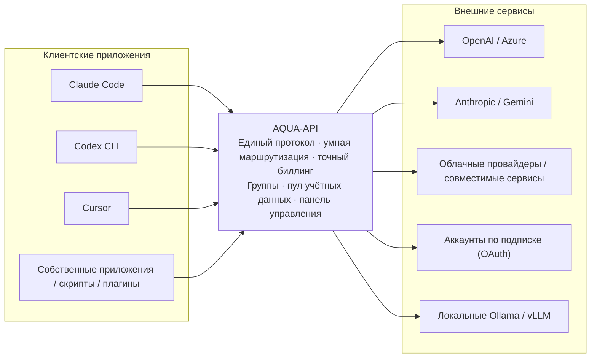
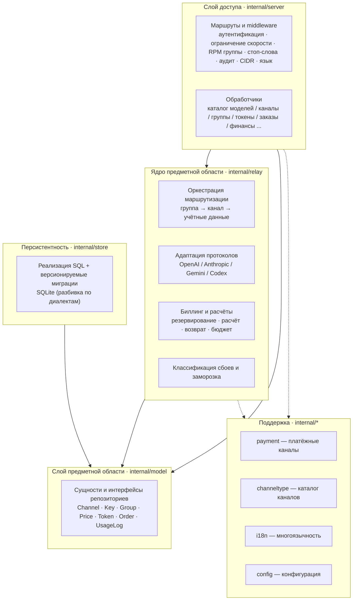
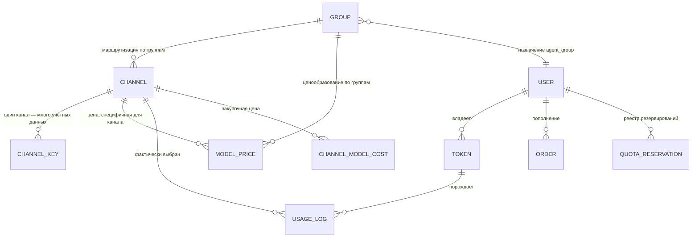
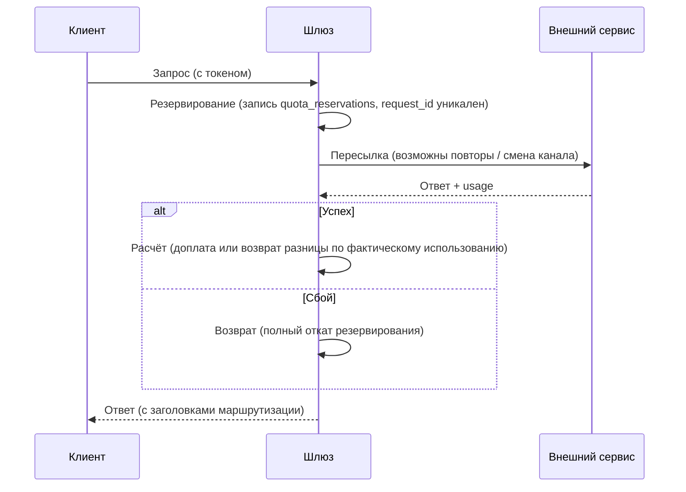

<div align="center">


# AQUA-API

**Соберите все ваши AI-бэкенды в единой точке входа.**

Самостоятельно размещаемый шлюз LLM API · Система управления использованием AI


[简体中文](README.md) · [English](README.en.md) · [Français](README.fr.md) · [Русский](README.ru.md) · [Español](README.es.md) · [العربية](README.ar.md)

</div>

---

## Официальные адреса

| Канал | Адрес |
| --- | --- |
| Официальный сайт (онлайн-демонстрация) | https://aqua.is3.cc |
| Репозиторий кода | https://github.com/LTZY-ACU/AQUA-API |
| Сообщить о проблеме (Issues) | https://github.com/LTZY-ACU/AQUA-API/issues |

> **Этот репозиторий — единственный авторитетный источник официальных адресов.** При изменении домена он обновляется здесь первым, а затем синхронизируется в любое другое место.
> Поэтому добавить в закладки этот репозиторий надёжнее, чем сохранять один домен.

### Защита от подделок

- Проект **не предоставляет и не авторизует** никакие услуги «пополнения за вас», «доверительного управления» или «официального совместного использования». Серверный код полностью открыт
  ([лицензия MIT](LICENSE)), любой может развернуть его самостоятельно — **работающий экземпляр ≠ официальный**.
- Признавайте только адреса из таблицы выше. Другие домены, даже с идентичным интерфейсом, к этому проекту отношения не имеют.
- Официальная сторона никогда не запрашивает в личных сообщениях логин, пароль, платёжные коды или коды подтверждения.
- Используя проект, вы принимаете [«Уведомление для пользователей и отказ от ответственности»](DISCLAIMER.md); границы бренда описаны в [«Заявлении о бренде и товарных знаках»](TRADEMARK.md).
- Перед участием в разработке прочтите [«Руководство по участию»](CONTRIBUTING.md) (модель Fork + PR, ветка `main` защищена).

### Ссылка не открывается?

Для подобных сайтов ложные блокировки со стороны соцсетей (QQ / WeChat и др.) — обычное явление. В таком случае:

1. Попробуйте другой браузер или смените сеть (мобильный интернет ↔ домашний широкополосный доступ);
2. **Делитесь ссылкой на этот репозиторий, а не «голым» доменом** — ссылки на платформы хостинга кода гораздо реже блокируются ошибочно,
   к тому же собеседник сможет сам подтвердить актуальный адрес сайта из репозитория;
3. Если блокировка подтверждена как ошибочная, подайте апелляцию по подсказке платформы.

> По любым вопросам присоединяйтесь к чату: **группа QQ 1103667832** (вход «Присоединиться к чату» в правом верхнем углу главной страницы сайта).

---

## Оглавление

- [Официальные адреса](#официальные-адреса)
- [Отказ от ответственности](#отказ-от-ответственности)
- [Что это](#что-это)
- [Почему стоит выбрать](#почему-стоит-выбрать)
- [Обзор возможностей](#обзор-возможностей)
- [Ключевые возможности](#ключевые-возможности)
- [Архитектура системы](#архитектура-системы)
- [Базовая модель данных](#базовая-модель-данных)
- [Полный жизненный цикл запроса](#полный-жизненный-цикл-запроса)
- [Поддерживаемые протоколы и бэкенды](#поддерживаемые-протоколы-и-бэкенды)
- [Обзор интерфейсов](#обзор-интерфейсов)
- [Права и роли](#права-и-роли)
- [Детали биллинга и учёта](#детали-биллинга-и-учёта)
- [Технологический стек](#технологический-стек)
- [Быстрый старт](#быстрый-старт)
- [Конфигурация](#конфигурация)
- [Примеры подключения](#примеры-подключения)
- [Руководство по эксплуатации](#руководство-по-эксплуатации)
- [Интернационализация](#интернационализация)
- [Безопасность](#безопасность)
- [Развёртывание и масштаб](#развёртывание-и-масштаб)
- [Частые вопросы](#частые-вопросы)
- [Глоссарий](#глоссарий)
- [Дорожная карта](#дорожная-карта)
- [Разработка](#разработка)
- [Участие в проекте](#участие-в-проекте)
- [Лицензия](#лицензия)

---

## Отказ от ответственности

**Перед использованием проекта прочтите [«Уведомление для пользователей и отказ от ответственности»](DISCLAIMER.md).**
Проект предназначен исключительно для законных технических исследований и внутреннего управления; пользователь обязан соблюдать
законодательство своей юрисдикции и условия подключаемых внешних сервисов. Автор не несёт ответственности за любые убытки, возникшие
в результате использования проекта.

Границы бренда и товарных знаков описаны в [«Заявлении о бренде и товарных знаках»](TRADEMARK.md).

---

## Что это

AQUA-API — это **самостоятельно размещаемый шлюз LLM API**, а также **система управления использованием AI**.

Имеющиеся у вас внешние сервисы обычно представляют собой набор несовместимых друг с другом вещей: официальные ключи OpenAI, Azure, Claude, Gemini, облачные провайдеры,
различные OpenAI-совместимые сервисы, аккаунты по подписке (Claude / Codex / Gemini) и локально запущенные Ollama / vLLM.
А на стороне потребителя — самые разные приложения: Claude Code, Codex CLI, Cursor, собственные приложения, скрипты, плагины.

AQUA-API встаёт посередине и превращает всё это в **единую точку входа, единый протокол и понятную отчётность**.



Основная задача проекта укладывается всего в три слова: **единство** (протокол и точка входа), **надёжность** (автоматический обход сбоев), **прозрачность расчётов** (каждое списание подтверждено документально).

---

## Почему стоит выбрать

Подобных шлюзов немало, не хватает лишь того, **кому можно спокойно доверить учёт денег**. Каждый пункт ниже — результат пройденных на практике ошибок.

| Критерий | Типичный подход | AQUA-API |
| --- | --- | --- |
| Ключи внешних сервисов | Хранятся в базе в открытом виде, в панели видно открытый текст | Шифрование AES-256-GCM при сохранении, мастер-ключ только из переменных окружения; даже при компрометации панели открытый текст не извлечь |
| Мастер-ключ шифрования | Прописан вместе с остальным в файле конфигурации | Одноимённое поле в файле конфигурации игнорируется; ключ задаётся только через переменную окружения и не утекает вместе с репозиторием |
| Сбой внешнего сервиса | После серии неудач — постоянное отключение, пул уменьшается | Классификация сбоев + заморозка в режиме half-open: ограничение скорости — лишь временный обход, по истечении срока автоматическое восстановление; удаление только при явном заявлении сервиса об отзыве учётных данных |
| Стратегия повторов | Либо повторять всегда, либо не повторять никогда | Разделение по типу сбоя: 429 — смена key с заморозкой, 5xx — смена канала, 401/403 — длительная заморозка, модерация контента — смена модели, пустой 200 — понижение уровня; учитывается `Retry-After` |
| Ограничение скорости и параллелизм | Один глобальный порог, при срабатывании блокируется всё | Независимый учёт по каждому учётному данным (вес / приоритет / лимит в минуту / число в обработке); для группы задаётся пакет запросов в минуту |
| Квота | Проверка до и после запроса, при параллелизме возможен перерасход | Резервирование → расчёт → возврат; доступная квота = квота − использовано − зарезервировано, отрицательного баланса даже при параллелизме не возникает |
| Периодический бюджет | Есть только общая квота, о перерасходе узнаёшь постфактум | Бюджет токена по скользящему окну (день / неделя / месяц), при превышении лимита в окне — автоматическое отключение |
| Биллинг стриминга | Читаются лишь первые байты ответа, длинный ответ тарифицируется как 0 | Инкрементальный разбор SSE, `usage` считывается даже из последнего кадра потока |
| Протоколы | Только совместимость с OpenAI | На стороне потребителя полноценны три протокола OpenAI / Anthropic / Gemini; на стороне внешнего сервиса адаптер выбирается по типу канала |
| Разделение аудитории | Ключ и есть право доступа, различить бесплатных и платных невозможно | Группа определяет доступные каналы и цены, токен может выбирать группу: одни и те же внешние сервисы, но у бесплатной и платной аудитории — свой учёт |
| Закупка для агентов | Скидки учитываются вручную, отчётность не сходится | Группа агента: в каталоге по идентичности агента показывается «зачёркнутая базовая цена + цена со скидкой», скидка = множитель группы, цена каталога и фактическое списание из одного источника |
| Гибкость ценообразования | Одна модель — одна цена, изменить нельзя | Цена настраивается по трём измерениям «модель × группа × канал»; каждая запись учёта хранит снимок версии ценообразования, после изменения цены старые записи пересчитываются |
| Прозрачность себестоимости | Есть только доход, непонятно, есть ли прибыль | Отчёт сверки реальной себестоимости: агрегация дохода, себестоимости и маржи по группе / каналу / модели; закупочная цена рассчитывается и по объёму, и за раз |
| Эксплуатация | При падении канала полагаются на ручной контроль | Панель здоровья каналов + автоматическое отключение по проценту успеха; панель администрирования поддерживает белый список CIDR |
| Комплаенс | Всё ограничивается одной строкой дисклеймера | Система комплаенс-уведомлений по всему сайту: раздел заявлений + бейджи моделей + всплывающее подтверждение при первом визите + предупреждение на странице пополнения |
| Развёртывание | Нужны база данных, Redis, среда сборки | Один бинарный файл + SQLite, фронтенд встроен, нулевой CGO, gcc не нужен |

---

## Обзор возможностей

Одна таблица охватывает весь спектр возможностей (подробности — в последующих разделах).

| Модуль | Возможности |
| --- | --- |
| Подключение протоколов | Совместимость с OpenAI · Anthropic · Gemini · Codex / Responses, четыре типа входящих можно включить одновременно |
| Адаптация внешних сервисов | Совместимость с OpenAI · Azure OpenAI · Anthropic · Gemini · Codex · аккаунты по подписке; в каталоге зарегистрировано 79 типов каналов, реализовано 37 |
| Маршрутизация каналов | Маршрутизация по группам · ветвление моделей на уровне канала · группировка и ветвление моделей на уровне учётных данных · правила по времени · пропуск по предохранителю на уровне канала |
| Диспетчеризация учётных данных | Последовательно / по кругу / взвешенный случайный / самый давно неиспользуемый / наименьшее число в обработке; вес · приоритет · лимит в минуту · число в обработке · время до конца заморозки |
| Обработка сбоев | Повторы с классификацией сбоев · заморозка на уровне канал × модель · экспоненциальная задержка · учёт `Retry-After` · привязка сессии · half-open восстановление |
| Биллинг | По объёму (три цены: ввод / вывод / кэш) · за раз · сопоставление по шаблону · цена, специфичная для канала · множитель группы · снимок версии ценообразования |
| Квоты и контроль рисков | Трёхэтапная схема резервирование / расчёт / возврат · двухуровневые квоты (токен и пользователь) · периодический бюджет токена (день / неделя / месяц) · идемпотентный реестр запросов |
| Группы и агенты | Сущность группы · множитель биллинга · порог разблокировки · RPM группы · распространение только из панели · уровень закупки агента и цена со скидкой в каталоге |
| Платежи и учёт | Вручную / YiPay / Stripe / официальный Alipay / официальный WeChat Pay · коды активации · идемпотентное зачисление заказа · доучёт отложенного платежа |
| Система пользователей | Регистрация · вход по коду на e-mail и сброс пароля · сессионные Cookie · временная пробная квота · реферальные вознаграждения · ежедневная отметка |
| Панель управления | Каталог моделей · каналы и пул ключей · группы · цены · токены · пользователи · заказы · коды активации · журнал вызовов · аудит |
| Дополнительные возможности | Асинхронные задачи · совместное формирование корпуса · массовая рассылка e-mail · объявления сайта · стоп-слова · сопоставление моделей · аккаунты по подписке OAuth |
| Наблюдаемость | Панель здоровья каналов · алерт по частоте повторов · отчёт сверки себестоимости · заголовки маршрутизации ответа · обзор эксплуатации и резервное копирование |
| Безопасность | Шифрование ключей при сохранении · маскирование логов · белый список CIDR · аудит извлечения открытого текста · защита от превышения прав |
| Интернационализация | По 6 языков на сервере и во фронтенде · данная документация доступна на шести официальных языках ООН |
| Развёртывание | Один бинарный файл · Docker · systemd · встроенный фронтенд · SQLite без сопровождения |

---

## Ключевые возможности

### Шлюз и пересылка

- **Три протокола на стороне потребителя**: совместимость с OpenAI (`/v1/chat/completions`, `/v1/models`, `/v1/embeddings`),
  Anthropic (`/v1/messages`), Gemini (`/v1beta`) — все три входящих протокола могут напрямую обслуживать соответствующие клиенты
- **Адаптеры внешних сервисов**: совместимость с OpenAI, Azure OpenAI (имя развёртывания + api-version), Anthropic, Gemini,
  Codex / Responses, а также различные аккаунты по подписке
- **Единое промежуточное представление**: внутри всё сводится к протоколу OpenAI (N×1); новый внешний сервис требует написать только «вход», новый клиент — только «выход»
- **Двустороннее преобразование потоков**: события SSE Anthropic / Gemini ↔ OpenAI `chat.completion.chunk`, включая вызов инструментов
- **Тайм-аут внешнего сервиса 300 секунд**: длинные ответы больших моделей не обрываются
- **Сквозная передача ошибок без изменений**: реальные ошибки внешнего сервиса (в т.ч. `detail` по RFC7807, `error.message` OpenAI) возвращаются напрямую, без проглатывания
- **Заголовки маршрутизации ответа для наблюдаемости**: `X-Routed-Via` (фактически выбранный канал), `X-Fallback-Attempts` (число попыток понижения уровня),
  `X-Upstream` (фактическое имя модели во внешнем сервисе) — для диагностики не нужен перехват пакетов

### Пул учётных данных и умная диспетчеризация

- **Пять стратегий**: последовательно / по кругу / взвешенный случайный / самый давно неиспользуемый / наименьшее число в обработке (по умолчанию), переключаются на уровне канала
- **Параметры уровня учётных данных**: вес, приоритет, лимит в минуту, число в обработке, время до конца заморозки — настраиваются для каждого ключа из панели
- **Повторы с классификацией сбоев**:
  - `429`: смена ключа и помещение его в короткую заморозку (экспоненциальная задержка), с учётом `Retry-After`
  - `5xx` / тайм-аут: повтор со сменой канала
  - `401 / 403 / 402`: длительная заморозка (не удаляем сразу, чтобы избежать ошибочного отсева хорошего ключа из-за кратковременного контроля рисков)
  - блокировка модерацией контента: смена модели
  - `200` с пустым содержимым: считается сбоем и понижается уровень
- **Заморозка на уровне канал × модель**: сбой замораживает только «данный канал × данную модель», не затрагивая другие модели того же канала
- **Привязка сессии**: одна сессия (`X-Session-Id`) закрепляется за одним и тем же учётным данным для повышения попаданий в кэш внешнего сервиса; при недоступности цели — автоматическое понижение уровня
- **Предохранитель на уровне канала**: когда у всех учётных данных канала исчерпан баланс / квота, маршрутизация активно пропускает канал и пишет лог, а не выбирает его и затем терпит неудачу
- **Разные способы ввода**: по одному / пакетная вставка / «всё в одном»

### Биллинг и учёт

- **Формула**: `квота = (входные Token × цена ввода + выходные Token × цена вывода) / 1 000 000`, дополнительно поддерживается тарификация за раз
- **Правила цен**: сопоставление по имени модели или по шаблону, могут привязываться к группе, а также задавать отдельную цену для конкретного канала
- **Отдельная цена кэша**: token из кэша внешнего сервиса тарифицируется по отдельной цене (при отсутствии настройки — откат к цене ввода)
- **Безопасность квоты**: трёхэтапная схема резервирование + расчёт + возврат, идемпотентный реестр гарантирует «не более одного зачисления»
- **Снимок версии ценообразования**: каждая запись журнала вызовов фиксирует версию правил ценообразования на тот момент; после изменения цены старые записи пересчитываются по старой цене
- **Периодический бюджет**: для токена задаётся «максимум N квоты за период»; окно по истечении сбрасывается лениво, без зависимости от планировщика
- **Платёжные каналы**: подтверждение вручную / YiPay / Stripe / официальный Alipay (RSA2) / официальный WeChat Pay (APIv3 + проверка подписи сертификата платформы + AES-GCM)
- **Учёт заказов**: проверка подписи обратного вызова, идемпотентное зачисление, доучёт отложенного платежа, ручное создание и закрытие заказа
- **Коды активации**: пакетная генерация; параллельное погашение — атомарное списание в рамках одной транзакции, 10 одновременных попыток погасить один код увенчаются успехом лишь один раз

### Группы, ценообразование и агентская система

- **Группа — полноценная сущность**: отображаемое имя, множитель биллинга, порог разблокировки, лимит запросов в минуту
- **Группы, распространяемые только из панели**: оптовая цена / агентский уровень полностью невидимы для обычных пользователей, назначаются только администратором
- **Уровень закупки агента**: пользователь, назначенный в агентскую группу, видит в каталоге моделей модели и цены именно своего уровня,
  показанные как «базовая цена зачёркнута + оранжевая цена со скидкой»
- **Цена каталога = фактическое списание**: цена каталога агента и биллинг берутся из одного набора правил цен
- **Статистика ссылок на группу**: перед удалением группы сообщается, сколько каналов и правил цен будет затронуто
- **Публичный калькулятор цен**: `GET /api/models/quote` (без входа), по числу token сразу возвращает прогноз стоимости

### Эксплуатация и панель управления

- **Каталог моделей**: фасетные фильтры + связанные счётчики фасетов + поиск + сортировка + два вида (карточки и список) +
  модальное окно с деталями (таблица цен, время вступления в силу, готовый к запуску cURL, калькулятор стоимости)
- **Управление каналами**: создание / удаление / изменение, проверка доступности, выдвижная панель пула ключей, получение списка моделей внешнего сервиса в один клик, расчёт закупочной цены (по объёму / за раз)
- **Панель здоровья каналов**: процент успеха, число ключей в заморозке, остаток баланса на одном экране; поддерживается автоматическое отключение по проценту успеха
- **Отчёт финансовой сверки**: агрегация дохода, себестоимости, маржи и рентабельности по группе / каналу / модели
- **Алерт по частоте повторов**: по группам скидок рассчитывается `r = число вызовов внешнего сервиса / число тарифицируемых запросов`, при пересечении порога безубыточности подаётся сигнал
- **Токены**: квота / срок действия / белый список моделей / принадлежность к группе / периодический бюджет / аудит извлечения открытого текста
- **Система пользователей**: регистрация, вход по коду на e-mail и сброс пароля, выдача временной пробной квоты и её отзыв по истечении
- **Приглашения и отметки**: пригласительные коды, реестр вознаграждений за регистрацию и пополнение, ежедневная отметка
- **Объявления сайта / аудит операций / стоп-слова / SMTP / асинхронные задачи / массовая рассылка e-mail / совместное формирование корпуса**
- **Остальная панель управления**: метаданные и сопоставление моделей, аккаунты по подписке OAuth, обзор эксплуатации и резервное копирование базы данных

### Фронтенд и темы

- **Три темы**: светлая / тёмная / тёмно-синяя, переключение в любой момент, предпочтение сохраняется локально
- **Интерфейс на шести языках**: 简体中文, English, Français, Русский, Español, العربية (включая RTL-раскладку)
- **Мобильные устройства**: нижняя навигация, автоматическое преобразование таблиц в карточки, адаптация к безопасной зоне, выдвижение модальных окон снизу

---

## Архитектура системы

Многоуровневый дизайн, однонаправленные зависимости, циклические зависимости между пакетами `internal/` запрещены.



| Слой | Каталог | Ответственность | Чего не делает |
| --- | --- | --- | --- |
| Слой доступа | `internal/server` | Маршрутизация, middleware, валидация запросов, преобразование DTO | Не пишет SQL напрямую, не реализует логику пересылки |
| Ядро предметной области | `internal/relay` | Маршрутизация, преобразование протоколов, пересылка, биллинг и расчёты, обработка сбоев | Не знает деталей HTTP, зависит только от интерфейсов `model` |
| Слой предметной области | `internal/model` | Сущности, правила, определение интерфейсов репозиториев | Не пишет SQL, не знает HTTP |
| Персистентность | `internal/store` | Реализация репозиториев, выполнение миграций, агрегирующие запросы | Не несёт бизнес-правил |
| Поддержка | `payment` / `channeltype` / `i18n` / `config` | Адаптеры платежей, каталог каналов, тексты, конфигурация | Не зависит обратно от верхних слоёв |

> Новый внешний сервис: регистрируется тип в `internal/channeltype/catalog.go`; при отличии протокола добавляется адаптер в `internal/relay/`.
> Новая таблица: создаётся новый скрипт с инкрементным номером в `internal/store/migrations/sqlite/` (только добавление, без изменения),
> затем синхронизируются сущности `model` и список столбцов `store`.

---

## Базовая модель данных



| Сущность | Ключевые поля | Описание |
| --- | --- | --- |
| `model_groups` | `ratio` множитель · `rpm_limit` лимит в минуту · `unlock_min_recharge_cents` порог · `admin_only` только из панели | Носитель аудитории и агентского уровня; множитель и есть скидка |
| `channels` | `group_names` обслуживаемые группы · `models` поддерживаемые модели · `key_strategy` стратегия диспетчеризации · стратегии повторов и заморозки | «Можно ли идти по этому внешнему сервису» |
| `channel_keys` | Зашифрованный ключ · ветвление по `group_names` / `models` · `weight` / `priority` / `rpm_limit` / `in_flight` · `cooldown_until` · окно квоты подписки | «Какие учётные данные использовать при обращении к этому сервису» |
| `model_prices` | `model` · `group_name` · `channel_id` (0 = любой канал) · цены ввода / кэша / вывода / за раз · способ тарификации | Приоритет выбора цены: цена конкретного канала → цена группы по умолчанию |
| `tokens` | `remain_quota` / `unlimited_quota` · `group_name` · `budget_quota` / `budget_period` / `budget_window_*` | Учётные данные потребителя + периодический бюджет |
| `quota_reservations` | Уникальный индекс `request_id` · конечный автомат `status` · `reserved` / `settled` | Идемпотентный шлюз, гарантирующий не более одного зачисления |
| `usage_logs` | Фактический канал / модель внешнего сервиса · детализация token · `quota` · снимок цены `price_version` | Основа для сверки и пересчёта |
| `channel_model_costs` | Правила закупочной цены по объёму / за раз | Вход для сверки себестоимости |
| `payment_orders` | `trade_no` · сумма · конечный автомат | Заказы на пополнение |
| `users` | Квота · `agent_group` агентская группа · роль | Аккаунт и агентская принадлежность |

---

## Полный жизненный цикл запроса

Путь одного вызова `/v1/chat/completions` внутри шлюза — для диагностики проблем и повторной разработки.

```mermaid
flowchart TD
    S["Запрос клиента"] --> P1["① Аутентификация и ограничение скорости"]
    P1 --> P1a["TokenAuth: проверка токена (включён / срок / белый список моделей / принадлежность к группе)"]
    P1a --> P1b["Резервирование квоты (первый шаг схемы резервирование → расчёт → возврат)"]
    P1b --> P1c["Шлюз RPM группы (при rpm_limit = 0 пропускается без затрат)"]
    P1c --> P1d["Предварительная фильтрация стоп-слов"]

    P1d --> P2["② Маршрутизация"]
    P2 --> P2a["Отбор доступных каналов по группе (состояние включения / поддержка модели / правила по времени)"]
    P2a --> P2b["Проверка предохранителя на уровне канала: исчерпан ли баланс у всех учётных данных → пропуск"]
    P2b --> P2c["Выбор учётных данных внутри канала: заморозка при сбое + заморозка канал × модель + привязка сессии + пять стратегий"]

    P2c --> P3["③ Пересылка и адаптация"]
    P3 --> P3a["Входящий протокол → внутреннее представление OpenAI → адаптер внешнего сервиса"]
    P3a --> P3b["Двустороннее преобразование потоков (на уровне кадров SSE)"]
    P3b --> P3c["Обработка по классификации сбоев: 429 — смена key / 5xx — смена канала / модерация — смена модели / пустой 200 — понижение уровня"]

    P3c --> P4["④ Запись обратно и учёт"]
    P4 --> P4a["Вставка заголовков наблюдаемости ответа (X-Routed-Via / X-Fallback-Attempts / X-Upstream)"]
    P4a --> P4b["Расчёт квоты: при успехе доплата или возврат разницы, при сбое полный возврат"]
    P4b --> P4c["Запись журнала вызовов (фактический канал / модель внешнего сервиса / снимок версии ценообразования)"]
    P4c --> P4d["Обновление рабочего состояния учётных данных (последнее использование / заморозка / счётчик сбоев / баланс)"]
```



---

## Поддерживаемые протоколы и бэкенды

**Потребители (как приложения подключаются к сайту)**: совместимость с OpenAI · Anthropic · Gemini

**Внешние сервисы (как сайт подключается к другим)**: в каталоге зарегистрировано **79** типов каналов, организованных в 8 категорий:

| Категория | Описание |
| --- | --- |
| Большие текстовые модели | OpenAI / Azure / Anthropic / Gemini / DeepSeek / Kimi / Zhipu / Tongyi / SiliconFlow / OpenRouter / Groq / Together / Mistral / xAI / Ollama / vLLM и др. |
| Агрегаторы | Различные агрегирующие прокси |
| Аккаунты по подписке | Аккаунты по подписке Claude / Codex / Gemini и др. (обновление OAuth) |
| Self-hosted | Локальное и приватное развёртывание |
| Изображения | Внешние сервисы генерации изображений |
| Видео | Внешние сервисы генерации видео |
| Аудио | Речевые внешние сервисы |
| Встраивание | Внешние сервисы типа Embedding |

> **Честно говоря**: из 79 типов **для 37 выполнены адаптеры протоколов и реализация аутентификации** (`Available: true`), их можно выбрать сразу;
> остальные типы помечены в панели как «скоро» и недоступны для выбора — вы не обнаружите недоступность на середине настройки.
> Белый список реализованных протоколов и способов аутентификации зафиксирован в `internal/channeltype/catalog_test.go` во избежание ошибочной разметки.

---

## Обзор интерфейсов

### Интерфейсы шлюза (протоколы потребителя)

| Метод | Путь | Описание |
| --- | --- | --- |
| POST | `/v1/chat/completions` | Диалог, совместимый с OpenAI (с поддержкой стриминга) |
| POST | `/v1/embeddings` | Векторизация |
| GET | `/v1/models` | Список доступных моделей |
| POST | `/v1/messages` | Протокол Anthropic (прямое подключение Claude Code) |
| POST | `/v1/responses` | Протокол OpenAI Responses / Codex |
| POST | `/v1beta/models/*action` | Протокол Gemini |
| POST | `/v1/tasks` | Отправка асинхронной задачи генерации |
| GET | `/v1/tasks` · `/v1/tasks/:ref` | Список и детали задач |

### Публичные интерфейсы (без входа)

| Метод | Путь | Описание |
| --- | --- | --- |
| GET | `/healthz` | Проверка состояния (включая версию базы данных и миграций) |
| GET | `/api/status` | Информация о сайте (включая курс обмена квоты, комплаенс-информацию) |
| GET | `/api/models` | Каталог моделей (с представлением агента) |
| GET | `/api/models/quote` | Публичный калькулятор цен |
| GET | `/api/announcements` | Объявления сайта |
| GET | `/api/payment/public` | Публичные параметры оплаты |
| POST/GET | `/api/payments/:method/notify` | Обратный вызов оплаты (проверка подписи по каналу) |
| GET | `/sitemap.xml` · `/robots.txt` | SEO |

### Интерфейсы аккаунта

| Метод | Путь | Описание |
| --- | --- | --- |
| POST | `/api/auth/register` | Регистрация |
| POST | `/api/auth/login` · `/api/auth/admin-login` | Вход по паролю / вход в панель администрирования |
| POST | `/api/auth/email-code` · `/api/auth/email-login` | Код на e-mail и вход по коду |
| POST | `/api/auth/password-reset` | Сброс пароля |
| GET | `/api/install/status` · POST `/api/install` | Мастер установки |
| GET | `/api/auth/me` · POST `/api/auth/logout` | Текущая личность / выход |

### Портал пользователя `/api/user`

Создание, удаление, изменение и чтение токенов, а также извлечение открытого текста (`/tokens`, `/tokens/:id/key`), доступные группы (`/groups`), использование и журналы
(`/usage`, `/logs`), задачи (`/tasks`), заказы (`/orders`, `/orders/:tradeNo`), погашение (`/redeem`),
приглашения и вознаграждения (`/referral`, `/referral/rewards`), отметка (`/checkin`), финансовый обзор (`/finance`),
пробная квота (`/trial`).

### Панель администрирования `/api/admin`

| Блок | Представительные эндпоинты |
| --- | --- |
| Обзор | `/dashboard` · `/maintenance/overview` · `/maintenance/backup` |
| Каналы | `/channels` CRUD · `/channels/:id/test` проверка · `/channels/:id/keys` пул ключей · `/channels/:id/costs` закупочная цена · `/channels/:id/mappings` сопоставление моделей · `/fetch-models` получение моделей · `/channel-types` |
| Группы и цены | `/groups` CRUD · `/prices` CRUD · `/prices/quote` калькулятор |
| Токены и пользователи | `/tokens` CRUD и открытый текст · `/users` CRUD |
| Контент и эксплуатация | `/announcements` · `/broadcasts` рассылка · `/sensitive-words` · `/corpus/*` корпус · `/trial-grants` |
| Учёт | `/orders` · `mark-paid` / `close` · `/redeem-codes` · `/finance/reconciliation` сверка себестоимости |
| Система | `/settings` · `/smtp` и тестовая отправка · `/oauth-providers` · `/audit-logs` · `/logs` · `/tasks` |

> Актуальный список из 140+ эндпоинтов — в `internal/server/router.go`; эндпоинты администрирования по умолчанию защищены сессионной аутентификацией,
> дополнительно может накладываться белый список CIDR.

---

## Права и роли

| Роль | Определение | Область видимости | Типичные возможности |
| --- | --- | --- | --- |
| Гость | Не вошёл | Каталог моделей (публичные цены), публичный калькулятор, объявления | Знакомство с ценами, расчёт стоимости |
| Обычный пользователь | Сессионный Cookie | Свои токены / использование / заказы / приглашения / отметки | Создание токена, пополнение, просмотр счетов |
| Пользователь-агент | Пользователю назначен `agent_group` | Каталог показывает модели и цены со скидкой **его уровня** | Вызовы со скидкой закупки, учёт по скидке |
| Администратор | Роль администратора | Вся панель (может дополняться белым списком CIDR) | Каналы, цены, пользователи, заказы, финансы |
| Супер-администратор | Создаётся мастером установки | Вся панель + системные настройки и обслуживание | Конфигурация сайта, резервные копии, SMTP, OAuth |

> Защита от превышения прав: извлечение открытого текста токена требует проверки принадлежности + записи в аудит; агентский уровень виден только его владельцу;
> переключение группы токена требует проверки «существование группы + достижение пользователем порога разблокировки».

---

## Детали биллинга и учёта

### Формула квоты

```
По объёму: квота = (входные Token × цена ввода + кэш Token × цена кэша + выходные Token × цена вывода) / 1 000 000
За раз: квота = цена за раз × количество
Фактическое зачисление = квота × множитель группы / 100
```

Денежные значения на всём протяжении используются как **целочисленная квота типа int64**, и лишь на уровне отображения пересчитываются в юани по курсу обмена сайта, что исключает дрейф чисел с плавающей точкой.
Бесплатные модели / модели без цены **пропускают резервирование** и не блокируются стеной квоты.

### Трёхэтапный расчёт



### Приоритет ценообразования

```
Цена конкретного канала (channel_id = данный канал)   ← наивысший
        ↓ при отсутствии — откат
Цена группы по умолчанию (channel_id = 0)
```

### Себестоимость и маржа

```
Маржа = доход от продажи (фактически списанная с пользователя квота) − себестоимость внешнего сервиса (по правилам закупочной цены канала)
```

Отчёт сверки себестоимости агрегируется по группе / каналу / модели; **запросы без занесённой закупочной цены помечаются отдельно**,
иначе эта часть себестоимости считается по 0, и отчёт получается чрезмерно оптимистичным.

---

## Технологический стек

| Слой | Выбор | Описание |
| --- | --- | --- |
| Бэкенд | Go 1.27 + Gin v1.12 | Один бинарный файл, нулевой CGO (для SQLite используется чисто Go-библиотека `modernc.org/sqlite`) |
| База данных | SQLite | Встраиваемая, без сопровождения; скрипты миграций разбиты по диалектам, предусмотрены точки расширения |
| Фронтенд | Next.js 16.3 (статический экспорт) + React 19 + Tailwind CSS v4 + TypeScript 5 | Результат сборки `web/dist` встраивается в бинарный файл через `go:embed` |
| Графики | ECharts 5 | Диаграммы статистики в панели |

<div align="center">


</div>

> Фронтенд собирается статически с `output: 'export'`, **без отдельного хостинга фронтенда**: интерфейс и API используют один источник и порт,
> для развёртывания нужен только один бинарный файл.

---

## Быстрый старт

### Вариант 1: Docker Compose (рекомендуется)

```bash
git clone https://github.com/LTZY-ACU/AQUA-API.git && cd AQUA-API
cp .env.example .env

docker build -t aqua-api:local .          # Первая сборка (фронтенд + бэкенд + рабочий образ)
docker run --rm aqua-api:local -gen-key   # Вывести мастер-ключ и вписать в AQUA_APP_KEY в .env

docker compose up -d
```

Откройте в браузере `http://127.0.0.1:8787`. Данные размещаются на хост-машине в каталоге `./data`; при переносе сервера достаточно упаковать этот каталог.

### Вариант 2: docker run (без compose)

```bash
docker build -t aqua-api:local .

docker run -d --name aqua-api \
  -p 8787:8787 \
  -e AQUA_APP_KEY="<你的主密钥>" \
  -e AQUA_SERVER_LISTEN=0.0.0.0:8787 \
  -v "$PWD/data:/data" \
  --restart unless-stopped \
  aqua-api:local
```

### Вариант 3: один бинарный файл (Linux-сервер / systemd)

```bash
go build -o aqua ./cmd/aqua           # Чистый Go, нулевой CGO, gcc не нужен

./aqua -gen-key                        # Генерация мастер-ключа шифрования (только генерация, без записи на диск)

sudo useradd -r -s /usr/sbin/nologin aqua
sudo mkdir -p /opt/aqua /etc/aqua /var/lib/aqua
sudo cp aqua /opt/aqua/aqua && sudo chown aqua:aqua /opt/aqua/aqua

sudo cp .env /etc/aqua/aqua.env        # Вписать реальный ключ
sudo chmod 600 /etc/aqua/aqua.env && sudo chown root:root /etc/aqua/aqua.env

sudo cp aqua-api.service /etc/systemd/system/
sudo systemctl daemon-reload && sudo systemctl enable --now aqua-api
sudo systemctl status aqua-api
```

**Обновление**: замените `/opt/aqua/aqua` и выполните `sudo systemctl restart aqua-api`; миграции базы данных выполняются автоматически при запуске.

> Рекомендуется сохранять предыдущую версию бинарного файла (например, `aqua.bak-<временная метка>`). Для отката достаточно `cp` старого файла и перезапуска;
> миграции базы данных только добавляют столбцы, не удаляют их, обеспечивая обратную совместимость.

### Вариант 4: запуск из исходников (разработка)

```bash
# Фронтенд (необязательно: в репозитории web/dist — заглушка, реальный интерфейс встраивается только после сборки)
cd web && npm ci && npm run build && cd ..

go build -o bin/aqua ./cmd/aqua
export AQUA_APP_KEY="<你的主密钥>"      # Windows: $env:AQUA_APP_KEY="..."
./bin/aqua -config ./aqua.json          # Без -config используются значения по умолчанию и переменные окружения
curl http://127.0.0.1:8787/healthz
```

> **Фронтенд встроен**: `go:embed` упаковывает `web/dist` в бинарный файл, поэтому для развёртывания нужен всего один файл.
> При `go build` без предварительной сборки фронтенда интерфейс будет страницей-заглушкой, но API полностью работоспособен.

### Первое использование (мастер установки)

При первом открытии сайта запускается мастер установки: создание аккаунта супер-администратора → заполнение информации о сайте → (необязательно) настройка платёжных и почтовых каналов.
В панель администрирования можно также войти через отдельный вход.

### Обратный прокси

При предоставлении сервиса извне рекомендуется ставить перед ним Nginx или Caddy и включать HTTPS. Два частых подводных камня:

```nginx
location / {
    proxy_pass http://127.0.0.1:8787;
    proxy_http_version 1.1;

    # 1) Для потоковых ответов необходимо отключить буферизацию, иначе фронтенд будет ждать генерации всего ответа и только затем отображать текст посимвольно
    proxy_buffering off;
    proxy_cache off;

    # 2) Тайм-аут должен превышать тайм-аут внешнего сервиса шлюза (по умолчанию 300 секунд), иначе длинный ответ оборвётся обратным прокси раньше
    proxy_read_timeout 600s;
    proxy_send_timeout 600s;

    proxy_set_header Host $host;
    proxy_set_header X-Real-IP $remote_addr;
    proxy_set_header X-Forwarded-For $proxy_add_x_forwarded_for;
    proxy_set_header X-Forwarded-Proto $scheme;
}
```

> Если домен находится за оранжевым облаком Cloudflare, учитывайте, что возврат к источнику в CF имеет жёсткий предел 100 секунд, при превышении возвращается 524.
> Чтобы полностью использовать тайм-аут 300 секунд, добавьте серую (DNS only) запись для прямого подключения к источнику.

---

## Конфигурация

Приоритет: **значения по умолчанию < файл конфигурации < переменные окружения**.

### Переменные окружения

| Переменная | Обязательна | Описание |
| --- | --- | --- |
| `AQUA_APP_KEY` | Да | Мастер-ключ шифрования, задаётся только через переменную окружения (одноимённое поле в файле конфигурации игнорируется). Генерируется командой `aqua -gen-key` |
| `AQUA_SERVER_LISTEN` | Нет | Адрес прослушивания, по умолчанию `127.0.0.1:8787`; в контейнере должен быть `0.0.0.0:8787` |
| `AQUA_SERVER_MODE` | Нет | `debug` / `release` / `test` |
| `AQUA_DATABASE_DRIVER` | Нет | Сейчас `sqlite` |
| `AQUA_DATABASE_DSN` | Нет | Путь к файлу SQLite, по умолчанию `./data/aqua.db` (родительский каталог создаётся автоматически) |
| `AQUA_RELAY_GROUP` | Нет | Группа шлюза по умолчанию (в какую группу попадают токены без группы), по умолчанию `default` |
| `AQUA_ADMIN_ALLOW_CIDRS` | Нет | Белый список доступа к панели администрирования, CIDR через запятую (например, `10.0.0.0/8,1.2.3.4/32`). Пусто — без ограничений |
| `AQUA_CHANNEL_AUTO_DISABLE_MIN_REQUESTS` | Нет | Минимальный размер выборки для автоматического отключения канала, `0` — отключить автоотключение (по умолчанию выключено) |
| `AQUA_CHANNEL_AUTO_DISABLE_SUCCESS_RATE` | Нет | Нижний предел процента успеха (например, `0.9`); ниже него при достаточной выборке канал отключается |
| `AQUA_CHANNEL_AUTO_DISABLE_WINDOW_MINUTES` | Нет | Окно статистики (минуты) |
| `AQUA_SMTP_HOST` | Нет | Адрес SMTP-сервера (коды на e-mail и уведомления, можно настроить и в панели) |
| `AQUA_SMTP_PORT` | Нет | Порт SMTP, по умолчанию `465` |
| `AQUA_SMTP_USERNAME` | Нет | Имя пользователя SMTP |
| `AQUA_SMTP_PASSWORD` | Нет | Пароль SMTP, задаётся только через переменную окружения |
| `AQUA_SMTP_FROM` | Нет | Адрес отправителя |
| `AQUA_SMTP_FROM_NAME` | Нет | Отображаемое имя отправителя, по умолчанию `AQUA-API` |
| `AQUA_EPAY_KEY` | Нет | Секретный ключ продавца YiPay (подпись MD5) |
| `AQUA_STRIPE_SECRET_KEY` | Нет | Stripe Secret Key |
| `AQUA_STRIPE_WEBHOOK_SECRET` | Нет | Секрет подписи Stripe Webhook |
| `AQUA_ALIPAY_PRIVATE_KEY` | Нет | Приватный ключ приложения Alipay (RSA2, поддерживаются PEM и «голый» base64) |
| `AQUA_ALIPAY_PUBLIC_KEY` | Нет | Публичный ключ Alipay |
| `AQUA_WECHATPAY_APIV3_KEY` | Нет | Ключ APIv3 WeChat Pay (32 байта) |
| `AQUA_WECHATPAY_PRIVATE_KEY` | Нет | Приватный ключ продавца WeChat Pay (PEM) |
| `AQUA_WECHATPAY_PLATFORM_PUBLIC_KEY` | Нет | Публичный ключ сертификата платформы WeChat Pay для проверки подписи обратного вызова |
| `AQUA_LOG_LEVEL` | Нет | `debug` / `info` / `warn` / `error` |
| `AQUA_LOG_FORMAT` | Нет | `text` / `json` |

Полный пример см. в [`.env.example`](.env.example).

### Файл конфигурации

```json
{
  "server":   { "listen": "127.0.0.1:8787", "mode": "release" },
  "database": { "driver": "sqlite", "dsn": "./data/aqua.db" },
  "log":      { "level": "info", "format": "text" }
}
```

### Два железных правила безопасности

1. **Секретные настройки никогда не попадают в базу данных**. Платёжные и SMTP-настройки, а также мастер-ключ шифрования задаются только через переменные окружения; в базу данных попадают
   и могут изменяться из панели лишь эксплуатационные параметры (адрес шлюза, номер продавца, курс, лимиты, переключатели). Даже при полном похищении базы данных
   из неё нельзя получить ни одного непосредственно пригодного учётного данного.
2. **Мастер-ключ обязательно резервируйте отдельно**. При его изменении все ключи внешних сервисов в базе больше не расшифруются, их придётся вводить заново.

---

## Примеры подключения

Любой клиент, совместимый с OpenAI, — укажите Base URL сюда и замените Key на токен AQUA-API.

### curl

```bash
curl https://你的域名/v1/chat/completions \
  -H "Authorization: Bearer sk-你的令牌" \
  -H "Content-Type: application/json" \
  -d '{
    "model": "你的模型名",
    "messages": [{"role": "user", "content": "你好"}],
    "stream": true
  }'
```

### OpenAI SDK (Python)

```python
from openai import OpenAI

client = OpenAI(
    base_url="https://你的域名/v1",
    api_key="sk-你的令牌",
)
resp = client.chat.completions.create(
    model="你的模型名",
    messages=[{"role": "user", "content": "你好"}],
)
print(resp.choices[0].message.content)
```

### Клиент Claude Code / Anthropic

AQUA-API нативно поддерживает протокол Anthropic и может напрямую обслуживать трафик Claude Code:

```bash
export ANTHROPIC_BASE_URL=https://你的域名
export ANTHROPIC_AUTH_TOKEN=sk-你的令牌
claude
```

### Другие клиенты

Cursor, Codex CLI, Cherry Studio, NextChat, LobeChat, иммерсивный перевод и др. — выберите
«OpenAI-совместимый / пользовательский интерфейс OpenAI», укажите Base URL и токен выше.

### Расчёт стоимости (без токена)

```bash
curl "https://你的域名/api/models/quote?model=你的模型名&prompt_tokens=1000&completion_tokens=500"
```

---

## Руководство по эксплуатации

### Связь групп и каналов

- **Канал** определяет «может ли этот запрос идти по данному внешнему сервису»: какие модели он заявляет и к каким группам относится;
- **Учётные данные** (каждый key внутри канала) определяют «какие из них использовать при обращении к сервису» и дополнительно ограничивают, каким группам и моделям они служат;
- **Токен** может указывать свою группу; если не указана — попадает в группу шлюза по умолчанию (`AQUA_RELAY_GROUP`).

> Самый частый подводный камень: после переноса канала в новую группу, если забыть синхронизировать группу по умолчанию, все «токены без группы» немедленно начнут получать
> «нет доступных каналов».

### Как настроить уровень закупки агента

1. В разделе «Группы» панели создайте агентский уровень (например, `agent`), задайте множитель биллинга как скидку закупки (например, `60` — оплата по 60 % цены, то есть скидка 40 %),
   и включите «только из панели»;
2. В разделе «Цены» настройте прайс-лист для этого уровня либо переиспользуйте один набор правил со скидкой по множителю;
3. В разделе «Пользователи» назначьте `agent_group` аккаунта агента на этот уровень;
4. После входа агент автоматически видит в каталоге моделей свой уровень с «зачёркнутой базовой ценой + ценой со скидкой», при этом источник цены тот же, что и для фактического списания.

### Квоты и бюджет

- **Общая квота**: двухуровневая — токен и пользователь, `-1` означает без ограничения;
- **Периодический бюджет**: для токена задаётся «максимум N юаней за период», период — день / неделя / месяц; при превышении лимита в окне возвращается 429,
  по истечении окна сброс происходит автоматически.

### Рекомендации по управлению каналами

- Не менее 3 ключей на канал, чтобы избежать единой точки ограничения скорости;
- Для сервисов со склонностью к ограничению скорости занижайте лимит одного ключа в минуту, передавая смену key диспетчеру;
- Следите за панелью здоровья каналов по проценту успеха; при необходимости включайте автоматическое отключение по проценту успеха;
- Регулярно проверяйте запросы «без занесённой закупочной цены», обеспечивая достоверность отчёта о себестоимости.

---

## Интернационализация

| Уровень | Поддержка | Описание |
| --- | --- | --- |
| Интерфейс фронтенда | 简体中文 · English · Français · Русский · Español · العربية | Шесть языков, включая RTL-раскладку |
| Тексты сервера | Те же шесть | Локализация сообщений об ошибках по `Accept-Language` |
| Данная документация | Те же шесть | См. переключатель языков в шапке |

> Данная документация охватывает **шесть официальных языков ООН** (китайский, английский, французский, русский, испанский, арабский).
> Если вам нужны лишь некоторые из них, просто удалите соответствующие `README.<язык>.md`, остальные не пострадают.

---

## Безопасность

- **Шифрование ключей при сохранении**: ключи внешних сервисов шифруются AES-256-GCM, мастер-ключ задаётся только через переменную окружения (одноимённое поле файла конфигурации игнорируется)
- **Маскирование логов**: в логи выводятся лишь «внедрены ли учётные данные», а также хост и путь внешнего сервиса; даже строка запроса не выводится
- **Белый список CIDR**: `AQUA_ADMIN_ALLOW_CIDRS` ограничивает источники доступа к панели администрирования, вне белого списка доступ отклоняется
- **Аудит извлечения открытого текста**: открытый текст токена выдаётся через отдельный интерфейс с записью в журнал аудита (кто, когда, какой ключ)
- **Защита от превышения прав**: агентский уровень виден только его владельцу; переключение группы токена проверяет существование и порог разблокировки; при несовпадении принадлежности — единый ответ 404
- **Идемпотентность**: реестр запросов с уникальным индексом `request_id` служит шлюзом; повтор, разрыв соединения, двойной обратный вызов — не более одного зачисления
- **Пароли и сессии**: пароль хешируется с солью; для сессии используется подписанный Cookie, проверяемый на сервере
- **Безопасность контента**: предварительная фильтрация стоп-слов + управление словарём
- **Резервное копирование**: предусмотрены резервное копирование базы данных и точка проверки файла резервной копии

---

## Развёртывание и масштаб

| Сценарий | Рекомендация |
| --- | --- |
| Локальная проба | Запуск одного бинарного файла, SQLite в `./data` |
| Продуктив на одной машине | systemd + обратный прокси Nginx/Caddy + HTTPS; сохраняйте предыдущую версию бинарного файла для отката |
| Контейнеризация | Многоэтапный Dockerfile; том данных на `/data`; внедрение ключей через переменные окружения |
| Резервное копирование | Остановка службы и копирование либо горячее резервирование `aqua.db` через `VACUUM INTO`, **одновременно сохранив `AQUA_APP_KEY`** |
| Масштаб | SQLite на одной машине достаточно для малого и среднего объёма; слой хранения уже содержит швы по диалектам, что позволяет в дальнейшем плавно подключить внешнюю базу данных |
| Горизонтальное масштабирование | Шлюз не имеет состояния и может работать в нескольких экземплярах, но **привязка сессии находится внутри процесса**, при нескольких экземплярах она вырождается в режим «по возможности» |

---

## Частые вопросы

**`/healthz` возвращает 503 — что делать?**
503 возникает при недоступности базы данных. Проверьте ошибку базы данных в логах; в случае SQLite в первую очередь проверьте права на каталог данных.

**Почему в панели не видно открытого текста ключей каналов?**
Это осознанное решение. Ключи хранятся в базе зашифрованными AES-256-GCM, интерфейс показывает только маску; даже при компрометации панели пригодные учётные данные не извлечь.
Для замены просто перезапишите новый ключ.

**После переноса канала в новую группу все токены выдают «нет доступных каналов»?**
Это самый частый подводный камень. У шлюза есть группа по умолчанию (`AQUA_RELAY_GROUP`), определяющая, где искать каналы для «токенов без группы».
После переноса канала в новую группу необходимо синхронно изменить эту группу по умолчанию и перезапуститься, иначе старые токены мгновенно потеряют связь.

**Почему бесплатная модель всё равно упирается в квоту?**
Модели, не совпавшие ни с одним правилом цен, пропускают резервирование и в норме не должны блокироваться. Если блокировка есть, проверьте, не задано ли в группе правило цен по шаблону
(например, `*`), которое делает модель «платной» и включает проверку квоты.

**Внешний сервис часто возвращает 429 или тайм-аут?**
429 — сбой уровня учётных данных: происходит смена ключа и его помещение в короткую заморозку (экспоненциальная задержка, автоматическое восстановление по истечении).
Если это часто, обычно ключей слишком мало или у сервиса низкий лимит скорости — добавьте ключи в канал или понизьте лимит одного ключа в минуту.

**В группе задан лимит в минуту, пользователь получает 429 — что делать?**
В теле ответа `error.code` равен `quota.group_rpm_exceeded`, что указывает на лимит в минуту этой группы.
Увеличьте лимит или переведите пользователя в группу без ограничения скорости.

**Агент говорит: «вижу цену со скидкой, а списывается полная»?**
В норме такого быть не должно: цена каталога агента и биллинг берутся из одного набора правил цен. Проверьте два момента:
во-первых, `agent_group` аккаунта агента действительно назначен на этот агентский уровень; во-вторых, группа, выбранная агентом при создании токена, — это именно этот уровень.
Если оба верны, а расхождение сохраняется, создайте Issue.

**Как делать резервную копию данных?**
В случае SQLite: остановите службу (или используйте горячее резервирование `VACUUM INTO`) → скопируйте `aqua.db` → одновременно сохраните `AQUA_APP_KEY`.
Без мастер-ключа ключи внешних сервисов в резервной копии — это набор нерасшифровываемых байтов.

**Поддерживаются ли MySQL или PostgreSQL?**
Сейчас по умолчанию и единственно поддерживается SQLite, чего достаточно для самостоятельного размещения и малого/среднего объёма. Слой хранения уже содержит швы по диалектам,
подключение в дальнейшем не потребует переписывания бизнес-слоя.

**Как добавить новый тип канала внешнего сервиса?**
Зарегистрируйте метаданные типа в `internal/channeltype/catalog.go` и убедитесь, что он входит в белый список реализованных в `catalog_test.go`.
При отличии протокола потребуется добавить адаптер в `internal/relay/`.

**Почему в логах не видно настроенных мной ключей внешних сервисов?**
Это тоже осознанное решение: в логи выводятся лишь «внедрены ли учётные данные», а также хост и путь внешнего сервиса, и даже строка запроса URL не выводится.

**Как узнать, по какому каналу прошёл запрос и сколько было понижений уровня?**
В заголовках ответа есть `X-Routed-Via`, `X-Fallback-Attempts`, `X-Upstream`; в журнале вызовов также фиксируются фактический канал и имя модели внешнего сервиса.

---

## Глоссарий

| Термин | Значение |
| --- | --- |
| Канал / Channel | Один внешний сервис (включая base_url, протокол, аутентификацию и доступные модели) |
| Учётные данные / Channel Key | Один ключ внешнего сервиса внутри канала; допускает независимые вес, ограничение скорости и область применения |
| Группа / Group | Носитель аудитории и цен; определяет доступные каналы и множитель биллинга |
| Агентский уровень | Группа, распространяемая только из панели, множителем выражающая скидку закупки |
| Квота / Quota | Внутренняя учётная единица сайта (целое число); при отображении пересчитывается в юани по курсу обмена |
| Токен / Token | API Key, выдаваемый потребителю (начинается с `sk-`) |
| Резервирование · расчёт · возврат | Трёхэтапный процесс квоты для защиты от перерасхода при параллелизме |
| Периодический бюджет | Верхний предел квоты токена за день / неделю / месяц, при превышении — отключение |
| Заморозка / Cooldown | Временное состояние недоступности учётных данных, по истечении восстанавливается автоматически |
| Удаление / Retire | Постоянная недоступность учётных данных (только при явном заявлении сервиса об отзыве) |
| Пропуск по предохранителю | Когда канал в целом недоступен, маршрутизация активно пропускает его |
| Снимок версии ценообразования | Зафиксированная при учёте версия правил ценообразования для последующего пересчёта |
| Закупочная цена / Cost | Закупочная себестоимость внешнего сервиса для сверки маржи |
| Заголовки маршрутизации ответа | `X-Routed-Via` и др., для наблюдения за фактической маршрутизацией и понижением уровня |

---

## Дорожная карта

- [x] Взаимное преобразование протоколов (OpenAI ↔ Anthropic ↔ Gemini), двустороннее преобразование потоков с вызовом инструментов
- [x] Пять стратегий диспетчеризации пула учётных данных, half-open заморозка, привязка сессии, счётчик в обработке
- [x] Система квот резервирование / расчёт / возврат; инкрементальный разбор потокового использования
- [x] Группы и множители, каталог моделей, коды активации, пять платёжных каналов, асинхронные задачи
- [x] Развёртывание одним бинарным файлом + Docker, встроенный фронтенд
- [x] Браузерный мастер установки + отдельный вход супер-администратора; аудит административных операций, объявления сайта
- [x] Вход по коду на e-mail и сброс пароля; реферальные вознаграждения и отметки; временная пробная квота
- [x] Повторы с классификацией сбоев, заморозка канал × модель, учёт `Retry-After`
- [x] Бюджет токена по скользящему окну (день / неделя / месяц)
- [x] Пакет запросов в минуту группы (RPM), пропуск по предохранителю баланса на уровне канала
- [x] Уровень закупки агента и сравнение с ценой со скидкой в каталоге, публичный интерфейс калькулятора цен
- [x] Отчёт сверки реальной себестоимости (доход − себестоимость − маржа), снимок версии ценообразования
- [x] Панель здоровья каналов и автоматическое отключение по проценту успеха, белый список CIDR для администрирования
- [x] Три темы (светлая / тёмная / тёмно-синяя), система комплаенс-уведомлений по всему сайту
- [x] Подписанная аутентификация AWS Bedrock и Google Vertex (SigV4 / JWT сервисного аккаунта)
- [x] Универсальный асинхронный адаптер внешних сервисов (управляемый конфигурацией; подходит для любых сервисов генерации изображений / видео / музыки); адаптеры под конкретных поставщиков добавляются по мере необходимости
- [x] Интерфейс ввода цены, специфичной для канала (модель × группа × канал)
- [x] Визуализация окна квоты аккаунтов по подписке (двойное окно: 5 часов / неделя)

---

## Разработка

```bash
go build ./...       # Сборка
go test ./...        # Тесты
gofmt -w .           # Форматирование

cd web && npm ci && npm run type-check && npm run build   # Фронтенд
```

Структура каталогов (корень данного репозитория — это и есть каталог кода):

```
cmd/aqua/              Точка входа программы (только сборка, без бизнес-логики)
internal/config/       Загрузка и валидация конфигурации
internal/model/        Модели предметной области и интерфейсы репозиториев (без SQL)
internal/store/        Реализация персистентности (SQL + версионируемые миграции, разбивка по диалектам)
internal/server/       Слой HTTP (маршруты / middleware / обработчики)
internal/relay/        Адаптация протоколов и пересылка (ядро: маршрутизация / биллинг / заморозка)
internal/payment/      Адаптеры платёжных каналов
internal/channeltype/  Реестр типов потребителей и сервисов (79 видов)
internal/i18n/         Многоязычные тексты сервера
web/                   Фронтенд (Next.js, результат сборки встраивается в бинарный файл)
assets/                Бейджи и иконки документации
Dockerfile             Многоэтапная сборка: фронтенд → бэкенд → минимальный рабочий образ
aqua-api.service       Юнит systemd (развёртывание на «голом железе»)
```

### Инженерные соглашения (обязательные)

1. **Мелкие коммиты**: каждый самостоятельно описываемый небольшой шаг коммитится сразу, запрещено накапливать всё до одного финального коммита;
   каждый коммит должен собираться и откатываться. Полная временная линия коммитов — это цепочка доказательств процесса создания проекта, squash запрещён.
2. **Комментарии как структурированная документация**: в начале каждого исходного файла описываются три части «назначение / поток данных / расширение»,
   что делает код, как движутся данные и куда расширяться; пишутся только технические причины, без личных впечатлений.
3. **Секреты не попадают в базу, на диск и в логи**, подробности — в разделе «Два железных правила безопасности» выше.
4. **Границы оригинальности**: разрешено читать, исследовать и изучать любой публичный проект (включая референсные реализации) для понимания функциональности и алгоритмических идей;
   но запрещено дословно копировать его код, комментарии, таблицы констант и стиль именования. Критерий прост:
   способны ли вы, оторвавшись от референсного проекта, самостоятельно объяснить компромиссы этой реализации.

Подробнее см. в [`AGENTS.md`](AGENTS.md) и [`CONTRIBUTING.md`](CONTRIBUTING.md).

---

## Участие в проекте

- Ветка `main` защищена, отправка только у мейнтейнеров; внешний вклад — исключительно через Fork + Pull Request.
- В своём форке можно свободно разрабатывать в любом числе веток `feature/*`, `fix/*`,
  а для включения в основной репозиторий — отправить PR, после проверки он сливается (без squash, временная линия коммитов сохраняется).
- Правила коммитов, чек-лист проверки и шаблоны Issue / PR см. в [CONTRIBUTING.md](CONTRIBUTING.md).

---

## Лицензия

Исходный код распространяется под [лицензией MIT](LICENSE).

> При соблюдении условий этой лицензии вы можете свободно копировать, использовать, изменять и распространять данное ПО, в том числе в коммерческих целях;
> при повторном распространении необходимо сохранить уведомления об авторских правах и лицензии. Лицензия не предоставляет никаких прав на товарные знаки.

Сопутствующие файлы:

| Файл | Назначение |
| --- | --- |
| [LICENSE](LICENSE) | Полный текст лицензии (лицензия MIT) |
| [DISCLAIMER.md](DISCLAIMER.md) | Уведомление для пользователей и отказ от ответственности |
| [TRADEMARK.md](TRADEMARK.md) | Заявление о бренде и товарных знаках |
| [NOTICE](NOTICE) | Уведомление об авторских правах, временные метки оригинальности и обязанности при распространении |
| [CONTRIBUTING.md](CONTRIBUTING.md) | Руководство по участию (модель сотрудничества Fork + PR) |
| [AGENTS.md](AGENTS.md) | Навигация по коду (для AI-ассистентов и разработчиков) |

---

<div align="center">

**Если этот проект сэкономил вам время на сверке отчётности, поставьте Star ⭐**

[Онлайн-демонстрация](https://aqua.is3.cc) · [Создать Issue](https://github.com/LTZY-ACU/AQUA-API/issues) · [GitHub](https://github.com/LTZY-ACU/AQUA-API) · [English](README.en.md)

</div>
